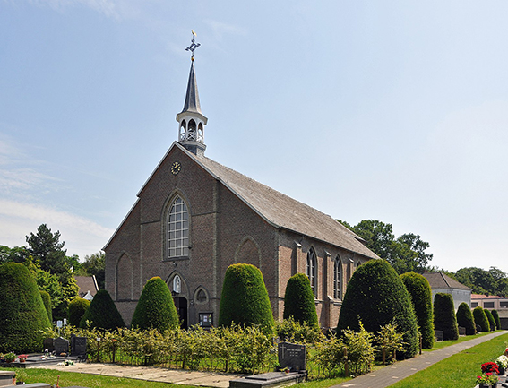

# Sint-Maria-Aalter

De gezinnen van Maurits en Albert situeren zich in Sint-Maria-Alter. Ze woonden in de Knesselaarsestraat. De naam zegt het. Het is de straat die rechtstreeks naar Knesselare leidt, komdende van de zuidkant. Maurits en Flora bewoonden het laatste huis van Sint-Maria-Aalter aan de rechterkant. De grens met Knesselare bevondt zich op 100 meter van de officiële grens. Al de ramen keken uit naar Knesselare. De muur van het huis richting Sint-Maria-Aalter had geen ramen. Het huis weerspiegelde hiermee dat de bakermat van de familie Knesselare was, terwijl de grenspaal van West-Vlaanderen ter hoogte van Sint-Joris-ten-Distel zich op nog geen kilometer van het huis bevondt.  

