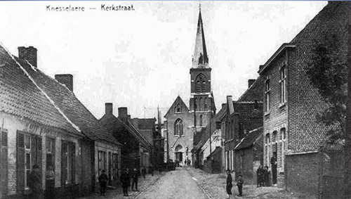

# Via Hoekestraat naar de Kerkstraat

In _'Knesseloare'_ - de lokale uitspraak voor de officiële naam 'Knesselare' -  heeft zich het grootste deel van het leven van [Vitalis](1879-vitalis-de-bleeckere) en [Octavia](1878-octavia-versluys) afgespeeld, alsook dat van hun kinderen en de meeste van hun kleinkinderen. Ze situeren zich vooral in en rond Hoekestraat, het zuidwesten van Knesselare. Deze zeer oude prentkaart toont de Kerkstraat, een weg die vanuit Hoekestraat, zoals de naam zegt, recht naar het centrum van het dorp loopt en in T-vorm recht op de kerk uitkomt. Die weg is ontelbare keren afgelegd door het gezin De Bleeckere-Versluys.    

