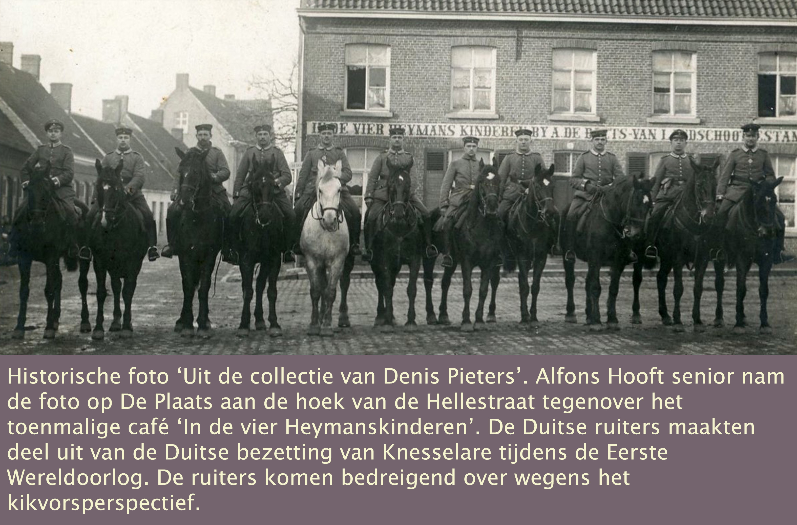

In _'Knesseloare'_ - de lokale uitspraak voor de officiële naam 'Knesselare' -  heeft zich het grootste deel van het leven van Vitalis De Bleeckere en Octavia Versluys afgespeeld, alsook dat van hun kinderen en de meeste van hun kleinkinderen. Ze situeren zich vooral in en rond Hoekestraat, het zuidwesten van Knesselare. Deze zeer oude prentkaart toont de Kerkstraat, een weg die vanuit Hoekestraat, zoals de naam zegt, recht naar het centrum van het dorp loopt en in T-vorm recht op de kerk uitkomt. Die weg is ontelbare keren afgelegd door het gezin De Bleeckere-Versluys. Hier volgen verhalen die direct of indirect de gezinnen De Bleeckere en Versluys betreffen in relatie tot hun dorp Knesselare. Dit is het overzicht met de links naar de verschillende verhalen over 'Knesseloare'

[De komst van de fotografie naar Knesselare](kom_foto)

['Verslagenheid en vrees'](#ver_vrees)

[Knesselare onder vuur](#knes_vuur)

[Familie Verhoestraete in de keuken, achter de toog en aan het gareel](#fam_ver)

# De komst van de fotografie naar Knesselare

De [familiefoto van Versluys](/1878-octavia-versluys/mozaik/3-versluys) dateert van 1904. Dat is zo een tachtig jaar nadat de eerste foto-opname letterlijk het levenslicht zag in 1826. Natuurlijk de eerste decennia van de moderne fotografie waren experimenteel. De nieuwe kunst van ‘het licht’ moest nog een hele weg afleggen tot die in Knesselare aankwam. Dat dit gebeurde, was vooral te danken aan August De Jaeger (°1846-+1909). Die zijn we ook tegen gekomen bij ons onderzoek naar de dubbele huwelijksfoto van het gezin Versluys. August De Jaeger was toen namelijk de burgemeester die het huwelijk van Irma Versluys en Ivo De Dobbelaere in het gemeentehuis van Knesselare heeft bekrachtigd. Zijn naam komt voor op de [huwelijksakte](/onderzoek-familiefoto versluys) van het koppel Irma-Ivo. De Jaeger bestuurde Knesselare van 1897 tot 1908, de periode waarin zich de familiefoto Versluys situeert. In zijn hoofdstuk ‘Over fotografen en fotografie’ noemt auteur [Jan Van de Casteele](/onderzoek-bronnen) August De Jaeger ‘de eerste fotograaf’ van Knesselare. Die zoon van een welgestelde familie had in Leuven geneeskunde gestudeerd; hij was dus goed op de hoogte van wat er toen in wereld omging en hij had ook artistieke talenten. Hij was amateur-schilder, -beeldhouwer én -fotograaf. Toch is August De Jaeger zeker niet de fotograaf die de historische Versluys-foto heeft gemaakt. Zoveel tijd had de geëngageerde burgervader en huisarts niet om zich toe te leggen op de tijdsintensieve fotografie. Maar hij was zich wel bewust van het toekomstige belang ervan. Daarom was hij de man die de noodzakelijke duw in de rug gaf aan de jonge man die de vader en grootvader zou worden van dé fotografiefamilie van Knesselare: de familie Hooft. De Jaeger moedigde namelijk de jongeling Alfons Hooft aan om fotograaf te worden en bestelde voor de jonge man zelfs een bijzondere lens in Londen. Hiermee was de eerste steen gelegd voor de succesrijke professionele fotografie in Knesselare. 

Dit zijn de drie generaties van Studio Hooft: van rechts naar links Alfons senior (1867-1928), Maurits (1898-1964), Alfons junior (1930-2006). Studio Hooft heeft het Knesselare van de 20st eeuw vastgelegd op de gevoelige plaat. Na de Tweede Wereldoorlog zijn alle familiefoto’s in Knesselare – trouw, eerste en plechtige communie, jubileum, soldaat van het Belgisch leger, op pensioen, e.a. – genomen in Studio Hooft in de winkel aan De Plaats (vroeger ‘De Ploatse’ of ‘’t Dorp’, vanaf 1971 ‘De Plaats’ genoemd) tegenover de kerk. Dat geldt ook voor de familiefoto’s van de kinderen en kleinkinderen van het gezin De Bleeckere-Versluys op onze site.

Op bovenstaande foto uit 1904 – hetzelfde jaar als de familiefoto Versluys – zien we het toenmalige woonhuis van het gezin Hooft in de Kloosterstraat. Het was het huis van de stamvader van het gezin Hooft. Zijn naam was Bernardus en hij was timmerman. Hij leidde zijn zoon Alfons Hooft op tot timmerman. Het gezin baatte in de Kloosterstraat ook nog een winkel uit met horloges, juwelen en allerhande huishoudartikelen. De historische foto van de winkel etaleert het vakmanschap van het gezin Hooft in de goudsmederij en de horlogerie, maar nog niet in dat van de fotografie. In de rechtse etalage zien we wel al ingekaderde foto’s. Wellicht oefende Alfons, de nog jonge zoon van Bernardus, in 1904 al in bijberoep het beroep van fotograaf uit. Die veronderstelling blijkt nog meer gegrond door het feit dat Alfons in 1905 van de Kloosterstraat verhuisde naar ‘de Ploatse’, ook ‘’t Dorp’ genoemd, om zich daar tegenover de kerk definitief te installeren als beroepsfotograaf. Daar zouden vervolgens zijn zoon Maurits en nadien zijn kleinzoon Alfons junior Studio Hooft succesvol verder uitbouwen en uitbaten tot in 1996.

Paul Verhoestraete, de beheerder en de onderzoeker van Knesselares uitgebreid foto-archief, liet Sylvain in maart 2021 weten dat er heel wat foto’s van Alfons Hooft senior zijn bewaard gebleven, echter geen negatieven. Die zijn verloren gegaan. Bovenstaande portretfoto van Alfons Hooft – met dank aan Paul Verhoestraete - werd genomen in 1897 bij gelegenheid van diens huwelijk met Antonia De Wispelaere. Zoals blijkt uit de tekstband onderaan de foto, is die gemaakt in de Gentse Studio van Jos. Wante. Dat wil zeggen dat Alfons toen zeker nog niet zelf aan fotograferen toe was, maar wel dat hij al een feeling had voor de opkomende kunst van de portretfotografie en de fotostudio zoals die in de grootsteden al begon te floreren. Met andere woorden, dat Alfons Hooft reeds in 1904 de familiefoto Versluys heeft genomen, is vrij onwaarschijnlijk, ook al zullen de leden van het gezin Versluys bij hun wekelijkse voettocht naar de kerk voor de zondagsmis wel eens naar de etalage van Hooft in de Kloosterstraat zijn gestapt om er de fotokaders te bewonderen.

 Waren er dan nog andere fotografen in Knesselare actief? Ja en neen. Neen: Alfons Hooft was de allereerste beroepsfotograaf van en in Knesselare. Ja: Er waren rondtrekkende beroepsfotografen die uit de grote steden ook afzakten naar de landelijke dorpen. Twee ervan waren zeker in Knesselare actief in de periode 1880-1904. De Brusselaar Moriau en de Antwerpenaar Meslin kwamen foto’s maken op bestelling: klas-, familie- of evenementenfoto’s. Die foto’s waren toen niet goedkoop. Ze werden immers nog gemaakt met zeer fragiele en tevens vrij zware glasplaten als basismateriaal voor de negatieven. Ze bestonden uit glas, beeldzilver en een gelatine-emulsielaag. We weten dat Moriau familiefoto’s maakte in Knesselare, al in 1897, het jaar van burgermeester De Jaeger. En Moriau maakte zijn familiefoto’s buiten in het natuurlijke zonlicht; de afwerking en de levering gebeurden niet met een echte fotokader, maar met een passe-partout met lijnen in de vorm van een kader waarbinnen de foto werd afgedrukt.
 
 De familiefoto Versluys is eveneens buiten genomen en is ook met een lijnen passe-partout bezorgd. Alleen staat de naam ‘Moriau’ er niet op gedrukt, terwijl Moriau wel die gewoonte had. M.a.w. absolute zekerheid over de fotograaf van foto Versluys kunnen we niet (meer) verkrijgen. De foto demonstreert wel dat het gezin Versluys mee was met zijn tijd en bij de bijzondere, feestelijke gelegenheid van het dubbele huwelijk een speciale financiële inspanning heeft willen doen. Misschien hebben ze wel Alfons Hooft aangesproken om een rondreizende fotograaf voor hen te contacteren. Die was toen immers al vertrouwd met het milieu van de opkomende fotografie want hij stond op het punt om voor zichzelf een eigen zaak te gaan beginnen.

# 'Verslagenheid en vrees' 

_‘Het uitbreken van den oorlog veroorzaakte algemeen verslagenheid en vrees.’_ De woorden komen van de Knesselaarse pastoor Edmond Van Butsel. Hij was amper een jaar in dienst toen de aanstormende Duitsers in 1914 zijn pad en dat van zijn parochianen kruisten. Hij zag het zelf gebeuren en ondervond dat ook aan de lijve. De gebeurtenissen moeten hem diep hebben geraakt want hij typte er kort na de oorlog twee volle bladzijden over. Als gewezen leraar beschikte hij over een vlotte pen. Hij voegde zijn uitgebreid verslag losbladig toe aan de jaarboeken van de kerkraad van Knesselare. Die bevinden zich in het Rijksarchief Gent. Daar heeft Thirza Vandenabeele ze opgespoord en Sylvain een kopie ervan bezorgd. Hij stelt hier het unieke ooggetuigenverslag voor. De citaten zijn de letterlijke weergave van de  pastoor, met behoud van de toen geldende spelling. Enkele citaten uit het verslag van de pastoor verschenen eerder op de site van [Knesselare Nieuws](/onderzoek-bronnen) onder de titel _Herinnering aan “den grooten oorlog”, deel I en deel II_. 'Knesselare Nieuws' publiceerde ook nog de dagboeknotities over de Eerste Wereldoorlog in Knesselare van mevrouw Odile Arnaut uit de Kloosterstraat, de dochter van onderwijzer Jules Arnaut, tevens gemeentesecretaris.

Pastoor Van Butsel schetst eerst de sfeer die onder de bevolking van Knesselare heerste bij het nieuws dat de Duitsers op komst waren. ‘Verslagenheid en vrees’. Niemand in België had toen enige ervaring met wat een oorlog met zich meebracht. Net zoals in alle Knesselaarse families en gezinnen, zullen ze ook in het gezin Versluys-De Witte en in die van de al getrouwde kinderen, onder andere dat van het jonge gezin Vitalis De Bleeckere en Octavia Versluys, met angst en beven de gebeurtenissen hebben afgewacht. Hun angstig gemoed werd gevoed door de mondelinge berichten over de terreur die de Duitse soldaten pleegden tegenover de burgerbevolking. De pastoor noteert: ‘De wreedheden die deze langs de kanten van Dendermonde hadden gepleegd waren hier aan de ooren gekomen.’ De Duitse soldaten hadden namelijk het bevel gekregen om de Belgische burgerbevolking te terroriseren bij het kleinste teken van weerstand. Dat bevel maakte deel uit van de militaire strategie: zo snel mogelijk naar de nog jonge Belgische zeehaven Brugge-Zeebrugge oprukken om dan Engeland te kunnen aanvallen en om via België eveneens het Franse grondgebied zo snel mogelijk te gaan bezetten. De snelle opmars van het Duitse leger mocht door niets of niemand worden gestuit. Niets of niemand mocht hen letterlijk ook maar iets in de weg leggen. Daarom terroriseerde het Duitse leger systematisch de bevolking. 

In Knesselare dat op de weg lag van de snelle, Duitse opmars naar Brugge-Zeebrugge, draaide de geruchtenmolen op volle toeren. De gezinnen stonden voor een verscheurende keuze: vluchten of biddend bang afwachten. Zelfs de Knesselaarse onderpastoors waren in paniek samen met hun families gevlucht ‘naar Holland’; ze hadden hun pastoor Van Butsel alleen achtergelaten. Deze kapitein verliet het schip van zijn parochie niet. Er kwamen tal van huizen leeg te staan; die vielen ten prooi aan plunderaars die misbruik maakten van de situatie. De overgrote meerderheid van de blijvers, eenvoudige katholieke mensen, trokken naar de kapellen, gingen meer naar de mis en biechten meer. De pastoor stelde die verhoogde kerkelijke praktijk met een zekere tevredenheid vast:

>>_Dagelijks trok een groote menigte al biddende naar de Kapel van O.L.V. Voorspraak, een bidplaats waar het miraculeuze beeldeken vereerd werd met veel vertrouwen. Groot was ook het getal der geloovigen die tot de HH. Sacramenten naderden. De menschen namen hunnen toevlucht tot God._

Op woensdag 14 oktober in de morgen was het dan zover. De Duitsers stonden in Knesselare. Onmiddellijk eisten ze de grote Sint-Willibrorduskerk op als verblijf- en slaapplaats voor de eerste vloed van oprukkende soldaten. De pastoor werd aldus direct met de nare gevolgen van de bezetting geconfronteerd. Hij mocht geen mis meer opdragen noch de biecht horen. Daar kwam nog bovenop dat de meeste Duitse soldaten protestants waren en antikatholiek gezind waren. Op vrijdagavond hielden ze een protestantse dienst, ook al had pastoor Van Butsel zich daar tegen verzet. De situatie verslechterde snel. ’s Anderdaags, de zaterdag, meer bepaald rond 17u00 stroomden nog meer Duitse soldaten toe. De pastoor noemt ze _‘nieuwe benden’_. En hij noteert: _‘Den zondag 18n, ’s morgens, was gansch de parochie vergeven van de Duitschers en onophoudelijk kwamen andere benden voorbijtrekken.’_ Toen kwam de pastoor zelf midden in de Duitse storm te staan. Zijn levende beschrijving achteraf laat geen detail achterwege, ook al schrijft hij over zichzelf in de derde persoon.

>>_De pastoor wachtte altijd tot dat de Duitschers weg waren om de H. Mis te doen, toen opeens eene bende soldaten hem uit de pastorij kwam halen zeggende dat er civilen op den toren waren. Zij haalden een jongen tevoorschijn van 15 jaar die tusschen de beenen der Duitschers op den toren geraakt was en zoo ’t schijnt eens aan het klokzeel getrokken had. Dit was verraad en medeplichtig was de pastoor. Deze had schoon te zeggen dat hij van niets wist en zelfs dien jongen niet kende, ’t was eigenlijke eenen van Aeltre, hij  ― de schrijver bedoelt hier hemzelf, de pastoor ― wierd brutaal vastgegrepen, met woest geweld langs den anderen kant der markt gesleurd en voor op een wagen gezet. Dit alles met zoveel woestheid dat zijne soutaan op borst en rug gescheurd was. De koster wierd ook vastgegrepen en insgelijks op een wagen geplaatst. Zij ontnamen hem de sleutels der kerk, liepen op den toren, sneden de klokzelen af, maakten de horloge kapot en deden de deur der kerk op slot en namen de sleutels mede. Het was dan negen uren van de voormiddag; de menschen die gekomen waren om mis te hooren waren met angst geslagen en trokken al schudden en beven naar huis. Een goede ziel had de stoutmoedigheid den pastoor die nog altijd nuchter was een kom melk te brengen._ [Toelichting bij ‘nuchter’: in die tijd mocht de pastoor noch de gelovigen vooraf iets eten alvorens de mis op te dragen, respectievelijk bij te wonen; iedereen moest op een lege maag de ‘heilige hostie’, beschouwd als ‘het lichaam van Christus’ ontvangen] _Gelukkiglijk want van de ganschen dag kreeg hij van de Duitschers niets terwijl zij erg smulden en dronken. Van ten 9 uren ’s morgens zat de pastoor op zijn wagen tot ten 9 uren ’s avonds, tot bij Snellegem, 2 – 3 uren boven Brugge. Dan wierd hij bij eenen Overste gebracht, die reeds te bed lag. Toen een Duitscher begon den paster te beschuldigen, stak de grijze overste zijn hand van onder het deksel naar omhoog zeggende: ‘Laat af, er is hier misverstand, laar Mr de pastoor vrij.’ Deze had het geluk een onderkomen te vinden bij den heer pastoor van Snellegem, en ’s anderdags met den middag kwam hij met den koster behouden en bewaard terug bij zijne parochianen._

Over de vier jaren van de bezetting is de pastoor in zijn verslag kort. De burgers van Knesselare deelden het lot van alle Belgische burgers in de bezette gebieden: ‘Opeischingen en afpersingen van allen aard’: runderen, varkens, kleinvee, landbouwgoederen, gereedschappen, allemaal bestemd voor enerzijds de Duitse soldaten aan het oorlogsfront en anderzijds ook voor het hongerende Duitsland waar de langbouw door de oorlog zo goed als stil was gevallen, met hongersnood als gevolg voor de Duitse burgerbevolking. De pastoor stipt aan dat hij wat de kerk en de diensten op zondagen betreft, hij zich moest schikken naar de Duitsers. Die hielden soms op zondag een protestantse én een katholieke dienst omdat er ook soldaten waren die uit katholieke delen ― Rijnland, Beieren ― van Duitsland waren gekomen. Gedurende de hele bezetting eisten de Duitsers in Knesselare de parochiezaal en de katholieke jongensschool op. Het klooster bood toen onderdak aan de jongensklassen. De Duitse terreur naar de bevolking bleef al die tijd duren, zelfs nog tot ‘een veertiental dagen voor den aftocht’. Zelfs dan nog werden weerbare mannen tot 45 jaar opgeëist:

>>_‘Daar zij niet opkwamen, gingen de Duitschers ze ten huize opzoeken. De weinige die zij vonden namen ze mede, en waar zij die niet vonden, dwongen zij eene moeder of zuster mede te gaan en al dat volk sloten zij op in de kerk. In den avond mocht het vrouwvolk naar huis gaan. De mannen moesten blijven. Gelukkig maar voor eenen nacht.’_ 

Op 20 oktober 1918 was Knesselare bevrijd. Op die dag ‘_zijn onze Belgische soldaten hier triomfantelijk binnengekomen’_. Dat betekende niet dat de oorlogsellende definitief voorbij was. De Belgische manschappen botsten nog op Duitse weerstand in Zomergem aan de vaart. Gedurende tien dagen werden er nog Duitse obussen en granaten afgevuurd richting Knesselare. De pastoor eindigt zijn verslag met de herinnering aan de laatste burgerslachtoffers die toen nog te betreuren vielen. De pastoor kende hen want hij heeft hun begrafenisdienst moeten leiden: 

>>_‘Den nacht van 21-22 viel al elken kant der kerk een zware obus, die veel ruiten braken in de kerk en in de huizen, en waardoor ook een ouderling van 80 jaar, Jacobus Thys, in zijn bed gedood werd. Den avond nadien viel een obus op het woonhuis der hofstede Matthys. Den Zaterdag 26, in den namiddag, wierd een meisje van 20 jaar, Romanie Gussé, op den slag gedood, door een obus.’_

Haar 61-jarige vader August en haar 33-jarige broer Alfons hebben zich de maandag daarop gemeld op het gemeentehuis om haar overlijden aan te geven. Het landbouwgezin woonde in de wijk Westvoorde, richting Ursel. De overlijdensakte vermeldt dat Romanie, officieel heette ze ‘Maria Romanie’, landwerkster was. De jonge vrouw werkte mee op de boerderij van haar ouders, August Gussé en Marie Louise Verniest. Met haar begrafenisdienst eindigde in Knesselare ‘de verslagenheid en vrees’ van de Eerste Wereldoorlog definitief. Romanie bevond zich op de verkeerde plaats op het verkeerde moment omdat de verliezende Duitsers gekrenkt waren in hun grootheidswaanzin en hun vernederende nederlaag niet konden accepteren. Niemand kon het jonge, beloftevolle leven van Romanie redden van de Duitse obus, ook niet de God van de goede herder, pastoor Van Butsel.

# Knesselare onder vuur

[Paul Verhoestraete](/bakermat-'Knesseloare') is zo vriendelijk geweest ons deze unieke foto ter beschikking te stellen. Uniek inderdaad! De foto verbindt de gevolgen van de sneeuwstorm op kerstdag 1927 met de gevolgen van de militaire storm van de Tweede Wereldoorlog. Concreter verwoord: de foto koppelt tweede kerstdag, 26 december 1927, de dag van de opname, met 27 mei 1940, de dramatische oorlogsdag in het centrum van Knesselare. De foto vertelt op een zeer ongewone en tevens erg diep menselijke wijze een ongekende en dramatische geschiedenis van de Duitse Blitzkrieg in Knesselare. Duitse bommenwerpers waren rond half één in de nacht van 10 mei 1940 voor het eerst de Belgische grens overgevlogen. In haar speciale editie van vrijdag 10 mei 1940 blokletterde de Gentse hoofdredactie van de krant Vooruit: ‘Duitsland valt België aan! Hedenochtend te 4u.30 werden onze vliegterreinen gebombardeerd en daalden Duitsche valschermspringers neer.’ Amper enkele weken later ervoeren de Knesselaarse burgers de Tweede Wereldoorlog aan de lijve. Op maandag 27 mei rond 10u00 zagen ze Duitse infanteristen De Plaats bezetten. Die waren opgerukt vanuit Ursel. Maar al vlug botsten de Duitse soldaten op weerstand. Ze werden beschoten. De hel brak los in Knesselare dorp. Henri Verhoestraete en Judith Van De Velde kwamen midden in het militair vuur te staan en overleefden al vluchtend die dag niet. Van dat dramatisch moment getuigt de bijzondere foto van 1927 én 1940.

Paul Verhoestraete, de kleinzoon van Henri en Judith, heeft de foto gevonden in het familiearchief Verhoestraete. De familie situeerde zich in het centrum van Knesselare, meer bepaald in het gebouw op de hoek van de Kerkstraat met De Plaats. De oude foto van 1927 toont de oostkant van De Plaats met de Veldstraat. Een sneeuwstorm had alle verkeer lamgelegd. De buren kwamen op twee kerstdag buiten om samen op de foto te gaan staan. Links zien we de herberg De Zwaan die, grondig verbouwd tot brasserie, nog steeds bestaat. Rechts is slechts een klein deel van het café met kleine feestzaal ‘Den Appel’ zichtbaar, eigendom van het gezin van Henri Verhoestraete en Judith Van De Velde. Voor hen kleurde de oorlogsdag 27 mei 1940 helemaal zwart.

Samen met hun overbuurvrouw Julia De Neve kwamen Henri en Judith toen om het leven door inslaand mortiervuur. Henri was erg verminkt, maar leefde nog enkele minuten. Zijn vrouw Judith was op slag dood; ze was vreselijk verminkt. Het lichaam van Henri werd teruggevonden op zowat 50 meter afstand van de plaats waar het militaire geweld hem, zijn vrouw en hun overbuurvrouw had getroffen. De buren hebben de drie verminkte lichamen gevonden ter hoogte van de haag achter het huis van Maurice De Spiegelaere in de Kerkstraat, waar zich nu een gemeenteparking bevindt. Henri had op het ogenblik van de dodelijke inslag heel wat foto’s bij zich, vooral van zijn kinderen, maar ook de bijzondere foto van 1927. Die moet veel voor  hem hebben bekeken. Hij hield die blijkbaar altijd bij. Hij had de foto geplooid bij zich. We zien de plooi in de foto. Die vertoont ook enkele bloedvlekken van Henri. Zo is die unieke foto een bijzondere getuige geworden van de noodlottige gevolgen van de Tweede Wereldoorlog voor de gewone burgers. Over het concrete militaire geweld van toen in Knesselare dorp vond Paul Verhoestraete twee versies.

De eerste versie is die van de media, zoals gerapporteerd door het Historisch Genootschap van het Meetjesland, de ‘Appeltjes van het Meetjesland’. Ziehier het bericht: 
Op 27 mei 1940 worden vader Henri en moeder Judith Verhoestraete – Van de Velde te Knesselare tijdens hevige gevechten door een inslaande obus gedood. Het begon al vroeg! Omstreeks 10u00 vielen enkele obussen in de dorpskern van Knesselare. Iets voor de middag begon het dan pas voor goed! De troepenkolonnes (Belgen) waren ondertussen steeds maar aangezwollen. Herhaaldelijk kwamen groepen van drie vliegtuigen mitrailleren en bombarderen, zowat over geheel het grondgebied van de gemeente. Op het middaguur werd zo het centrum hevig bestookt. Fosforbommen waren oorzaak van het totaal uitbranden van  woningen in de Kerkstraat. Daarenboven kwamen ook brisantbommen neer naast en op de kerk. Toen het hels gedoe een ogenblik ophield sloegen velen in panische angst op de vlucht naar veiliger gedachte oorden. Het echtpaar Henri Verhoestraete-Judith Van de Velde en hun overgebuur Julia De Neve vluchtten uit de kelder van de gelagzaal van hun herberg achter de huizen van de Veldstraat van het dorp weg. Ter hoogte van de tuin Magerman (huidig nr. 14) werden ze door brisantbommen getroffen. Men vond er drie zwaar verminkte lichamen terug.

De tweede versie komt dichter bij de reële feiten. Die versie heeft Paul Verhoestraete zelf verzameld via gesprekken met de kinderen van Henri en Judith, meer bepaald met Pauls eigen vader Gentiel en zijn ooms Gerard, Willy en André. Vooral André wist een meer gedetailleerd verhaal te vertellen, gebaseerd op getuigenissen van dorpsgenoten en soldaten die de militaire acties zelf hebben meegemaakt. Paul kon ook nog spreken met Lutgarde De Spiegelaere die toen als klein meisje zelf het hele gebeuren heeft beleefd. Hier volgt de reconstructie zoals Paul die heeft kunnen optekenen.

>>_Reeds vroeg in de voormiddag van die bewuste maandag 27 mei 1940 trokken oprukkende Duitsers rond 10 uur Knesselare binnen, komende uit de richting Ursel. Duitse vliegtuigen hebben toen zeker niet blindelings gebombardeerd want ze zouden hun eigen soldaten getroffen hebben. Wel werd Knesselare door Belgische soldaten, die in Beernem en Maria-Aalter (richting Wingene) opgesteld stonden, met kanonnen beschoten, in een poging de Duitsers tegen te houden. Vader Henri en moeder Judith verbleven in hun beveiligde kelder. Er was een extra onderstutting gemaakt en eveneens een nooduitgang, via een weg te nemen kelderraam. Zij hadden enorme schrik, vooral van het instorten van hun huis dat, in centrum dicht bij de kerk gelegen, blijkbaar in de vuurlinie lag. Toen zij plotseling duidelijk hoorden roepen dat er brand was en denkend dat hun huis getroffen was, vluchtten zij de kelder uit, de achtertuin in. Er was inderdaad brand, maar het was het huis van Maurits de Brauwer, iets verderop. Hun buur, Remi Cooreman, zag hen vanuit zijn kelderraam  wegvluchten en probeerde hen binnen te roepen. Henri en Judith gingen daar niet op in, wederom door de schrik van brand en instorting. Iets verderop viel de fatale obus. Waarschijnlijk werden Henri en Judith gedood door Belgische obussen, afgeschoten vanuit  Beernem. En welke kanonnen stonden er in Beernem? Kanonnen die toebehoorden aan het 13e Artillerie uit Brugge, de eenheid waar André deel van uitmaakte. André was toen weliswaar niet meer in Beernem maar andere Belgische soldaten hadden die kanonnen overgenomen. Mogelijks kan de beschieting ook gebeurd zijn vanuit de grens tussen Beernem en Knesselare, daar stonden 7.5 mm kanonnen, die van André’s eenheid waren 15.5 mm kanonnen._ 

# Familie Verhoestraete in de keuken, achter de toog en aan het gareel

**DEN APPEL**

>>_‘…een woonhuis dienende voor herberg genaamd Den Appel, met groote steenen schuur, koestal, boey, daaronder grooten kelder, zwijnskoten met meer andere gerieven, benevens nog twee huizen, waarvan het eene dient voor winkel, met erf en hoveniershof.’_ 

Deze tekst is de oudste beschrijving van het gebouw dat in het centrum van Knesselare ― op de hoek van de Kerstraat en De Plaats ― bijna een eeuw lang een sociale hoofdrol heeft gespeeld. Dat gebeurde onder de regie van de familie Verhoestraete van 1869, het jaar van de verkoopakte, tot in 1975, toen een losgeslagen container van een vrachtwagen schoof en het gebouw onherstelbaar beschadigde. Charles Verhoestraete kocht op 7 juni 1869 van de familie Rodts uit Maldegem het goed voor 8740 Belgische frank.  

Charles Verhoestraete bewoonde het centraal gelegen gebouwencomplex samen met zijn vrouw Rosalie de Vuldere. Het kinderloze echtpaar namen in 1882 een belangrijke beslissing. Ze adopteerden hun dertienjarige nicht Octavie en twaalfjarige neef Henri uit Beernem. Beiden waren na het vroege overlijden van hun ouders weeskinderen geworden. Charles en zijn vrouw Rosalie baatten de herberg ‘Den Appel’ uit en ze hielden een zaak van gareelmakerij open. Charles had immers het beroep van gareelmaker van zijn vader geleerd en wilde het zelf ook doorgeven aan Henri die hij als zijn zoon en opvolger ging beschouwen. Henri liep eerst nog school in Beernem. Terwijl hij door loting in Antwerpen zijn 38 maanden verplichte legerdienst vervulde, overleed Charles op 24 maart 1892. Toen ook zijn tante Rosalie op 7 maart 1909 overleed, verwierf de toen negenendertigjarige Henri het handelshuis met herberg. Enkele maanden later, op 5 mei 1909, huwde Henri met de vierendertigjarige naaister, Judith Van de Velde. Zij begonnen van dan af een bloeiende dubbele zaak uit te bouwen: de herberg ‘Den Appel’ en de zaak ‘Verhoestraete’ voor gareel- en harnassen voor paarden. 

Henri en Judith kregen vijf kinderen: Gisèle, Gerard, Willy, Gentiel, André, allen geboren tussen 1910 en 1921. Met hen was de nodige opvolging verzekerd. De kinderen leerden thuis wat hard werken betekende en ze groeiden op in een erg boeiende, sociale omgeving want ‘Den Appel’ werd een echt begrip in Knesselare. Ideaal gelegen in een driehoek met de kerk en het gemeentehuis aan De Plaats, werkte ‘Den Appel’ als een sociale magneet. Trouwers, rouwenden, jubileumvierders, verenigingen allen vonden ze hun plek in ‘Den Appel’.

**IN 'T BURGERWELZIJN**

Op 21 juni 1933 vond het huwelijksfeest van Maria Elisa Versluys en Raymond Beuselinck plaats in de herberg  en feestzaal ‘In ‘t Burgerwelzijn’. De familiefoto van 1933 (link) maakt deel uit van het reilen en zeilen van het publieke leven van de Knesselaren in die tussenoorlogse tijd. In 1933 begonnen de nare herinneringen aan de ‘Groote Oorlog’ te vervagen, was er van ‘een tweede wereldoorlog’ nog geen teken aan de horizon te bespeuren en begon het economische leven na de voorbije jaren van de Grote Depressie wegens de grote beurscrash van 1929 in Wall Street, NY,  terug wat zuurstof te krijgen. Ook in Knesselare durfden de mensen terug voorwaarts kijken. De geest van optimisme waaide weer op. Wat kon daar beter uitdrukking aan geven dan een groot trouwfeest?

**INTERVIEW MET PAUL VERHOESTRAETE**

Sylvain interviewde Paul Verhoestraete, zoon van Gentiel, een van de vijf kinderen van Henri en Judith. Hij schetst een levendig beeld van ‘_In ’t Burgerwelzijn_’. Paul, geboren in 1951, heeft zijn ouders, nonkels en tantes, over hun directe belevenis van het leven in de herberg-feestzaal van Henri en Judith bevraagd en hun herinneringen opgetekend in een eigen familiegeschiedenis. Daarvan heeft Sylvain gebruik mogen van maken. Paul antwoordde ook graag op drie vragen van Sylvain.

Sylvain: Weet je wanneer en waarom jouw grootouders Henri en Judith aan hun café-feestzaal ‘Den Appel’ de nieuwe naam ‘In ’t Burgerwelzijn’ gaven? En waarom en wanneer ook die naam na de Tweede Wereldoorlog verdween en ‘In ’t Wit Paard’ werd.

>>Paul: _Mijn grootvader Henri  was ‘een blauwe’, een liberaal dus. Daar was moed voor nodig in die tijd. Tot 1926 waren de katholieken er aan de macht. In 1926 werd de liberaal Theofiel De Lichte burgemeester en dit bleef zo tot er drie ‘oorlogsburgemeesters’ aan de macht kwamen. Vermoedelijk werd ‘Den Appel’ anno 1926 omgevormd tot ‘In ’t Burgerwelzijn’; het werd het lokaal van de liberalen. Zij verdedigden de gedachte dat België een liberaal land was, een land waar alle burgers vrij zijn en waar het burgerwelzijn bovenaan de politieke agenda zou moeten staan. Vanaf dat moment liet de katholieke notaris er ook geen openbare verkopingen meer doorgaan. Verschillende ‘zelfverklaarde stamboekkatholieken‘ lieten zich van dan af ook niet meer zien. >Na WO II werd mijn nonkel Willy de nieuwe eigenaar-uitbater. Wie het initiatief nam voor de nieuwe naam ‘In ’t Wit Paard’ kan ik niet meer achterhalen.  Nonkel Willy verblijf tijdens de Tweede Wereldoorlog maandenlang als krijgsgevangene in Duitsland, tewerkgesteld in een boerderij in een landelijk dorp. Was er daar een ‘Weissen Rössl’? In 1946 nam in ieder geval de CVP de touwtjes steven in handen in Knesselare. Maurits Devreese werd er burgemeester en zou dat blijven tot 1982. Hij won zes verkiezingen. Van de liberale partij blijft weinig over. Of was ‘In ’t Wit Paard’ gewoon een betere naam om er een café met kleine feestzaal van te maken zonder ‘liberale’ verwijzing?_

Sylvain: Henri en Judith hadden zelf vijf kinderen groot te brengen en op te voeden. Bovendien namen ze nog Clara Mulier op in hun gezin, de dochter van de overleden zus van Judith, die door Henri en Judith als hun oudste dochter werd beschouwd. Hoe konden de ouders hun groot gezin combineren met het drukke leven in de herberg met zijn keuken voor familiefeesten en rouwmaaltijden, plus daar bovenop nog dagelijks de zaak van paardengarelen en -harnassen runnen? 

>>Paul: _Weeskind Clara Mulier stond vooral in voor de opvoeding van de kinderen. Zijn was een tiental jaar ouder dan het oudste kind. Mijn pa Gentiel was al achttien jaar toen hij te weten kwam dat Clara niet zijn zus was. Grootvader Henri was al veertig jaar oud toen hij trouwde en er kwamen nog vijf kinderen (en enkele miskramen). Hij bekommerde zich blijkbaar heel weinig om de opvoeding van zijn kinderen. Hij was een echte ‘cafébaas’ die ook iedere gelegenheid te baat nam om op kroegentocht te gaan. En er waren in die tijd nogal wat gelegenheden (kermissen, wijkfeesten, kerkelijke feestdagen enzovoort). Hij vond ook dat zijn vier zonen best ook gareelmaker werden zonder aan te voelen dat de periode van paard en kar wel haar beste tijd had gekend. Zelf was hij meer klant dan cafébaas van zijn eigen herberg. Er waren toen een vijftal herbergen op De Plaats en legendarisch is het verhaal dat de herbergiers met hetzelfde geld om de beurt bij elkaar op bezoek gingen om te drinken. Op het einde van de dag zeiden ze dan dat ze heel de dag gedronken hadden en geen geld kwijt waren. Moeder Judith moet meermaals geprotesteerd hebben, haar drank opgebruikt maar ‘geen geld in het schof (lade)’._

Sylvain: Welke maatschappelijke rol speelde de herberg ‘Den Appel’, ‘In ’t Burgerwelzijn’ en na de Tweede Wereldoorlog ‘_In ’t Wit Paard’_ in Knesselare?

>>Paul: _De herberg was zowat het middelpunt van het verenigingsleven in Knesselare, ook al was vader Henri duidelijk politiek (blauw) gekleurd. Bijna iedereen is er vriend aan huis; huisgezin en herberg lopen er door elkaar. Gemeentepolitiekers, veldwachters, notabelen, ‘gendarmes’, voermannen enzovoort, iedereen is er welkom en men mag steeds, indien gewenst, aan de gezinstafel voor een maaltijd aanschuiven. Mijn grootouders Henri en Judith, mijn eigen pa tijdens de Tweede Wereldoorlog en zijn broer, mijn nonkel Willy, nadien, hadden de reputatie zwijgzame herbergiers te zijn die zich nooit mengden in soms hevige politieke en andere discussies ‘aan den toog’. De herberg was natuurlijk ideaal gelegen, recht tegenover de kerk op het dorp. Er waren vóór de oorlog wel vijf tot zes herbergen op De Plaats. De ‘zwijgzame herbergiers’ werden wel gewaardeerd en de herberg beschikte over de grootste ruimte. De andere konden onmogelijk voldoende plaats aanbieden voor verenigingen of feestmaaltijden. Ook om die reden was het voor veel verenigingen het vergader- en repetitielokaal (fanfare). Soms werd er zelfs een toneelvoorstelling in gegeven (Strijdbroeders, later Rederijkers). De herberg was, zeker op zondagvoormiddag, de plaats waar veel plaatselijke handelaars samenkwamen. Ze gingen eerst  naar de ‘eerste mis’ en kwamen er dan zaken doen. Veekoopmannen kochten er varkens en koeien van de plaatselijke landbouwers, bieten, aardappelen en allerlei gewassen werden er doorverkocht. Ondertussen liep de herberg  vol met kaarters (er waren elf kaarttafels = 44 kaarters), biljarters enzovoort._ 

Sylvain: In de herberg werden er ook maaltijden geserveerd. Hoe ging dat in zijn werk toen?

>>_Een feestmaaltijd voor veertig man zoals die op 21 mei 1933 was zeker geen uitzondering. Mijn vader vertelde dat er vóór de Tweede Wereldoorlog soms rouwmaaltijden ― warme maaltijden met minimum drie gangen ― gegeven werden voor zeventig personen. Nadat mijn nonkel Willy na de Tweede Wereldoorlog de zaak had omgevormd gingen er soms feesten of rouwmaaltijden door tot honderd man. In de tussenoorlogse periode, zoals in 1933, was mijn grootmoeder Judith Van de Velde de kokkin. Zij bekommerde zich met de uitbating van de herberg en het verzorgen van trouw- en rouwmaaltijden. Zij kreeg hierbij de hulp van Clara, haar aangenomen dochter, en enkele meisjes en vrouwen uit de buurt van op en rond De Plaats. Ze werkten bijna letterlijk voor een appel en een ei, in de praktijk was dat wel een goed stuk rosbief en taart. Op zeker ogenblik werd het echter steeds moeilijker om de nodige eetwaren te vinden om de maaltijden te kunnen verzorgen._

Sylvain: Wie was eigenlijk de chef-kok van dienst?
 
>>_Tijdens de oorlogsjaren, toen mijn pa Gentiel ― in juni 1943 gehuwd met mijn moeder Paula Buyse ― na de dood van zijn ouders en eenmaal teruggekomen uit krijgsgevangenschap, de zaak uitbaatte, werden er voor zover ik weet geen maaltijden aangeboden. Mijn moeder vertikte het ook maar één stap te zetten in de herberg. Ze was zo opgevoed, erg streng katholiek. Mijn pa stond er alleen voor in de herberg en in de zaak. Vanaf 1945 werd dat de echtgenote van mijn nonkel Willy, Suzanne Verkimpe, de vaste kokkin. Dat is hun trouwfoto. Mijn tante Suzanne was de uitstekende kokkin van ‘In ’t Wit Paard’. Ze had niet gestudeerd voor kokkin, zij was eigenlijk hoedenmaakster! Als kokkin deed ze echt wonderen in haar keuken._

>>_Koken voor honderd genodigden was dan wel uitzonderlijk, maar toch slaagde Suzanne daarin. Haar keuken was de familiekeuken en uitzonderlijk klein. In de kelder stonden bijvoorbeeld verschillende gasbekkens waarop maaltijden bereid en warm gehouden werden, wat niet altijd ongevaarlijk was. Er was geen dampkap, frietjes bakken voor honderd man, stel je voor. Er werd een raam open gezet. Dan werd bijvoorbeeld ook het ‘schoon servies’ van bij ons thuis gebruikt want couverts voor zo’n grote groep had men niet in ‘In ’t Wit Paard’. De kookkunst van Suzanne trok veel volk. Zelfs burgemeesters met hun secretaris uit de Meetjeslandse gemeenten kwamen daar af en toe samen, niet om aan politiek te doen, officieel natuurlijk wel, maar om ‘eens goed te eten en drinken’.  Wij hadden ook een pastoor, Hubert Bruwiere, een ‘aristocratische’ man die in zijn prachtige pastorie vaak familie, vrienden en veel andere geestelijken uitnodigde. Telkens zorgde mijn tante Suzanne daar voor een riante maaltijd. Vandaag zou de keukenaccommodatie van ‘In ‘t Wit Paard’ totaal ongeschikt zijn om mensen te ontvangen maar ja, het waren andere tijden. Men kende al die luxe van restaurants nog niet._

Sylvain: : Heb jij ook zelf als garçon de handen uit de mouwen gestoken?

>>_Ik weet dat mijn nonkel Willy zijn herberg de zondag open hield tot zowat 13u30. Hij zei mij vaak dat de ontvangst van de zondagvoormiddag zijn week ‘goed’ maakte. Toen hij wat ouder werd was ‘In ‘t Wit Paard’ alleen de zondagvoormiddag open maar bleven vergaderingen, feest- en rouwmaaltijden natuurlijk doorgaan. Er ging trouwens bijna geen week voorbij, los van de vergaderingen, zonder trouwfeest of rouwmaaltijd. Belangrijk om weten is dat, zeker de periode die ik als garçon meemaakte ― de jaren 1965 tot 1975 ― de prijzen voor feestmaaltijden belachelijk laag waren, totaal niet te vergelijken met wat men nu (durft) vragen in restaurants. Mijn tante Suzanne liet zelfs toe dat de klanten zelf etenswaren aanbrachten, vaak  vlees  en/of groenten van eigen kweek, die zij als kokkin dan verwerkte._

