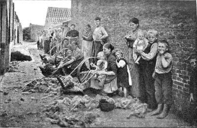

# Het historisch onderzoek van August De Winne 

De Brusselaar **August De Winne** (1861-1935) maakte in 1901 een journalistieke reportage voor de toenmalige socialistische krant _Le Peuple_. In 1902 verschenen zijn bijdragen voor het eerst in boekvorm onder de Franse titel _A travers Les Flandres_, met een voorwoord van de Gentse socialistische leider en eerste Vlaams socialistisch parlementslid **Edward Anseele** (1856-1938). Anseele vertegenwoordigde het grote arrondissement Gent-Eeklo, waartoe ook Knesselare behoorde. De eerste Nederlandse editie van het boek van De Winne verscheen in 1903 met als titel _Door arm Vlaanderen_. De reportage en de boekedities bevatten ook foto’s, onder andere de foto die we hier gebruiken. Wij werken met de herdruk van uitgeverij Van Halewyck, Leuven, 2001. In het hoofdstuk De mierenjagers komt Knesselare aan het woord via een kroongetuige in een Gents café. 

Aan de verdere uitwerking volgt later.

 

