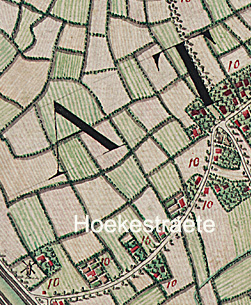
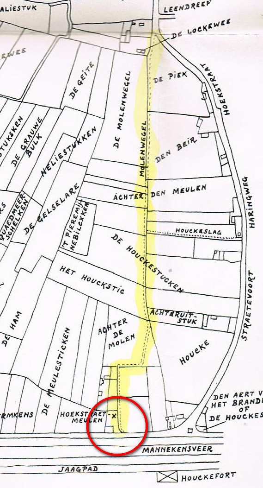
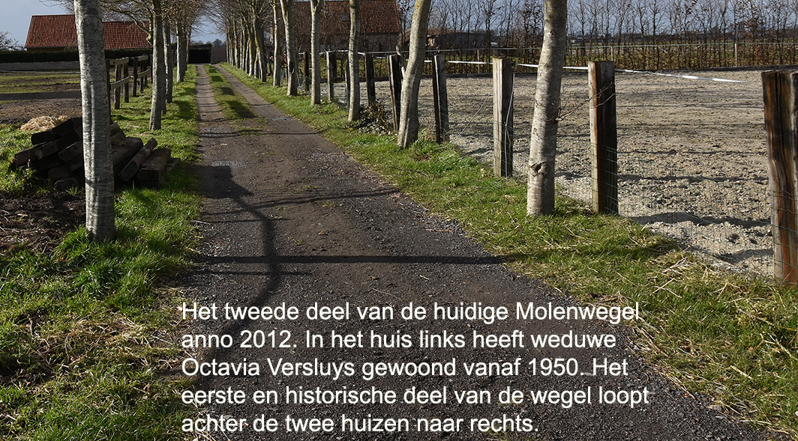
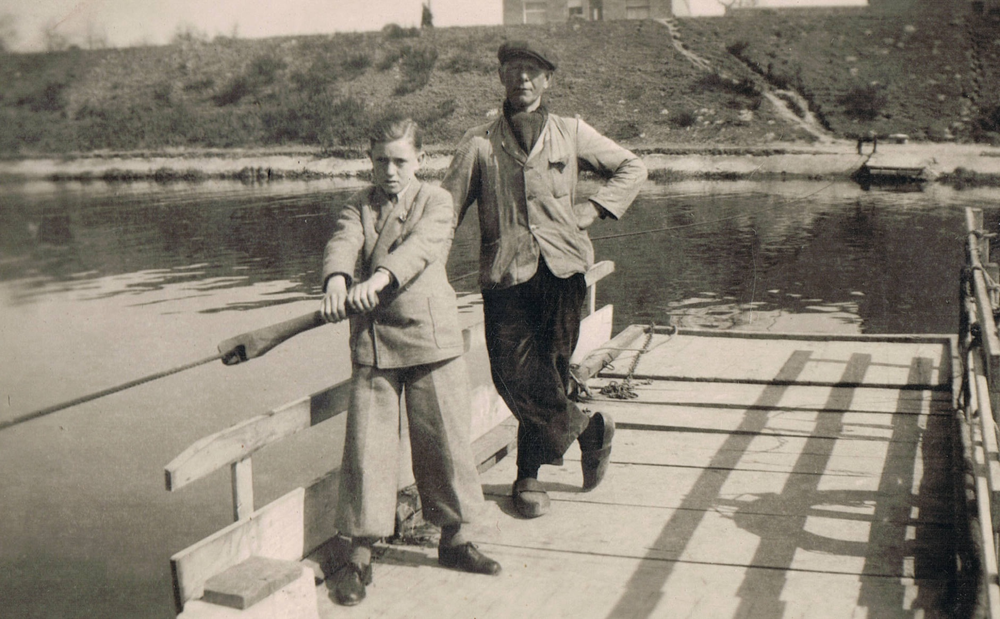

# De Molenwegel

De naam Hoekestraat, Knesselare, schreef men eeuwen geleden als ‘Hoekstraete’. Dat is te zien op de oude kaart van Ferraris van 1777. De omgeving van Hoekestraat heeft een hoofdrol gespeeld in het leven van de gezinnen Versluys – De Witte en De Bleeckere-Versluys. Vandaag loopt die straat vanuit het dorp Knesselare richting de Brugse Vaart en over de brug rechtdoor naar het station van Sint-Maria-Aalter. In een ver verleden was de naam Hoekestraat beperkt tot de grote buiging die de weg maakt. Omdat de weg niet lineair verliep, noemde men die in illo tempore ‘hoekig’. Dat is nog goed af te lezen van de kaart van Verhoutstraete/Ryserhove. Die is gepubliceerd in 1965 en is gebaseerd op kadastergegevens van het begin van de 19de eeuw. De kaart toont de plaats van ‘de Hoekstraetmeulen’ in de rode cirkel en de aparte Molenwegel in het geel. 

De kleine veldwegel die de Molenwegel heet, verwijst dus naar de historische molen aan de Brugse Vaart. Oude bronnen vertellen dat de molen in 1650 werd gebouwd op het historische Land van de Woestijne. Het was een houten korenwindmolen, gebouwd ongeveer een 150 meter ten westen van het begin van de Hoekestraat ter hoogte van de Brugse Vaart. De Hoekestraatmolen was één van de drie molens die Knesselare in de tweede helft van de 18de eeuw rijk was: de Plaatsemolen in het centrum, de Pietendriesmolen in het noordoosten en de Hoekestraatmolen in het zuidwesten. Van de Hoekestraatmolen blijft er vandaag geen enkel spoor meer over. De molen brandde af in 1683, wellicht tijdens een van de vele militaire schermutselingen die de bewoners van de streek hebben meegemaakt. De molen werd echter op dezelfde plaats weer opgebouwd. Hij is blijven functioneren tot in 1865. De molen werd stilgelegd na een tragisch ongeval. Het vijfjarig kindje van molenaar Bernard Martens liep tegen de draaiende molenwieken aan en was op slag dood. Molenaar Martens verhuisde naar de Plaatsemolen. De oude Hoekestraatmolen werd in 1867 definitief gesloopt.

De tweede kaart laat duidelijk zien dat de historische Molenwegel eigenlijk de bocht van de Hoekestraat afsnijdt en richting de molen loopt. Vandaag bestaat die historische Molenwegel niet meer, behalve het begin ervan schuin tegenover de Leendreef. Wel is er nog een spoor van een wegel gebleven dat eindigt achter het voormalige huis van weduwe Octavia Versluys en het buurhuis. Het feit dat beide huizen met hun rug naar de historische Molenwegel zijn gebouwd, wijst erop dat die Molenwegel toen niet meer in gebruik was, behalve als veldweg voor de lokale boeren. De twee huizen staan gericht naar de Hoekestraat. Men heeft blijkbaar beslist om de wegel van die twee huizen naar de Hoekestraat ook Molenwegel te noemen. De kleine weg komt loodrecht uit op de Hoekestraat. Wanneer de twee huizen zijn gebouwd, weten we nog niet. Wel kunnen we van de tweede kaart afleiden dat dit stuk van Molenwegel vermoedelijk moet zijn ontstaan op de grens van de toenmalige percelen Den Beir en De Piek. De kaart laat ook zien dat er vroeger een vrij groot stuk land lag dat eveneens ‘De Molenwegel’ werd genoemd. En tot in 1944 bestond er ook nog een herberg ‘De Molenwegel’. Het was toen een van de vijftig officiële herbergen die Knesselare rijk was. Waar de herberg ‘De Molenwegel’ zich juist bevond, is ons niet bekend. 

# De overzet

Hier komt het verhaal van de overzet.

# De brug

Hier komt het verhaal van de brug.