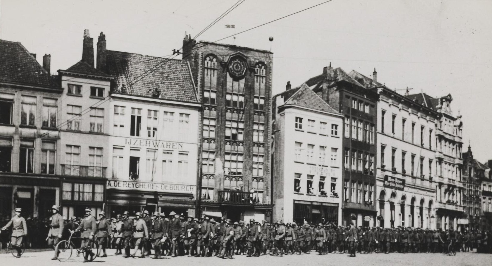
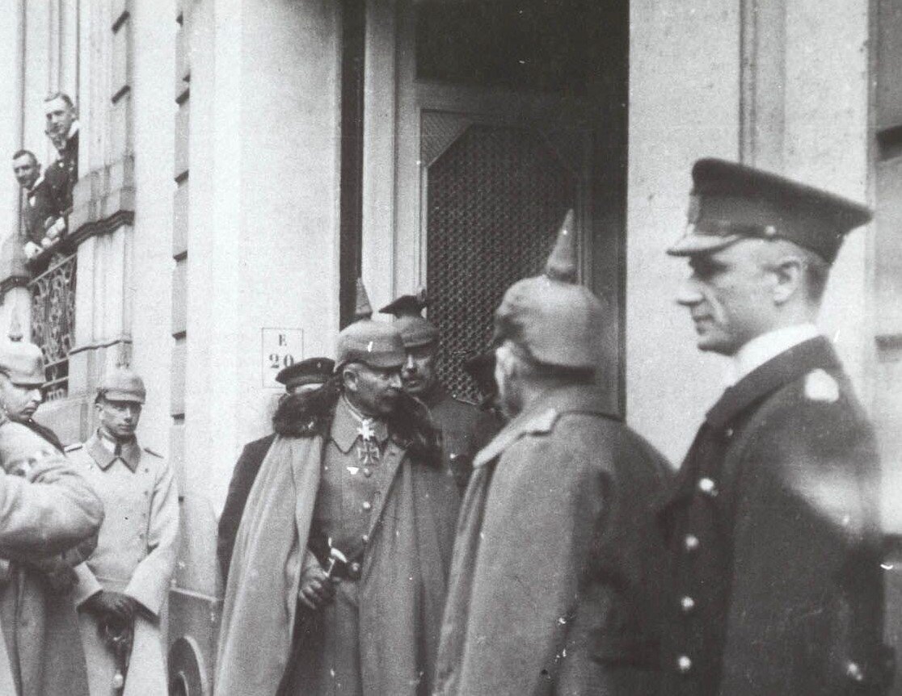
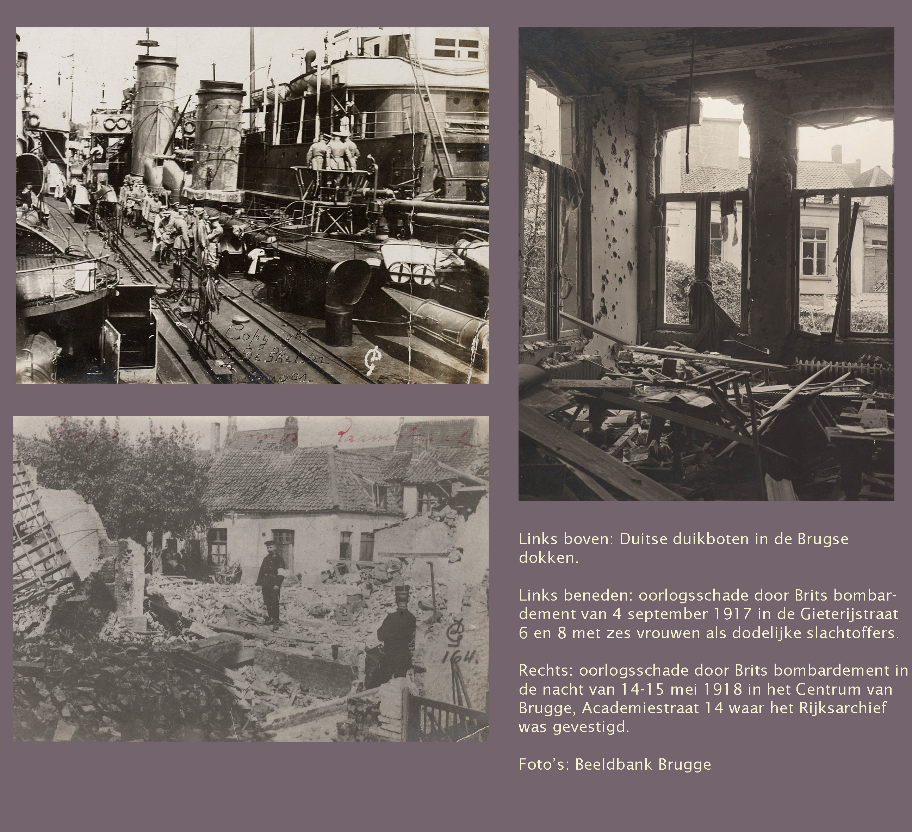
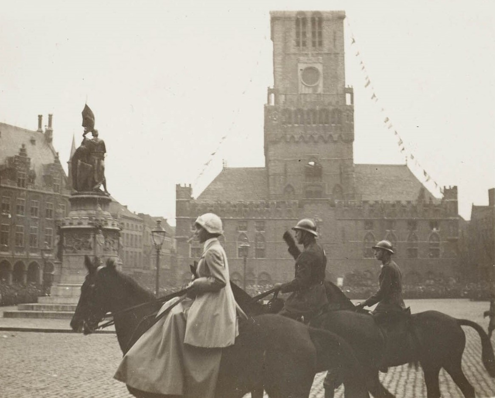

**HET 'DUITSE' BRUGGE VAN MARIA ELISA VERSLUYS** 

Toen in 2014-2018 de honderdste verjaardag van WO I werd herdacht, stond vooral de regio van de historische Ieper Boog (Ypres Salient) in de schijnwerpers. De Vlaamse en regionale overheden investeerden flink om de Westhoek een toeristische boost te geven. Het met soldatenkerkhoven bezaaide landschap van Flanders Fields werd op die manier een economische hefboom. Het vernieuwde Ieperse ‘In Flanders Fields’-museum fungeerde als centraal steunpunt. Deze visie had echter een keerzijde: één zijde van de oorlogsmedaille werd overbelicht, waardoor de andere zijde praktisch volledig werd vergeten. Aldus werd de reeds bestaande blinde vlek in het collectieve oorlogsgeheugen vergroot: het lot van de Belgische burgers die vier jaar lang ― meer dan 50 maanden en drie hongerwinters ― moesten zien te overleven onder de zware militaire bezetting door het leger van de Duitse Keizer Wilhelm II. Het liberale, jonge België veranderde plots in een Pruisische politiestaat.

Gelukkig zijn er altijd uitzonderingen op de algemene regel. In dit geval gaat het om een beperkte, maar wel erg belangrijke, driedelige uitzondering. Historicus Luc Schepens publiceerde in 1985 zijn doctoraatsstudie onder de titel ‘_Brugge Bezet 1914/1918 – 1940/1945. Het leven in een stad tijdens de twee wereldoorlogen_', hierna afgekort als BB. Zo’n twintig jaar later verscheen het grondige historische onderzoek van de Vlaamse en internationaal erkende historica Sophie De Schaepdrijver. Zij schreef de twee basisstudies over het lot van de vergeten burgerslachtoffers van de Duitse bezetting tijdens de Eerste Wereldoorlog in het algemeen, en van de Brugse bewoners in het bijzonder: ‘De Groote Oorlog’, met als ondertitel: ‘Het Koninkrijk België tijdens de Eerste Wereldoorlog’ (1997), hierna aangeduid met DGO, en ‘Bolwerk Brugge. Bezette Stad in 14-18’ (2014), hierna aangeduid met BOB. Dat laatste boek ondersteunde ook de historische tentoonstelling ‘Brugge in Oorlog’ (14 oktober 2014 ― 22 februari 2015) op de begane grond van de Brugse stadshallen. Die studies vormen de historische onderbouw voor ons verhaal van een van de ontelbare burgerslachtoffers van die Duitse bezetting: Maria Elisa Versluys.

Het medisch dossier van [Maria Elisa Versluys](https://www.debleeckere.be/1878-octavia-versluys/mozaik/3-versluys), dat Sylvain in het archief van het huidige Psychiatrisch Ziekenhuis Onze-Lieve-Vrouw in Brugge kon inkijken, onthult dat de mentale problemen bij haar zijn ontstaan tijdens de Duitse bezetting van Brugge tijdens de Eerste Wereldoorlog. Om dat te begrijpen, is het absoluut noodzakelijk kennis te nemen van wat die bezetting van Brugge voor de burgers concreet betekende; kennis die niet tot het collectieve geheugen behoort, zelfs niet bij de huidige Bruggelingen. Dat erkende ook de toenmalige burgemeester van Brugge, Renaat Landuyt, in 2014 in zijn voorwoord tot het genoemde boek ‘Bolwerk Brugge’ en de bijhorende tijdelijke tentoonstelling in Brugge:

>>_Als geboren Ieperling, kind van de frontstreek, moet ik toegeven dat ik tot voor kort niet op de hoogte was van de oorlogsgeschiedenis van Brugge. De tragische geschiedenis van de frontstreek is algemeen bekend, maar met de specifieke rol van Brugge in de Eerste Wereldoorlog en de omstandigheden tijdens de bezetting is het brede publiek veel minder vertrouwd._

Anno 2024 kunnen we, op basis van de beschikbare data, ons enigszins een beeld vormen van het enorme lichamelijke en mentale lijden dat de Duitse bezetting van Brugge de stedelingen heeft veroorzaakt. Maria Elisa was een van hen. Van de dag ― 12 juni 1894 ― waarop ze in Brugge was gearriveerd, tot de dag ― 14 oktober 1914 ― van de inname van de stad door de Duitse troepen, had Maria Elisa een succesvolle carrière als dienster opgebouwd in het centrum van de historische stad. Twee decennia lang. De Duitse bezetting van Brugge verbrak haar gunstige lot. Als ongehuwde vrouw vier jaar lang overleven in een permanente noodtoestand heeft Maria Elisa fysiek niet klein gekregen. Bij haar verplichte opname in Asile Notre-Dame in de zomer van 1921, noteerde hoofdgeneesheer Veys dat ze een lichamelijk gezonde vrouw was. Mentaal daarentegen had de aanhoudende militaire bezetting van de stad haar gebroken. Ze was geen uitzondering. Een naoorlogs medisch verslag over de gezondheidscrisis onder de Belgische bevolking in het jaar 1917 noteert: ‘Veel mensen waren zenuwlijders geworden.’ (DGO 255). De toestand in het bezette Brugge was echter nog erger dan in de rest van bezet België. Dat had een militaire reden. We schetsen hier de gebeurtenissen en de toestanden in bezet Brugge vanuit de optiek van Maria Elisa, in de ik/wij-vorm. Alle historische foto's, hier verwerkt, komen van de Beeldbank van Brugge.

>>_Toen de Grote Oorlog Brugge bereikte, was ik een van de 23.500 Bruggelingen die binnen de stadsmuren verbleven. Van hen waren er toen 4.000 vrouwen die een inkomen verdienden met het typisch Brugse exportproduct: het kantklossen. Ik behoorde niet tot die kantklossende vrouwen, want ik werkte in de horeca. Vooral het bekende Grand Café Charlemagne, vlakbij de Schouwburg, was mijn vertrouwde woon- en werkplek geworden. Er kwam belangrijk volk over de vloer, en de bezoekers konden er ook de Brugse kranten inkijken. Daardoor was ik goed op de hoogte van het laatste nieuws in België en mijn stad Brugge. Ik wist dus dat Duitsland vanaf 4 augustus 1914 in oorlog was met ons land. Maar die oorlog leek in Brugge nog veraf. Dat veranderde met de komst van de vluchtende Belgen die in Brugge aankwamen en verhalen vertelden over de beestachtige wreedheden van de Duitse soldaten. (BB 35-36). Vanaf 21 augustus sloeg de stemming in de stad om. Ik voelde hoe de gemoederen verhit raakten. De angst voor wat ons te wachten stond, nam met de dag toe. Je kon de nervositeit op straat zien opkomen. Op 6 september was bijna iedereen in de stad op de been voor de begrafenis van de eerste zes soldaten die in het Sint-Janshospitaal aan hun verwondingen waren overleden. Voor het eerst bracht de oorlog de dood in de stad. (BB 39) Het duurde nog iets meer dan een maand tot de Duitsers zelf onze stad bereikten. Op 14 oktober was het zover. Ik hoorde dat de Duitse troepen om 13u15 aan de Gentpoort stonden. Een uitzinnige paniek overmeesterde ons, Bruggelingen. ‘De stad was doods.’ (BOB 41) Iedereen bleef angstig binnen. Wat ging er nu met ons en de stad gebeuren? Wat gingen de Duitsers doen? Zouden er beschietingen komen en gevechten uitbreken?_ 

>>_Na een korte onderhandeling met onze burgemeester, Amédée Visart de Bocarmé, kreeg het Duitse leger de stad in handen zonder bloedvergieten. En om 15.00 uur trokken de Duitse troepen zegevierend door de straten naar de Markt. Het was hun zogenaamde ‘plechtige inname’. De volgende dag stelde ik vast dat de Duitse militairen het sierlijke en monumentale Provinciaal Hof als de zetel van hun militaire hoofdkwartier hadden opgeëist. Ik kende het gebouw goed, want ik was begonnen met werken in Café Craenenburg, dat vlak tegenover het Provinciaal Hof lag. Ik had altijd met bewondering naar het prachtige gebouw gekeken, maar vanaf nu werd het voor mij en mijn stadsgenoten een constante bron van angst. Daar zetelde nu de grote Duitse legerbaas, de Pruisische admiraal Ludwig von Schröder. Hij vestigde zich privé in een woning in de Ridderstraat. De man verzamelde een uitgebreide staf, bestaande uit een groep oudere beroepsmilitairen uit adellijke Oost-Pruisische families, een zeer machtige klasse in het Keizerrijk (BOB 49). We vernamen vrij snel dat de plaatscommandant voor de stad zelf de adellijke Pruis, Freiherr Horst Julius Treusch von Buttlar-Brandenfels, was. Hij deelde nu de lakens uit; onze burgemeester moest diens orders zonder discussie opvolgen. Voor ons werd die Freiherr al snel de meest gehate Duitser._

>>_Ik probeerde zelf de dagelijkse draad van het leven weer op te pakken, maar merkte dat dit steeds moeilijker werd. Net als iedereen moest ik bijna dagelijks de affiches gaan lezen met de verordeningen die de nieuwe Duitse machthebbers ons, burgers, oplegden. En die verordeningen werden met de dag strenger. Vanaf 26 oktober 1914 mocht geen enkele Bruggeling nog op de Markt blijven stilstaan. De ‘volle vrijheid van verkeer’ werd afgeschaft. Uit angst voor spionage liet het Duitse militaire bestuur niet toe dat Bruggelingen vanuit de stad contact hadden met bewoners van buiten de stad. Ik kon niet meer naar mijn familie in Knesselare, en zij konden mij niet meer in Brugge komen bezoeken. Alle fietsvergunningen werden ingetrokken vanaf 4 november; het verkopen of bezitten van de meeste dagbladen werd verboden; bezitters van reisduiven moesten zich onverwijld melden, en we waren verplicht Duits geld te aanvaarden. Niemand mocht na tien uur ’s avonds nog de straat op, en soms werd dat uur zelfs vervroegd. Niemand kon brieven of postkaarten verzenden, want tot de tweede helft van 1915 zat Brugge grotendeels zonder postbezorging. Daarna moesten alle brieven open verstuurd worden ter controle door de censuurdienst. Zelfs nieuwjaarswensen werden gecontroleerd (BOB 70-71). In Brugge zaten we echt opgesloten in onze eigen stad. Dat alles zaaide angst, die al snel in wanhoop omsloeg. Niemand, maar ook niemand, had ooit een oorlog meegemaakt. Wat kon er nog allemaal gebeuren? Wat stond ons nog te wachten? Zou dit lang duren? Maanden, jaren? Niemand had antwoorden._

>>_We vernamen dat onze stad het centrum werd van een apart militair gebied in bezet België. De Duitsers bouwden Brugge uit tot het hoofdkwartier van hun ‘Marinegebiet’, bestaande uit de driehoek Brugge – Zeebrugge – Oostende, bevolkt door een apart deel van het Duitse leger, het ‘Marinekorps Flanders’. Dit resulteerde in de oprichting van de U-Bootflottille Flanders op 29 maart 1915, en een maand later van de Torpedobootflottille. Die oorlogsboten lagen verschanst in de landinwaarts gelegen dokken van de stad. Daar stonden enorme hangars van gewapend beton om de destroyers en torpedoboten te beschermen tegen Engelse bommenwerpers. Na verloop van tijd werd de Vlaamse kust een van de zwaarst verdedigde kustlijnen ter wereld (BOB 61). Dat de Brugse haven, met directe verbinding naar Zeebrugge en Oostende, voor de Duitsers militair van grote betekenis was, bleek uit het feit dat de Duitse keizer Willem II zelf drie keer naar Brugge is gekomen: in oktober 1915, 1916 en april 1918. Op 21 april 1918 ving ik een glimp van de Duitse heerser op in de Sint-Jorisstraat 20, waar het hoofdkwartier van de duikbootbasis was gevestigd. In het Grand Café Charlemagne hoorde ik iemand vertellen dat hij op 24 april had gezien dat de keizer de Onze-Lieve-Vrouwekerk had bezocht._ 

>>_Duizenden mecaniciens van de Duitse marine werkten aan de Brugse dokken en maakten van de duinen van Oostende en Zeebrugge één lange, met kanonnen en granaatwerpers versterkte vesting. Al die Duitsers moesten in de stad worden gehuisvest, en daartoe eisten het Duitse bestuur steeds meer huizen op. Onze stad onderging een gedaantewisseling: ze veranderde in een Duits militair-maritiem bolwerk (BOB 15). De stad werd overspoeld met Duitsers. De Duitse frontsoldaten mochten, telkens na een frontdienst van drie à zes 
maanden, gedurende twee tot vier weken in Brugge verblijven om er te herstellen, uit te rusten en te oefenen. Zij brachten gruwelverhalen mee over het front. Ze vertelden over de gevaarlijke gasaanvallen. Hun verhalen beangstigden mij. Zouden die giftige dampen naar Brugge kunnen overwaaien?_

>>_Ook die Duitse frontsoldaten, mannen en jongens, moesten worden ingekwartierd in Brugse gezinnen of ondergebracht in openbare gebouwen, kazernes, scholen en kloosters. Ik zag ook Duitse hoogwaardigheidsbekleders en hogere militairen, die van elders in het land naar Brugge op militair verlof kwamen. Ze beleefden Brugge als een toeristische stad, waar ze onder andere de Vlaamse Primitieven in het Museum van Oude Kunst bewonderden. Ik zag hen in de stad met hun fototoestellen gebouwen fotograferen. Die foto’s zonden ze dan naar hun familie in Duitsland. Door al die Duitse heren en manschappen in onze stad kregen we dagelijks het besef een bezette stad te zijn, waar we niet als echte burgers, maar als gevangenen werden behandeld. Het bezettingsbeleid werd immers maand na maand strenger. We vernamen dat de Duitse opmars was gestopt, dat er zich een loopgravenoorlog had gevormd en dat Brugge deel uitmaakte van de Duitse verdedigingslinie, en tevens de uitvalsbasis was voor kleinschalige aanvallen op de Britse zeevaartroutes (BOB 53). In de stad hoorden we constant het geluid van de beschietingen aan het front. De Engelsen hadden met hun vloot een blokkade gevormd en Duitsland afgesloten van iedere toevoer van voedsel en grondstoffen vanuit de niet door hen bezette gebieden. In het westen was de Noordzee voor de Duitsers nu de poort van hun gevangenis, en wij zaten in Brugge met de Duitsers mee in die gevangenis (BOB 53)._

>>_We kenden constant gebrek aan voedsel. De Duitse bestuurders eisten immers alle beschikbare voedselvoorraden op, evenals de beschikbare kolen en zelfs kachels. We hoorden dat het Duitse opperbevel in Brussel België beschouwde als ‘een citroen die ze wilden leegpersen’. De hoge Berlijnse militairen gaven het bevel om in België een ‘militaire dictatuur’ in te stellen. Ons vrije België mocht nooit meer onafhankelijk worden, en het zou voor altijd een bevoorradingsschuur voor Duitsland blijven. Dat Duitse opperbevel vorderde alle inlandse Belgische goederen en versleepte die op grote schaal naar Duitsland (DGO 146-147). De gevolgen hiervan voelden we in Brugge, wegens de massale aanwezigheid van zoveel Duitse militairen die altijd op de eerste plaats kwamen. Wij werden niet eens als tweede- of derderangsburgers behandeld. Niet alleen de Duitse bezetter maakte ons dagelijks bestaan onmenselijk hard; de drie erg koude hongerwinters kwamen daar bovenop. Tijdens de winter van 1916-1917 bleef het onophoudelijk vriezen tot in april 1917. In die maand viel er nog hevige sneeuw, die pas tegen het eind van de maand dooide. Iedere winter werd onze strijd om te overleven harder. Overal zag je de misère toenemen. De rantsoenen waar we recht op hadden, waren hopeloos onvoldoende. Vanaf februari 1917 kreeg ik, zoals iedere modale Bruggeling, een halve liter dunne melk per dag en 50 gram boter per week. Vanaf januari 1918 was er helemaal geen boter meer, omdat er geen melk meer was (BB 73). Ik heb zelf mensen van ondervoeding zien flauwvallen op straat; de kinderen waren te zwak om naar school te gaan. Bovendien sloegen de Duitse bestuurders in die derde hongerwinter alle nog beschikbare kachels aan om die naar het front te brengen, en werd ons stadsbestuur nog eens gedwongen om 40% van de haar toegemeten kolenvoorraad, nodig voor koken en verwarmen, voor te behouden aan de verwarming van de door de Duitsers bezette gebouwen en kamers (BOB 141-142)._

>>_En of het allemaal niet erg genoeg was, kwamen daar de Britse bommen en het Duitse luchtafweergeschut bij. In de eerste maanden van 1918 werd dat oorlogsvuur van beide kampen intenser. Wij, Bruggelingen, kwamen nu tussen twee vuren te liggen: de Britse bommen en de zes Duitse batterijen van luchtafweerkanonnen, opgesteld rond de stad. Aan beide kanten experimenteerde men, omdat de afstelling van de bommenwerpers en het afweergeschut nog helemaal niet op peil stond. Onze stad kreeg aldus van beide kampen oorlogsvuur te verwerken. Direct na de oorlog las ik in de kranten dat er in totaal zo’n 6.000 vliegtuigbommen terechtkwamen in de binnenstad en de randgemeenten. De Britse vliegtuigbombardementen maakten 123 dodelijke burgerslachtoffers, waaronder een hoog percentage kinderen. Dubbel zoveel Bruggelingen raakten zwaar gewond, 126 huizen werden volledig vernield en 418 woningen liepen zware schade op. Vanaf 22 mei 1918 kregen we als burgers zelfs het verbod om bij nachtelijke aanvallen te vluchten naar de grote schuilkelders die in oktober 1917 waren gebouwd. In diezelfde periode verkeerde het Duitse bestuur in paniek. Het eiste de meest alledaagse gebruiksvoorwerpen op, zoals matrassen, omdat het Duitse leger aan het front wol nodig had (BOB 182)._

>>_Maar wij, Bruggelingen, putten moed, want het gonsde van geruchten dat het Duitse leger aan het bezwijken was. Reeds begin 1917 raakte bekend dat het Duitse leger gebrek aan soldaten had, dat steeds meer weerbare Duitse mannen uit de fabrieken werden gehaald en dat de burgerlijke dienstplicht in het hele Rijk was ingevoerd. In Brugge fluisterden het personeel van de horeca dat er steeds meer zelfmoorden in de Duitse garnizoenen voorkwamen, en dat Duitse officieren hotelkamers huurden waar ze zich ’s nachts verhingen. Vanaf de herfst van 1917 begon de algehele discipline in het Duitse leger te verslappen (BOB 265). Maar vanaf de late zomer van 1918 voelden we dat het einde van onze Duitse kwelling in zicht kwam. Op 29 september 1914 kreeg Von Schröder van de keizer de opdracht de Vlaamse kust te evacueren. Het Marinekorps Flanders werd op 6 oktober ontbonden. We hoorden tussen 14 en 18 oktober grote ontploffingen. Het Marinekorps vernietigde met zeemijnen de twee elektrische centrales, de waterreservoirs en de overblijvende machines van La Brugeoise. Burgers vertelden op 17 oktober dat ze hadden gezien dat om halfeen ’s middags Von Schröder met de auto Brugge had verlaten. We konden weer vrij ademen, zeker wanneer we zagen dat in de vroege ochtend van 19 oktober de laatste Duitsers de stad ontruimden via de Katelijnepoort (BOB 185). De straten zagen weer zwart van het volk. Ik zag op 18 en 19 oktober de eerste Belgische frontsoldaten in de stad aankomen om hun familie terug te zien. En op 19 oktober hoorde ik alle Brugse klokken luiden._ 

>>_Twee dagen later stond ik met vele stadsgenoten op de Markt om voor het eerst onze koning Albert en koningin Elisabeth, samen met kroonprins Leopold, in levende lijve te zien en hen enthousiast te verwelkomen. Ook al waren we lichamelijk en geestelijk uitgeput, we vonden de kracht om hen toe te juichen. Maar de vreugde duurde niet lang. De directe gevolgen van het harde oorlogsbestaan bleven we voelen. De Spaanse griep brak uit in Brugge van 24 oktober tot december 1918. En de hongersnood bleef aanhouden. De wrede Duitsers waren weg, maar onze dagelijkse strijd om te overleven niet. De chaos en de angst tijdens de lange oorlog hadden zich in mijn geest genesteld; alles leek zich tegen mij te keren. Ik voelde me mentaal wegglijden. Ik kon niemand om hulp vragen._

