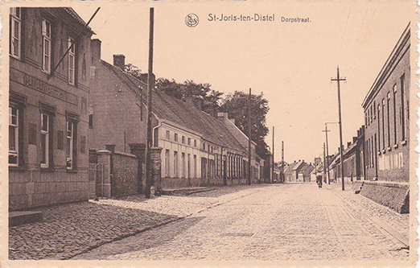

# Sint-Joris-ten-Distel

In het West-Vlaamse grensdorp Sint-Joris-ten-Distel stond de wieg van [Vitalis](1879-de-bleeckere). Zoals te zien is op deze oude prentkaart liep het kanaal Brugge-Gent voorbij het dorp. De baan die vanuit het dorp langs het kanaal, voorbij het herenhuis, loopt, gaat richting het Oost-Vlaamse Sint-Maria-Aalter, en zo verder naar Aalter-Brug. Komende vanuit het dorp, kon met ook de houten brug overrijden. Een deel van het dorp bevond zich immers aan de andere kant van het kanaal. Maar er was meer. De brug opende ook de weg naar het nabije gelegen Oost-Vlaamse dorp Knesselare. Vitalis ging ooit die weg om er [Octavia Versluys](1878-octavia-versluys) tegen te komen, en samen met haar een gezin te stichten in Knesselare.

