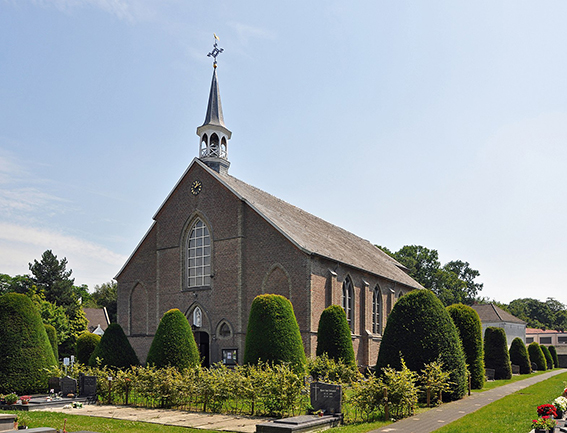

# Knesselaarsestraat

De gezinnen van [Maurits](1916-maurits-de-bleeckere) en Flora Verscheure, en van [Albert](1918-albert-de-bleeckere) en Julia Hooft situeren zich in Sint-Maria-Alter. Beide gezinnen woonden in de Knesselaarsestraat. De naam zegt het. Het is de straat die rechtstreeks naar Knesselare leidt. Maurits en Flora bewoonden het laatste huis van Sint-Maria-Aalter aan de rechterkant. De grens met Knesselare bevondt zich op 100 meter van de officiële grens. Al de ramen van het huis keken uit naar Knesselare. De muur van het huis richting Sint-Maria-Aalter had geen ramen. Het huis weerspiegelde hiermee het feit dat de bakermat van de familie Knesselare was. De grenspaal van West-Vlaanderen ter hoogte van Sint-Joris-ten-Distel bevondt zich op nog geen kilometer van het huis. Ook daar stond een belangrijk deel van de bakermat van de familie. Er werd dan ook regelmatig met de fiets of met de brommer via het kanaal naar Sint-Joris-ten-Distel gereden.   

# De oorsprong

# De kerk met kerkhof

