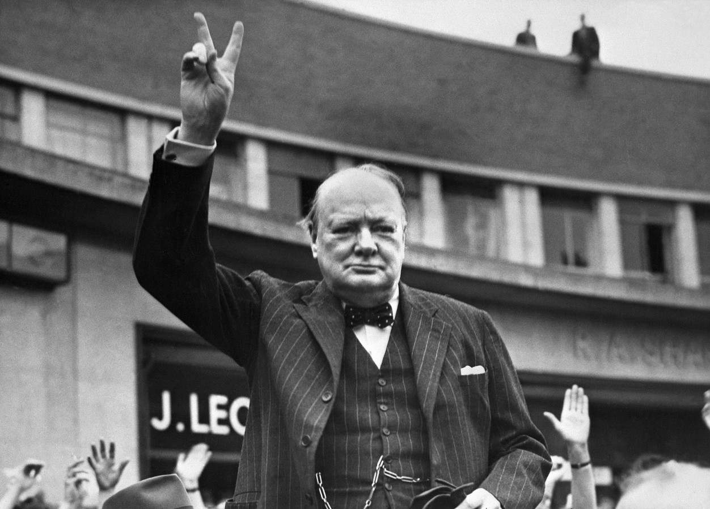

# Onze soldaten in de Tweede Wereldoorlog

Hier stellen we die leden van de families De Bleeckere-Versluys voor die persoonlijk met de Tweede Wereldoorlog direct betrokken zijn geweest, hetzij als militair hetzij als burger.

>**Sergeant Henri Versluys**

De Tweede Wereldoorlog heeft een dodelijk spoor nagelaten in het gezin [Alfons Versluys-Elisa Danneels](https://www.debleeckere.be/1878-octavia-versluys/mozaik/3-versluys). Henri was geboren te Aalter op 5 augustus 1905 als het tweede kind en de eerste zoon van Alfons en Elisa. Hij is de eerste van de kinderen die in Aalter is geboren. Wellicht is de eerste zoon van Alfons en Elisa genoemd naar zijn peter, Henri Versluys, de broer van Alfons.

>

We beschikken over vier foto’s van sergeant Henri door toedoen van Frans Van Haver. De twee foto’s links zijn genomen tijdens zijn legerdienst in de Belgische kazerne Kamp Elsenborn. Sinds 1998 is er het museum Truschbaum Museum opgericht. Het terrein zelf is nu een multinationaal oefenterrein van de NAVO.

Het kleine dorp Elsenborg, vandaag een deelgemeente van Bütgenbach in de Belgische Oostkantons, behoorde  tot voor de Eerste Wereldoorlog nog tot Duitsland. Na die oorlog kreeg Elsenborn naambekendheid wegens zijn Belgische kazerne Kamp Elsenborg. Gesticht in 1894 werd het kamp eerst gebruikt door het Pruisische leger dat in 1901 reeds 4000 à 5000 Duitse soldaten kazerneerde. Volgens het Verdrag van Versailles (1919) kon het Belgische leger het jaar daarop al het kamp overnemen. Het werd ingericht voor de opleiding van de Belgische artillerie. 

Sergeant behoorde tot hen die voor de nodige voorzieningen zorgden. Hij werkte in de keuken als beenhouwer. Die vaardigheid had hij van thuis meegekregen. Op de bovenste foto van links zien we hem met zijn collega’s van de slagerij onderaan de foto, van links geteld de twee persoon zittend met een groot slagersmes in zijn rechterhand. Rechts van hem staat een grote melkkan waarop hij en nog iemand neerzit. Op die kan staan twee jaartallen waarvan we enkel de 19.. kunnen lezen. Bij het onderste getal is nog een 2 leesbaar: 192.. Volgens Frans Van Haver is dat vermoedelijk 1926, het jaar dat Henri kon afzwaaien als soldaat. De tweede foto van links sluit daar bij aan. Hier zien we slechts zeven personen met links onder Henri met een lang voorwerp, vermoedelijk ook een instrument van de beenhouwer tijdens het slachten. Op de deur staat de tekst: ‘encore 56 demain matin’. Henri heeft op zijn bovenste werkkledij het getal 57 geschreven. Toen de foto werd genomen, moesten ze dus nog 57 dagen in het leger blijven. De rechtse fotorij zijn persoonlijke foto’s. De bovenste is die van zijn bidprentje dat bij zijn begrafenis werd uitgedeeld. Die foto is genomen uit zijn huwelijksfoto die we onderaan zien. Na zijn legerdienst huwde Henri met Maria Alicia D’Hoore. 

Toen Hitlers troepen onaangekondigd op 10 mei 1940 de Belgische grens overstaken, begon in België de Tweede Wereldoorlog. Het Belgische leger was geen partij voor de goed voorbereide en uitgeruste Duitse soldaten. De Belgische soldaten moesten zich snel terugtrekken om na de Achttiendaagse Veldtocht uiteindelijk te capituleren. Henri was sergeant in het zich terugtrekkende Belgische leger. Hij was dus opgeroepen als soldaat-beenhouwer ofschoon blijkt dat hij reeds leed aan een ziekte, welke weten we niet. Tijdens de Achttiendaagse Veldtocht moet de ziekte nog zijn toegenomen en moest Henri op zeker ogenblik opgenomen worden in het militair veldhospitaal op de site van de Abdij van Zevenkerke bij Brugge. Daar is Henri op 2 juli 1940 overleden. Hij was net geen 35 jaar geworden. Op zijn bidprentje lezen we: Troost u, ik sterf, slachtoffer eener edele zaak. Ik deed mijn plicht, dan ook wanneer de ziekte mij reeds kwelde. Kunt gij voor uwen echtgenoot, uw zoon, een dood dromen, eervoller in de ogen van God en van de menschen? 

Hieruit blijkt duidelijk dat Henri niettegenstaande hij een ziekte toch is ingegaan op de oproep van het Belgische leger om de Duitsers tegen te houden. De combinatie ‘ziekte én oorlog’ is Henri fataal geworden. Toen hij overleed in Zevenkerken in de vroege zomer van 1940, liet hij een weduwe achter. 

Op het bidprentje van Alfons Versluys, de vader van Henri, lezen we een expliciete verwijzing naar zijn overleden zoon Henri. De tekst is in de ik-vorm opgesteld door de toenmalige pastoor van Aalter, helemaal in de geest en de letter van de leer van de rooms-katholieke kerk. Er staat: Duurbare kinderen, niets liet vermoeden dat ik zo rap Moeder op de weg van de Eeuwigheid volgen zou. Wat God doet, is welgedaan, en Zijn wetten is geen verandering mogelijk. Van hierboven zullen we beide, samen met uw broeder Henri steeds over u blijven waken en voor u ten beste spreken.

Sergeant Henri Versluys is eerst begraven op het militair kerkhof van de Abdij van Zevenkerken en is nadien herbegraven op het kerkhof van Aalter.

# Familieverhalen over het thuisfront in de Tweede Wereldoorlog

 

