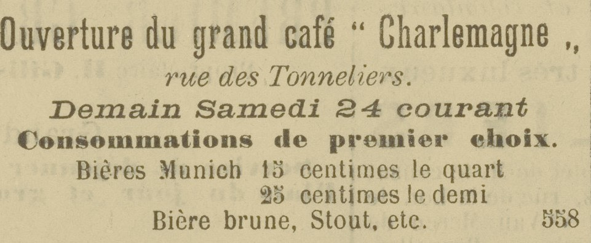
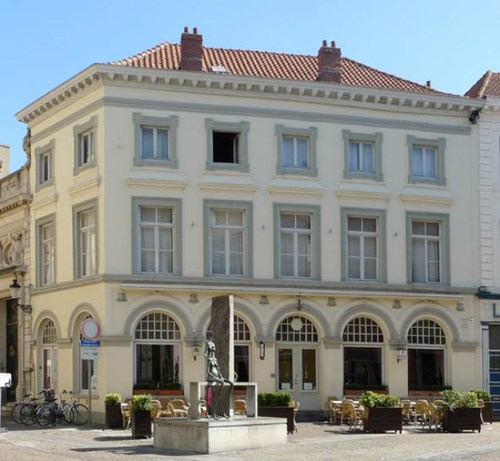
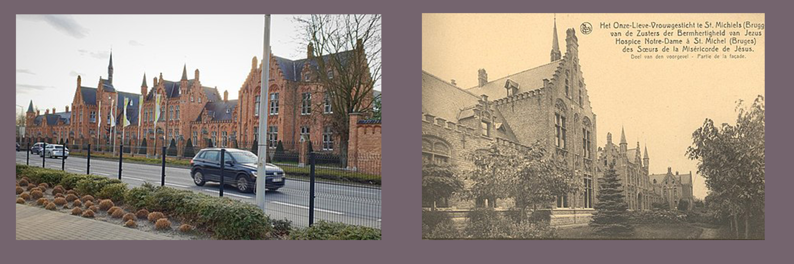

**HET GRAND CAFE CHARLEMAGNE**

Het belangrijkste deel van het actieve leven van [Maria Elisa Versluys]((https://www.debleeckere.be/1878-octavia-versluys/mozaik/3-versluys)) is nauw verbonden met Grand Café Charlemagne. In de eerste twee decennia van de 20ste eeuw was het geen gewone volkscafé. Het was een etablissement met prestige. De lange Franse naam getuigt daarvan. Het neoclassicistische breedhuis met horecafunctie, alsook de aanpalende huizenrij in dezelfde neoclassitische stijl, was ontworpen door niemand minder dan de toenmalige gevierde stadsarchitect Louis Delacenserie. Het hele project, het breedhuis en huizenrij, dateert van de laatste periode van diens carrière. Hij stierf in september 1909.

Hierboven: Advertentie in _La Patrie_ van 23 augustus 1901 over de opening van Grand Café Charlemagne ’s anderendaags, op zaterdag 24 augustus.

 Het Grand Café opende plechtig op zaterdag 24 augustus  1901. De eerste eigenaar van Grand Café Charlemagne heette Arthur Van Besien. Hij was de werkgever van Maria Elisa die vanaf eind december 1906 een vertrouwd gezicht werd in het chique, toen nog nieuwe koffiehuis. Er kwam zeker veel artiestenvolk over de vloer want het Café paalt aan de Stadsschouwburg. Trouwens vandaag heet het ondertussen gerenoveerde gebouw met een buitenterras Café Du Theatre.
 

 
 Uit de historische Brugse kranten ― Burgerwelzijn, Gazette van Brugge, Brugsch Handelsblad, Het Brugse Vrije, La Patrie, Journal de Bruges, Le Reveil de Bruges ― die Sylvain via de site van Erfgoed Brugge heeft kunnen raadplegen, weten we dat de belangrijke notariële verkopen van de toenmalige Brugse notarissen René Fraeys, Eugeen Kerkhofs, De Vestele en Léon Termote regelmatig plaatsvonden in het Grand Café Charlemagne. De voertaal was meestal Frans. De notarissen René Fraeys en Léon Termote La Patrie plaatsten in La Patrie, de editie van 29 december 1906, de eerste werkdag van Maria Elisa in Grand Café Charlemagne, een openbare verkoop van een ‘maison de campagne’ van 2070 m2 in Sint-Michiels met een pachtopbrengst van 240 Belgische frank per jaar. De verkoop ging door op 12 januari 1907 om 15u00 in Grand Café Charlemagne. In een aparte zaal van de zaak vonden er ook regelmatig lezingenreeksen plaats, onder andere van het Brugse Willems-Fonds, verzorgd door wetenschappers die hun moderne kennis aan een cultureel publiek wilden doorgeven. De avondlijke repetities van de koorleden van Le Cercle dramatique, choral et philantropique gingen geregeld door in Grand Café Charlemagne. De zaak beschikte ook over een ‘grooten billard’ en organiseerde biljartwedstrijden waarvan de eerste prijs anno 1901 35 Belgische frank bedroeg. Er was dus heel wat sociale, culturele en economische bedrijvigheid in Grand Café Charlemagne en het was duidelijk dat het een ontmoetingsplaats was voor de gegoede, in die tijd hoofdzakelijk mannelijke burgerij of bourgeoisie van Brugge.

 
 Dit is het renoveerde Grand Café Charlemagne, vandaag Café du Theatre.

**ASILE NOTRE-DAME TIJDENS HET VERBLIJF VAN MARIA ELISA VERSLUYS**

Het beeld rechts toont de voorgevel van het Asile Notre-Dame in het beginjaren van zijn ontstaan en werking en hetzelfde gebouw vandaag, nu Psychiatrisch Ziekenhuis Onze-Lieve-Vrouw genoemd (beeld links). We beschikken over [twee wetenschappelijke studies](https://www.debleeckere.be/onderzoek-bronnen) over de geschiedenis van de instelling. De eerste is geschreven naar aanleiding van de 75ste verjaardag van het bestaan van het gebouw en het ziekenhuis voor mentale zieken. De studie werd uitgevoerd door Jozef Geldhof en verscheen in 1975. De tweede studie verscheen in 2013 naar aanleiding van het honderd jaar bestaan van het gebouw en het ziekenhuis voor geesteszieken. Die studie is van de hand van Joris Casselman. 

Toen Maria Elisa Versluys in het Asile Notre-Dame te Sint-Michiels werd opgenomen in 1921, was het gebouw vrij nieuw. Het initiatief voor het nieuwe gebouw kwam voort uit de nood om de toenemende geesteszieken te Brugge te kunnen blijven opvangen. Voorheen leidde de Brugse kanunnik Petrus Maes (1806-1877) de belangrijke, 19de eeuwse Brugse, katholieke instelling voor ‘krankzinnigen’: Sint-Juliaansgesticht in de Boeveriestraat, waar zieke mannelijke en vrouwelijke patiënten werden verbleven. Om over geschikt verzorgend personeel te kunnen beschikken en om ervoor te zorgen dat de zorg in kerkelijke handen bleef, stichtte kanunnik Maes samen met zuster Marie-Joseph Van Uxem, algemeen overste van de Antwerpse Congregatie van de Zusters Apostolinnen, in 1842 de nieuwe vrouwelijke kloosterorde, de Zusters van de Bermhertigheid Jesu. De zusters waren actief in de hoofdzetel van Sint-Michiels, maar ook in Ieper. Sint-Juliaans kampte rond 1900 met plaatsgebrek en het gebouw was heel erg verouderd. De priester en latere kanunnik Josef Sansen (1863-1930) was toen directeur van Sint-Juliaans. In 1905 engageerde hij de Ieperse stadsarchitect Jules Homère Coomans (1871-1937) voor de bouw van een nieuw en onafhankelijk psychiatrisch krankzinnigengesticht voor vrouwen op een terrein van 40 hectaren te Sint-Michiels. De eerste steen werd gelegd op 8 december 1906, de bouw van het monumentale gebouw groeide uit tot een attractie voor de Brugse bevolking. 

De officiële opening gebeurde op 17 augustus 1910. Het gesloten complex met verblijfplaatsen voor de patiënten en met een klooster voor de zusters kreeg een neogotische baksteenstijl die toen in Brugge erg modieus was. Het gloednieuwe ziekenhuis  was berekend op 400 behoeftige zieken, ingedeeld in twee groepen: ‘les furieuses’ en ‘les démentées’, plus 50 betalende zieken, ‘les pensionnaires’, vrouwen uit de begoede burgerij en adellijke families. De instelling beschikte daartoe over een boerderij, een grote groentetuin, waar zo’n 30 patiënten mochten meehelpen. Er was eveneens een feestzaal voor toneelopvoeringen, concerten en plechtigheden. In de grote kapel konden de patiënten de dagelijkse  gebedsdiensten samen met de zusters bijwonen. Op de boerderij en in de tuin konden 30 patiënten helpen. De plechtige inzegening van het gloednieuwe en impressionante gebouw gebeurde op 14 april 1911 door de toenmalige bisschop van Brugge, Gustavus Waffelaert. Het was voor iedereen duidelijk: het Asile Notre-Dame was een door en door katholieke instelling. Maria Elisa heeft tijdens haar verblijf één directeur, kanunnik Eugeen Tyteca, en twee hoofdgeneesheren gekend: Eugeen Veys die in 1925 werd opgevolgd door dr. Michel Vanden Weghen. 

Het verblijf van Maria Elisa in het Asile van Sint-Michiels situeerde zich in het tweede decennium van de twintigste eeuw en in de eerste drie jaren van het derde decennium. Tijdens die periode stond het Asile nog volledig het teken van het wegwerken van de gevolgen van de bezetting door het Duitse leger van de stad Brugge. Die gevolgen situeerden zich op het materiële vlak. Door de Duitse militaire opeising van de totale evacuatie van het gebouw in maart 1915, na de oorlog nog gevolgd door de opeising van het gebouw door en voor het Belgische leger gedurende een half jaar, bleef er van de medische voorzieningen en het klooster niet veel over. Wanneer op 31 maart 1919 de zusters en de patiënten terug aankwamen in hun voormalig ziekenhuis van Sint-Michiels vonden ze er een ware puinhoop. Alles moest worden hersteld en heringericht. Er waren gigantische, materiële problemen en tegelijkertijd moesten de dreigende tuberculosebesmettingen en de opstoot van de Spaanse griep worden beheerst. En daar bovenop kwam nog de permanente overbevolking daar het personeel en de patiënten van Ieper enkele jaren, tot in 1928, ook in het gebouw van Sint-Michiels moesten worden opgevangen. De noodzakelijke herstelwerken vorderden wegens een gebrek aan financiële en materialen erg langzaam. Pas in 1920 beschikte het Asile over een telefoonverbinding en werkte de elektriciteitsinstallatie terug vanaf 1924, toen verbleef Maria Elisa al drie jaar in het Asile. Ze heeft de afwezigheid van degelijke zorg ervaren. In 1910 waren er voor het eerst 18 zusters met een diploma ziekenverzorging, dat ze hadden behaald voor een examencommissie van de staat. Na de oorlog kampte de Congregatie van Zusters van de Bermhertigheid Jesu met een gebrek aan roepingen en intredingen, wat zich in de zorg van de patiënten liet voelen. De zusters die er wel waren, hadden hun handen vol en moesten zich concentreren op de zorg voor hygiëne wegens de heersende tuberculoseplaag en de opstoot van de Spaanse griep, allebei een direct gevolg van de ontberingen in en rond Brugge tijdens de Duitse bezetting.

Om een idee te krijgen van de verzorging in de jaren 20 van vorige eeuw, beschikken we over het officiële jaarverslag van 1929. Dat bericht dat 92 patiënten in het naaiatelier werkten, 20 patiënten in het was- en strijkatelier, 46 patiënten deden huiswerk, 34 patiënten tuin- en landbouwwerk en 124 patiënten voerden allerlei klusjes uit op de paviljoenen. Het betreft patiënten die door de hoofdgeneesheer geschikt waren bevonden om in die ateliers mee te werken. Maria-Elisa heeft af en toe meegewerkt in de tuin, doch de meeste tijd isoleerde ze zich van haar lotgenoten omdat haar achtervolgingswaan bleef aanhouden. Echte psychiatrische hulp en begeleiding was onbestaande. De toenmalige katholieke visie op psychische zorg steunde op het concept van ‘morele behandeling’. De directeur en de zusters gingen ervan uit dat hun patiënten op een of andere manier terug op het morele goede pad moesten worden gebracht en dat kon best door de vrouwen zoveel als mogelijk het vrouw-model van de kloosterzuster voor te houden. Dat impliceerde veel bidden en geestelijke oefeningen. Daarnaast voorzagen de zusters ook ontspanning voor de patiënten: bezigheidstherapie in de genoemde ateliers, wandelingen en cultuuractiviteiten in de feestzaal. Daar die methode niet zomaar werkte, moesten de zusters bij sommige patiënten ook gebruik maken van dwangbuizen en spanlakens. In het geval van Maria Elisa weten we dat dr. Veys haar ook op ‘de stoel van de elektroshocks’ heeft geplaatst. Het zou duren tot na de Tweede Wereldoorlog, tot de aanstelling van de neuropsychiater Albert De Haene in 1945 als hoofdgeneesheer van het Onze-Lieve-Vrouwegesticht, dat de echte psychiatrie haar intrede doet in het Asile Notre-Dame dat Maria Elisa als patiënte heeft meegemaakt.
