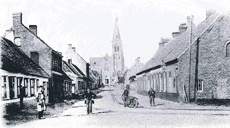

# Knesselare

In Knesselare heeft zich het grootste deel van het leven van [Vitalis](1879-vitalis-de-bleeckere) en [Octavia](1878-octavia-versluys) afgespeeld, alsook dat van hun kinderen en de meeste van hun kleinkinderen. Deze zeer oude prentkaart toont de Kerkstraat, een weg die, zoals de naam zegt, recht naar de kerk leidt. Die weg is ontelbare keren afgelegd door het gezin De Bleeckere. Ze woonden immers in Hoekestraat, een belangrijke straat die vanuit het zuiden rechtstreeks via de Kerkstraat naar het centrum van het dorp leidde. Dat is heden nog zo.    

