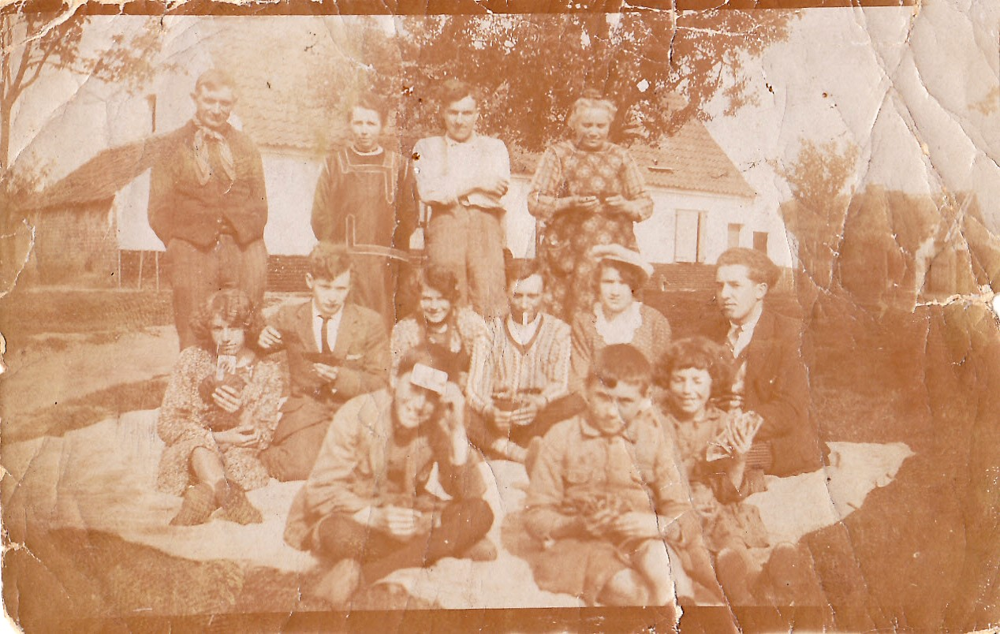
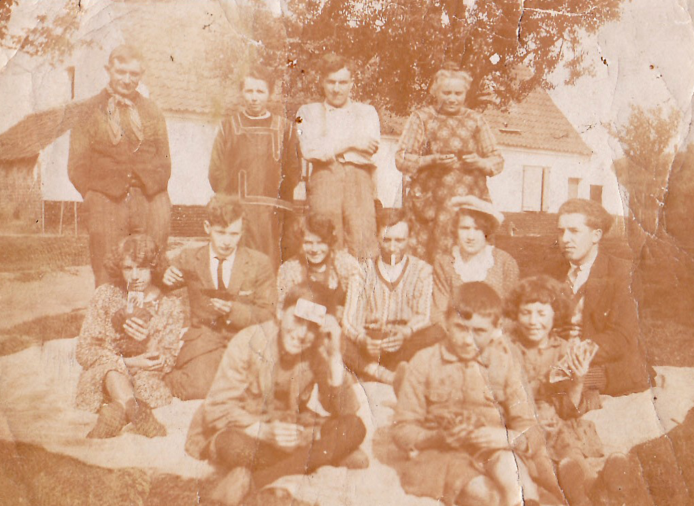
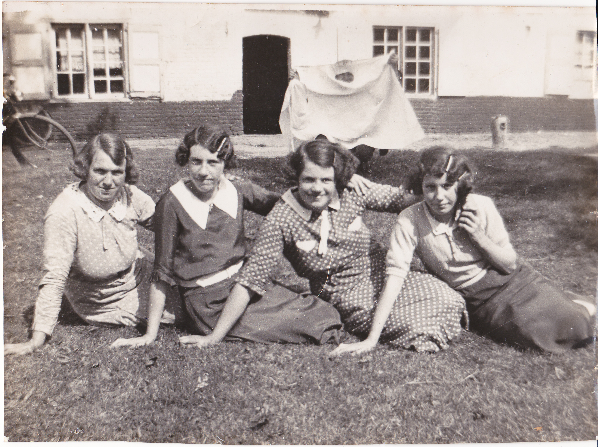

Het familiearchief bevat documenten die zijn aangetroffen in de eigen documentatie van en over de familie, die de diverse kinderen van [Vitalis](1879-vitalis-de-bleeckere) en [Octavia](1878-octavia-versluys) hebben bewaard. De belangrijkste foto uit her archief is de openingsfoto van deze website. Ontdek hier nog andere foto's.

## Groepsfoto op een zonnige dag

De foto voor de achtergrond van deze pagina Familiearchief is een uitsnede uit de eerste foto van het familiearchief. Het betreft een zomerse familiefoto die [Emeric](1946-emeric-de-bleeckere) heeft gevonden in het archief van zijn ouders. 

De bespreking van de foto volgt later. 

## Groepsfoto met vier dames

De meesten van de derde generatie, de kleinkinderen van Vitalis en Octavia, hebben deze foto niet eerder gezien. Het is via toedoen van Emeric dat deze foto aan de oppervlakte is gekomen. De vier zussen De Bleeckere poseren hier volgens leeftijd (van rechts naar links): [Maria](1908-maria-de-bleeckere), [Irma](1913-irma-de-bleeckere), [Berta](1914-berta-de-bleeckere) en [Lea](1922-lea-de-bleeckere).

Meer duiding volgt later.
