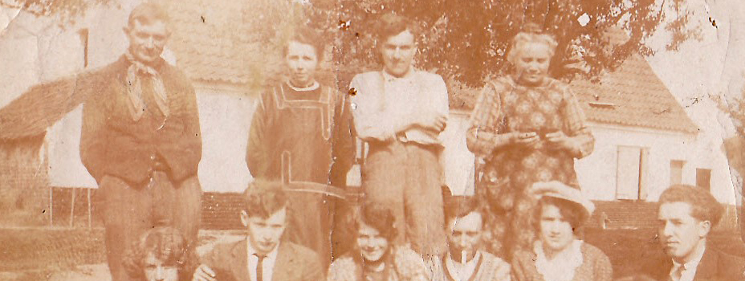

Het familiearchief bevat documenten die zijn aangetroffen in de eigen documentatie van en over de familie, die de diverse kinderen van [Vitalis](1879-vitalis-de-bleeckere) en [Octavia](1878-octavia-versluys) hebben bewaard. De belangrijkste foto uit her archief is de openingsfoto van deze website. Maar het archief bevat nog andere foto's.

## Groepsfoto op een zonnige dag

De foto voor de achtergrond van deze pagina Familiearchief is een uitsnede uit de eerste foto van het familiearchief. Het betreft een zomerse familiefoto die [Emeric](1946-emeric-de-bleeckere) heeft gevonden in het archief van zijn ouders. De bespreking van de foto volgt later. 

## Groepsfoto met vier dames

