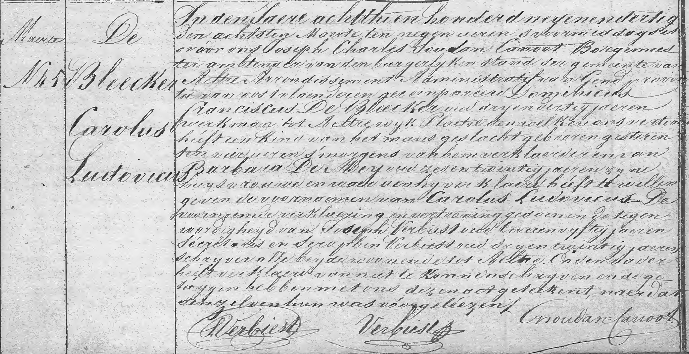

Dit is verzamelplaats voor officiële stukken die betrekking hebben op de familie [Vitalis De Bleeckere](1878-vitalis-de-bleeckere) en [Octavia Versluys](1879-octavia-versluys). 

## Geboorteakte van Carolus Ludovicus De Bleecker(e)

Dit is een kopie van de originele geboorteakte van Carolus Ludovicus De Bleecker(e). De (e) wijst erop dat de geboorteakte, geregistreerd te Aalter op 8 maart 1839, de familienaam _De Bleecker_ en niet _De Bleeckere_ vermeld. Dit is een mooi voorbeeld van hoe in de eerste jaren van de jonge Belgische Staat (1830) de administratie nog vrij slordig te werk ging. Een aspect ervan is dat de vader van Carolus Ludovicus ongeletterd was, zoals de akte zelf vermeldt. De gewone, ongeletterde man sprak dialect en natuurlijk werd de eind-'e' van de familienaam niet duidelijk uitgesproken. Vermoedelijk bestonden in die eerste jaren ook nog geen identiteitskaarten (nog te verifiëren) en moest de gemeentesecretaris het doen met een zuiver verbale mededeling van de familienaam.

De akte leert dat de vader van [Vitalis](1879-vitalis-de-bleeckere) is geboren te Aalter op 7 maart 1839. Hij was de zoon van Franciscus De Bleecker(e) en Barbara Den Mey. Het echtpaar woonde in de wijk Plaetse van de gemeente Aalter. 

Hier volgt een zo letterlijk mogelijke transcriptie van de akte:

>_In den Jaere achtthien honderdnegenendertig den achtsten maerte ten negen uren ’s voormiddags is voor ons Joseph Charles Soudan Canoot Borgemeester ambtenaer van den burgelyken stand der gemeente van Aalter Arrondissement Administratif van Gent provincie van oost-vlaenderen gecompareerd Dominicus Franciscus De Bleecker oud dryen dertig jaeren, werkman, tot Aeltre wijk Plaetse den welken ons vertoond heeft een kind van het mans geslacht geboren gisteren vier uren ’s morgens van hem verklaerder en van Barbara Den Mey oud zesentwintig jaeren zijne huysvrouwe en waeraan hij verklaerd heeft te willen geven de voornaemen van Carolus Ludovicus. De voorangaende verklaerjing en vertooning gedaen in de tegenwoordigheyd van Joseph Verbiest oud tweeenvijftig jaeren secretaris en Seraphin Verbiest oud dryentwintig jaeren schrijver alle beyde woonende tot Aelter. En de vader heeft verklaerd van niet te konnende schrijven en de getuigen hebben met ons dezen ackt geteekend, naerdat denzelven hun was voorgeléezen._ 

Er is een vreemd detail in de akte te lezen. De burgemeester was _Joseph-Charles Soudan_. Zo wordt hij officieel genoemd in de lijst van burgemeesters van Aalter, zoals vermeld op bladzijde 259 van het grote historisch boek over Aalter van Luc Stockman. In de geboorteakte wordt hij voluit Joseph Charles Soudan Canoot genoemd. Zijn handtekening bevestigt dat: Soudan=Canoot. Waarom zijn naam in de officiële lijst van Aalterse burgermeesters enkel de naam Soudan vermeldt, is onduidelijk. 

Toen de burgemeester Soudan-Canoot de akte ondertekende in 1839 was hij nog net geen twee jaar burgemeester. Hij was namelijk in juli 1837 tot burgemeester benoemd. Onder zijn burgemeesterschap (1837-1848) kreeg de gemeente Aalter zijn eerste gemeenteschool en trad in 1844 de allereerste gemeente-onderwijzer in dienst. Onder zijn bestuur maakte de gemeente een begin van de bestrating van de gemeente. In zijn laatste ambtsjaar (1848) brak er in Aalter een tyfusepidemie uit. Die gegevens geven een inzicht in het feit dat in de beginjaren van de staat België het gewone volk ongeletterd was. Er waren immers geen scholen. Het aantal geletterde mensen was dus ook in Aalter erg beperkt. De levensomstandigheden van de gewone mensen maakten hun dagelijks leven erg onzeker. 

## Geboorteakte van Mathilde Vandevoorde

Dit is een kopie van de geboorteakte van Mathilde Vandevoorde, de moeder van [Vitalis](1879-vitalis-de-bleeckere). De akte is opgenomen in het geboorteregister van de gemeente Beernem, jaartal 1850, nummer 91. Dat gebeurde op 3 mei 1850. Via de ouders van de moeder van Vitalis is de familie Vitalis De Bleeckere-Octavia Versluys geconnecteerd met de familie Pieter Vandevoorde-Carolina Vanpoucke. Pieter Vandevoorde is geboren in 1820 te Beernem en zijn vrouw Carolina Vanpoucke in 1818, eveneens te Beernem. Bij de geboorte van Mathilde was haar vader Pieter 30 jaar en haar moeder 32 jaar. Hij was werkman en zij was huisvrouw. De burgermeester die de geboorteaangifte heeft geregistreerd, heet Jacobus Vanreybrouck.

