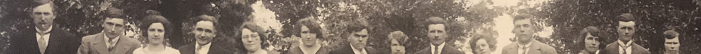

Het familiearchief bevat documenten die zijn aangetroffen in de eigen documentatie van en over de familie, die de diverse kinderen en kleinkinderen van [Vitalis](1879-vitalis-de-bleeckere) en [Octavia](1878-octavia-versluys) hebben bewaard. De belangrijkste foto uit het archief is de openingsfoto van deze website.

## Familiefoto van 1933

Achteraf én in wereldperspectief gezien, mogen we 1933 een noodlottig donker jaar noemen. Op 30 januari van dat jaar kreeg de NSDAP-partijleider Adolf Hitler in Berlijn de macht in handen als Rijkskanselier van de toenmalige Duitse Weimarrepubliek. Zes maanden later gebruikte hij zijn democratische, parlementaire  meerderheid om de andere partijen buiten de wet te stellen en voerde hij met zijn partij een gewelddadige dictatuur in. Hij verzekerde zich van de absolute macht, liet zich Führer noemen en begon aan de voorbereiding van een immense tsunami van militaire agressie: de Tweede Wereldoorlog. 
Maar in 1933 was zich daar nog niemand van bewust, zeker niet in België. Het kleine land had immers nog maar pas, in het jubileumjaar 1930, zijn honderdste verjaardag gevierd. Iedere Belg had met enige fierheid in de steden de luisterrijke, historiserende stoeten bewonderd. De burgers die zich nog de bange jaren van de Duitse bezetting tijdens de Eerste Wereldoorlog (‘De Groote Oorlog’) herinnerden, genoten met volle teugen van hun herwonnen moderne, democratische vrijheden. Dat was zeker het geval in Knesselare op woensdag 28 juni 1933. Het was een heugelijke dag, een ware feestdag voor de Knesselaarse families Versluys, De Dobbelaere, De Bleeckere en de Oedelemse familie Beuselinck. Het bewijs van die feestelijke hoogdag op de eerste dag van de zomer is de grote familiefoto van 1933. 

Wie goed kijkt, merkt onmiddellijk op dat de familiefoto tevens een trouwfoto is. Wie was het gelukkige echtpaar dat in de bloemen werd gezet en de betrokken familieleden bijeenbracht? Het antwoord krijgen we van de trouwakte van Maria Elisa De Dobbelaere en Raymond Beuselinck. Die was een week voordien, woensdag 21 juni,  in het gemeentehuis ondertekend. 

>Handtekeningen

Op de eerste regel zien we de handtekeningen van de trouwers: Raymond Beuselinck en Maria Louise De Dobbelaere. Zij tekent met ‘M De Dobbelaere’. Ze liet zich ‘Maria’ noemen. Zowel haar  huwelijksakte als het trouwboekje van haar ouders vermelden consequent haar volle voornaam: ‘Maria Elisa’. Op de tweede en derde regel vinden we de handtekeningen van de vier ouders. Eerst Vital Beuselinck en Juliana Carette, de ouders van de bruidegom Raymond, en Ivo De Dobbelaere en Hirma Versluys, de ouders van de bruid Maria Elisa. De handtekening van de moeder heeft als beginletter I, terwijl haar geboorteakte ‘Hirma’ vermeldt, maar in de volksmond werd Hirma gewoon ‘Irma’. Tenslotte, de onderste regel bevat de handtekeningen van de twee getuigen: Henri De Spiegelaere en Joseph Vincke. Beiden waren van Knesselare. De eerste was drieënzestig jaar en ‘touwslager’, de tweede vijfendertig jaar en ‘werkman’. Volgens de akte waren de getuigen door de echtgenoten zelf gekozen.

>Trouwers

Toen Maria Elisa trouwde in haar geboortedorp Knesselare was ze op haar éénendertigste. Haar moeder Hirma schonk haar het leven op 24 september 1901. Zij was Hirma haar tweede kind, haar eerste dochter. Hirma gaf aan haar dochter de naam van een van haar oudere zussen: Maria Elisa (link). Toen het meisje Maria Elisa ter wereld kwam, was haar tante met dezelfde naam éénendertig geworden en woonde sinds 1894 in Brugge. De geboorteakte van het dochtertje van Hirma leert dat haar leven niet onder een gelukkig gesternte begon. Dat komt omdat de naam van de vader ontbreekt op de akte, opgesteld op 25 september door de toenmalige burgermeester van Knesselare, August De Jaeger. Hij verklaart dat hem is verschenen Hortense Adelaïde De Blaere, gediplomeerde vroedvrouw. Zij komt verklaren dat Hirma Versluys de dag voordien, op 24 september, een meisje ter wereld heeft gebracht om vijf uur in de namiddag. De broer van Hirma,  de toen vijfendertigjarige August Versluys, was eveneens aanwezig om van de geboorte van zijn nichtje te getuigen. De tweede getuige was de eenenzeventig jarige Petrus Versluys, wellicht de oom van Hirma en August. Van enige vader is er geen sprake. Het pasgeboren meisje kreeg de familienaam van de moeder, wat in die tijd bijzonder ongewoon was. En toch spreekt de trouwakte van 1933 niet over Maria Elisa Versluys maar over Maria Elisa De Dobbelaere. Dat komt omdat op die andere trouwdag, 4 mei 1904, Ivo De Dobbelaere Maria Elisa erkend heeft als zijn kind. De kleine Maria Elisa, toen nog geen drie jaar, was ook aanwezig op de trouw van haar moeder, zoals blijkt uit de historische foto van 1904. (link). Ivo De Dobbelaere was niet de biologische vader van Maria Elisa; toch heeft hij haar erkend als zijn kind, wat toen een bijzonder sterke vaderlijke, humane geste was. De huwelijksakte van Maria Elisa en Raymond vermeldt bij Maria Elisa als beroep ‘landbouwster in Knesselare’. Dat betekent dat ze tot dan toe had meegewerkt op de boerderij van haar ouders in Hoekestraat. Op de dag dat hun dochter Maria Elisa trouwde, was haar vader Ivo zestig jaar en haar moeder Hirma zesenvijftig.

Over de echtgenoot van Maria Elisa Versluys/De Dobbelaere, Raymond Beuselinck, weten we dat hij is geboren in hetzelfde jaar als zijn vrouw Maria Elisa ― 1901, 25 augustus ― in de wijk Zeldonk, aan de westkant van de gemeente Oedelem én grenzend aan Knesselare. De trouwers waren dus even oud, op een maand na. Raymond was de zoon van Vital Beuselinck en Juliane Carette. Vader Vital was in 1933 zevenenzestig jaar en moeder Juliana achtenzestig. Ze woonden in Zeldonk waar ze een smidse uitbaatten. De historische foto getuigt daarvan.

Raymond was het vijfde kind van de acht kinderen van Vital en Juliane. Wanneer Raymond op 21 juni 1933 trouwde met Maria Elisa, was hij al smid. Hij had het vak thuis geleerd van zijn vader. Maria Elisa ging met haar echtgenoot wonen in diens ouderlijke huis, de smidse van Zeldonk. Daar kregen ze vijf kinderen: Antoon, Arnold, Antoinette, Walter en Wilfried. Raymond overleed in 1970 in het ziekenhuis te Brugge; hij werd 68 jaar. Dertien jaar later, 1983, werd weduwe Maria Elisa ernstig ziek, ze was op een maand na bijna 82 jaar toen ze zelf op 13 augustus thuis in Oedelem een eind maakte aan haar leven. Op de zomerse 21 juni 1933 lag die dramatische dag nog ver in het verschiet. 

>Feestelingen

Wat de foto van 1933 echt historisch maakt, zijn de vele aanwezige familieleden in feeststemming. Ze zijn met  41 volwassenen, twee kinderen en een baby. We kunnen niet meer achterhalen wie die drie zijn. We kunnen wel verschillende volwassenen identificeren. We benoemen ze rij per rij.

Op de eerste rij zitten in het midden het gelukkige koppel: Raymond en Maria Elisa. Trouwen in een witte jurk was toen ongezien en voor gewone mensen zeker niet haalbaar. De kleur zwart domineert. De mannen hadden hun zondagskostuum met ondervest en een wit gestreken en gesteven hemd met das uit de kleerkast gehaald. Snorren waren toen in de mode. We zien dat de oudste generatie de trouwers flankeren. Langs de bruidegom, Raymond, zitten zijn schoonouders Hirma en Ivo, terwijl naast de bruidegom haar schoonouders Vital en Juliane zitten. Naast Ivo De Dobbelaere zit een van zijn broers. Helemaal links heeft Octavia Versluys, de jongste zus van Hirma, plaats genomen. Via de doopakte van Maria Elisa weten we dat Octavia haar meter was. De man van Octavia, Vitalis De Bleeckere, vinden we helemaal rechts, naast Juliane. Naast hem zit nog de accordeonist van dienst. Hij is wellicht de jonge Maurits De Neve, een in Knesselare erg gewaardeerde en gekende ‘trekzakspeler’.  

Op de tweede rij staan 16 volwassenen van de eerste en tweede generatie.  We herkennen vooral leden van het gezin Versluys: op 3 en 4 de twee broers Versluys: August en Alfons, op 6 de grote broer Hendrick. Hij kwam van Seraing (Luik) om te kunnen meevieren. Alle drie staan ze ook samen op de tweede rij op de foto van 1904 (link). Dat geldt eveneens voor de dame op 11: zij is Romania, de zus van Hirma die allebei zijn getrouwd op dezelfde dag in 1904 toen de gezinsfoto is gemaakt. Naast Romania staat Maurits De Bleeckere, de zeventienjarige jongeman staat achter zijn vader Vital. Naast een onbekende dame zien we op 14 en 15 de oudere dame Leonia Versluys met haar man Alfons. Beiden zijn afgekomen van Merelbeke om aanwezig te zijn op het trouwfeest in Knesselare. En helemaal rechts, op 16, staat de broer van de bruid, Cyril Versluys/De Dobbelaere. Ook hij is een voorkind van Hirma, ook erkend in 1904 door Ivo De Dobbelaere. De andere personen kunnen we niet thuisbrengen. Wellicht horen ze bij de Oedelemse familie Beuselinck. Op het huwelijksfeest zagen de broers en zussen Versluys elkaar terug. Ze zullen veel hebben kunnen bijpraten. 

Op de achterste, derde staat de jongere generatie. Van de 14 personen kennen we, van links naar rechts, op 2 Alfons De Dobbelaere, een van de zonen van Ivo en Hirma, en een halfbroer van de bruid. Hij werd later de vader van Annie De Dobbelaere die Sylvain geholpen heeft bij het identificeren van verschillende personen. Naast Alfons, op 3, zien we Regina Werrebroeck, de eerste vrouw van Henri De Dobbelaere, een andere zoon van Ivo en Hirma. Henri staat naast zijn vrouw Regina. Zij overleed tijdens de Tweede Wereldoorlog. Op 6 herkennen we de dochter van Ivo en Hirma, Martha De Dobbelaere. De volgende personen kennen we niet; vermoedelijk zijn zij familieleden van de bruidegom Raymond. De kleine dame helemaal rechts heet Clemence Van Acker. Ze werd ‘Manse Pap’ genoemd, woonde in Sint-Maria-Aalter en was gehuwd met Cyril De Dobbelaere, de man helemaal rechts op de tweede rij. 

>Locatie

Het huwelijksfeest vond plaats in hartje Knesselare. Het toenmalige café met feestzaal ‘In ’t Burgerwelzijn’ van [de familie Verhoestraete](/bakermat-'Knesseloare') was dé ‘place to be’ voor familiefeesten. Op de hoek Kerkstraat-Veldstraat-De Plaats, slechts enkele stappen verwijderd van het gemeentehuis en de Sint-Willibrorduskerk, kwamen Knesselaarse families samen om te vieren en te rouwen. Dat in juni 1933 de betrokken families – Versluys/De Dobbelaere en Beuselinck – zich toen al dergelijk feest konden veroorloven, blijkt uit het grote aantal genodigden, uit de keuze voor een locatie buiten de eigen boerderij, de wijnflessen en de accordeonspeler. Ook de professionele foto zelf bevestigt dat gegeven. Die werd genomen in de tuin van de pastorij, vlak achter de kerk. De pastorij en de hoge bomen staan er nog steeds. De foto van 1933 zit figuurlijk opgeslagen in het geheugen van de bomen.

## Groepsfoto op een zonnige dag

De foto voor de achtergrond van deze pagina Familiearchief is een uitsnede uit de zomerse familiefoto die [Emeric De Bleeckere](1946-emeric-de-bleeckere) heeft gevonden in het archief van zijn ouders. 

De bespreking van de foto volgt later. 

## Groepsfoto met vier dames en spook

De meesten van de derde generatie, de kleinkinderen van Vitalis en Octavia, hebben deze foto niet eerder gezien. Het is via toedoen van Emeric dat deze foto aan de oppervlakte is gekomen. De vier zussen De Bleeckere poseren hier volgens leeftijd (van rechts naar links): [Maria](1908-maria-de-bleeckere), [Irma](1913-irma-de-bleeckere), [Berta](1914-berta-de-bleeckere) en [Lea](1922-lea-de-bleeckere) met op de achtergrond een nog ongekende grapjas in spookkostuum.

Meer duiding volgt later.
