Dit is verzamelplaats voor officiële stukken die betrekking hebben op de familie [Vitalis De Bleeckere](1878-vitalis-de-bleeckere) en [Octavia Versluys](1879-octavia-versluys). 

## Familie Versluys

We beschikken over verschillende officiële stukken die betrekking hebben op de ouders en de voorouders van Octavia. Met de akten van de vaderlijke afstamming van het geslacht Versluys in Knesselare keren we ver terug in de tijd. De voorstelling van de akten verloopt van dichtbij naar veraf. 

**DE OUDERS VAN OCTAVIA**

Hier volgt de drieledige voorstelling van de huwelijksakte van de ouders van Octavia.

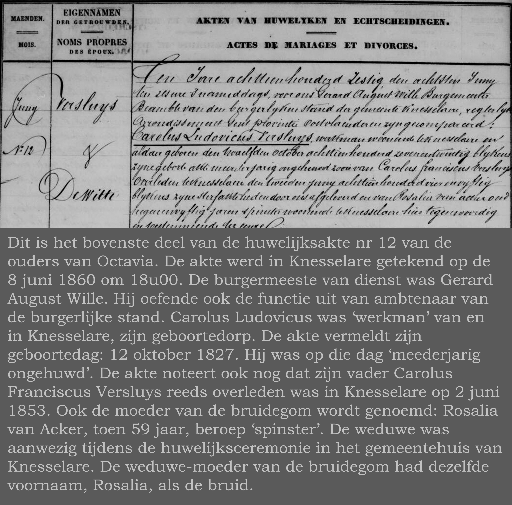

Hier volgt de voorstelling van de overlijdensksakte van de vader van Octavia.

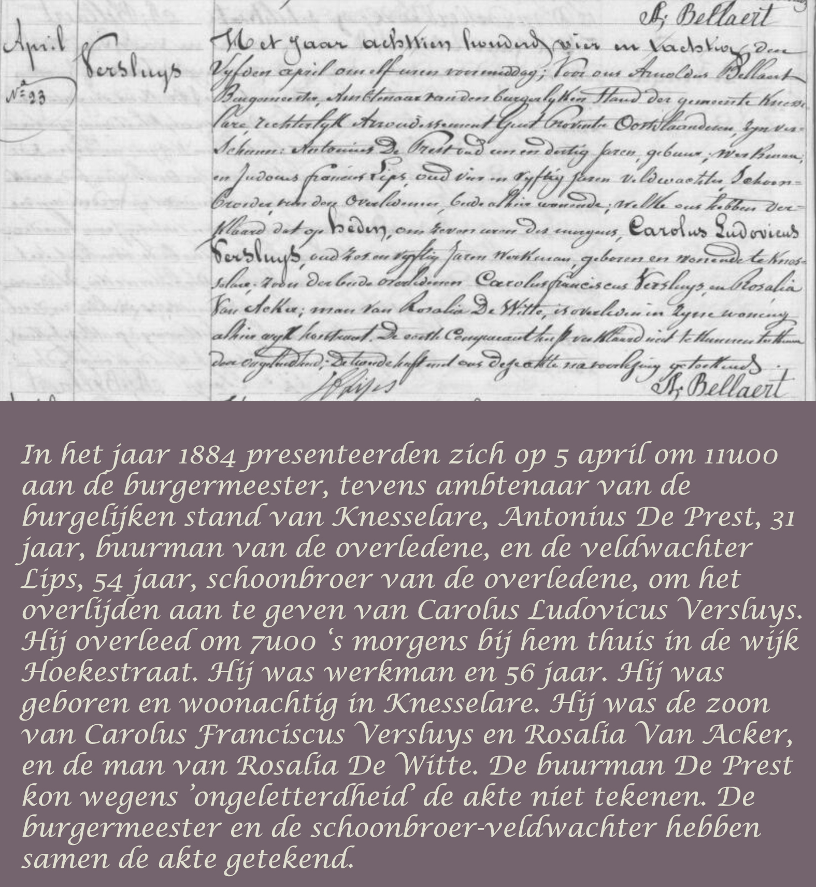

**DE 5 OUDE AKTEN VAN DE VADERLIJKE FAMILIELIJN VAN OCTAVIA: VERSLUYS**

Hier volgt de voorstelling van de 5 oude akten die ons een historisch en officieel
beeld geven van de familie Versluys in Knesselare.

**1765**

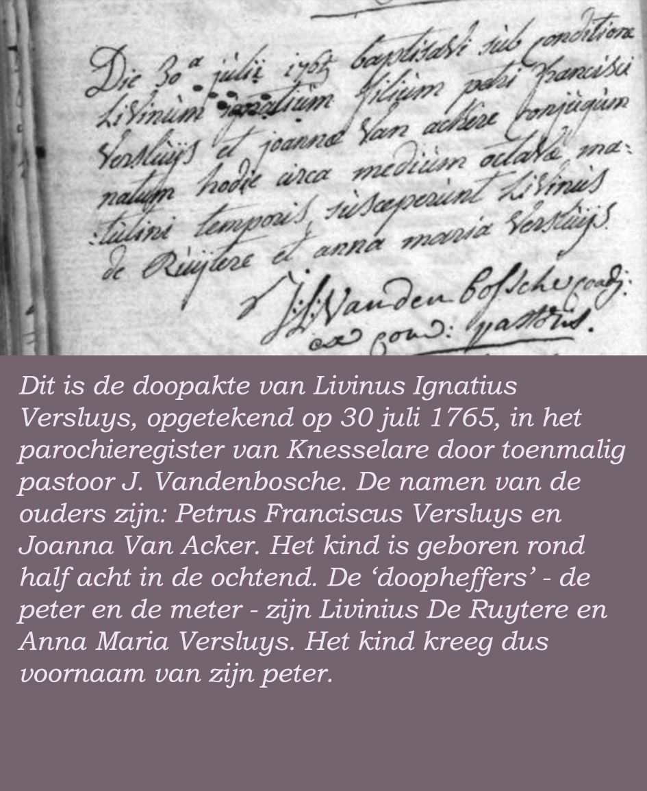

**1764**

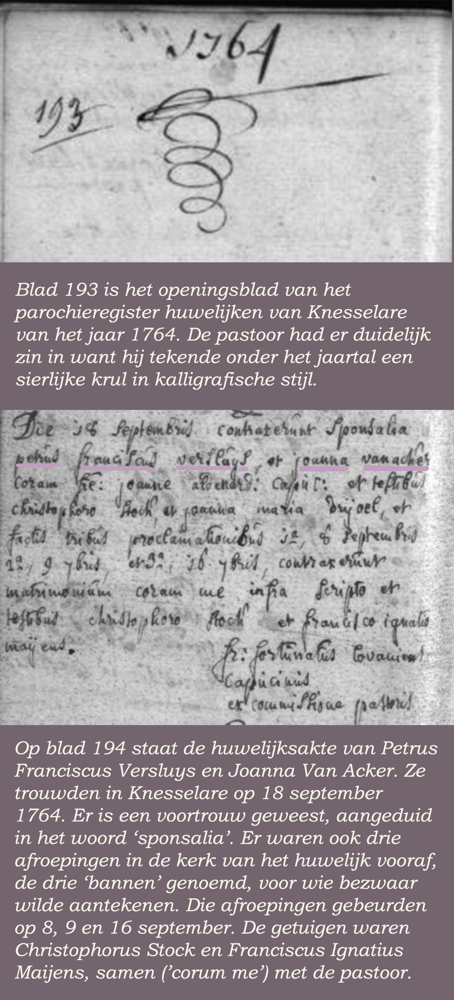

**1739**

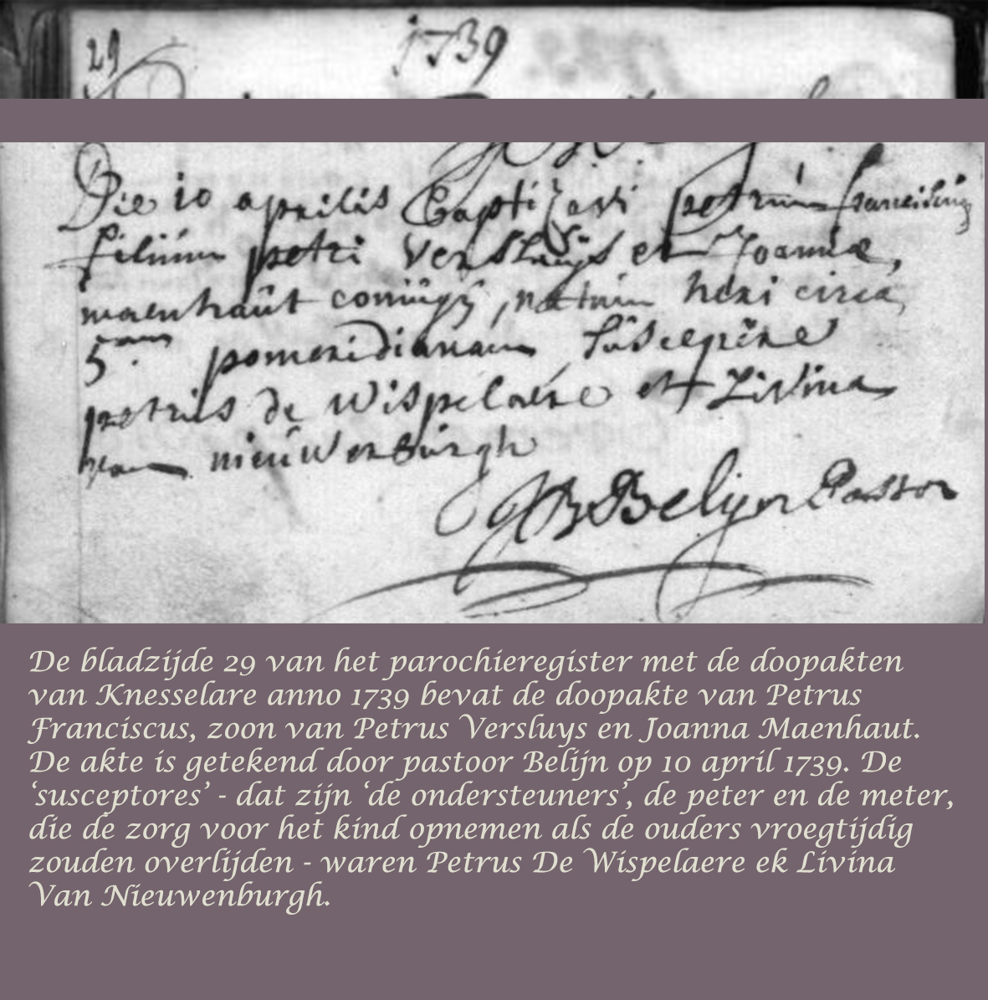

**1722**

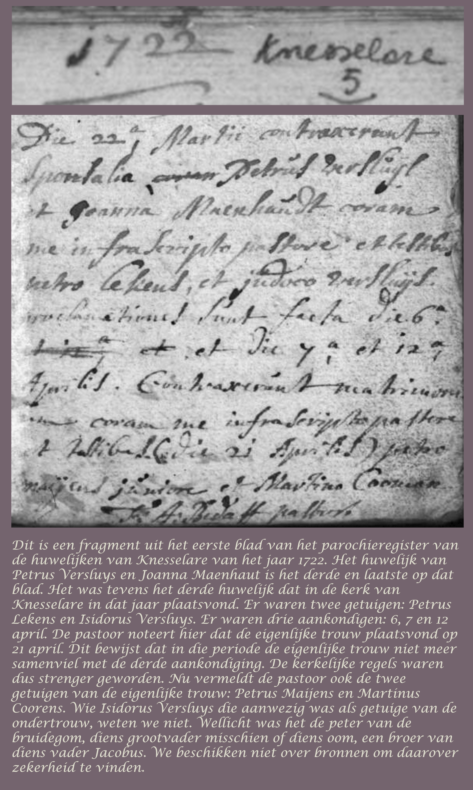

**1684**

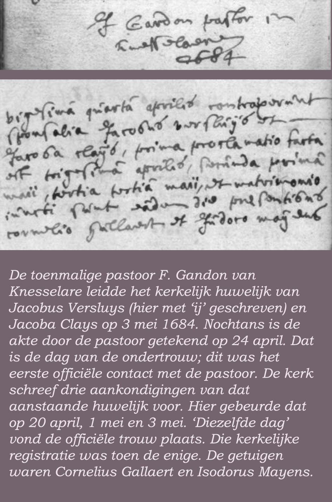

**BETREFFENDE MARIA ELISA VERSLUYS**

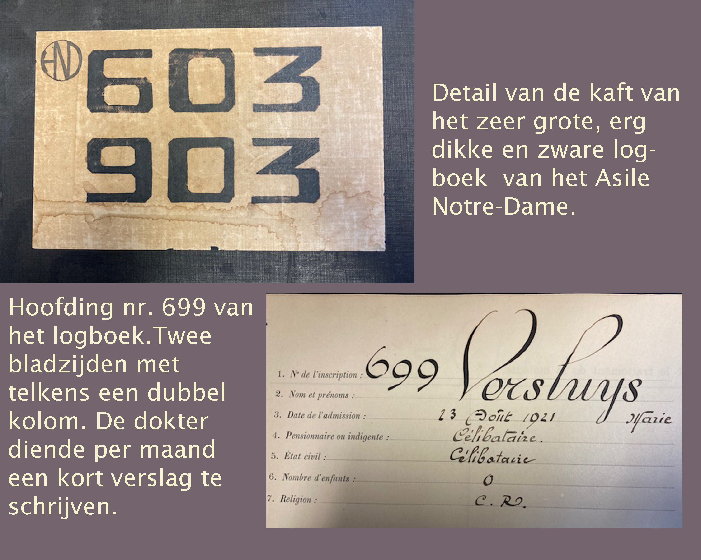

Het samengestelde beeld toont links ervan een uitsnede van het bijzonder grote en zware collocatieboek van het [Asile Notre-Dame, Sint-Michiels, Brugge,](/bakermat-Brugge) waar [Maria Elisa](/1878-octavia-versluys/mozaik/3-versluys#fam_maira_elisa) verbleef van de zomer 1921 tot aan haar overlijden op 29 september 1933. De uitsnede vermeldt de nummers van de opgenomen patiënten in de jaren 1921-1933. De rechtse uitsnede toont de hoofding van de dubbele pagina die is aangemaakt bij de opname van Maria Elisa in het Asile. De voorgedrukte data zijn kalligrafisch ingevuld. Maria Elisa kreeg het patiëntennummer 699 en ze werd opgeschreven als ‘Versluys Marie’.

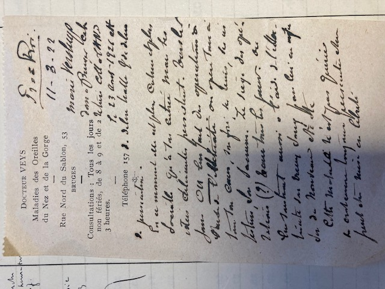

Tussen de twee grote bladzijden van het Logboek nummer 699 steken twee handgeschreven doktersbriefjes van de Brugse geneesheer Eugeen Veys. In de Brugse Noordzandstraat 53 had hij zijn eigen privépraktijk voor oor-, neus- en keelziekten. Hij werkte tevens als hoofdgeneesheer in het Asile Sainte-Marie. Die twee doktersbriefjes zijn bijzonder uitzonderlijk daar Sylvain ter plaatse heeft kunnen vaststellen in het bijzijn van archivaris Anne Vanhoutte dat dergelijke doktersbriefjes enkel in het Logboek bij Maria Elisa aanwezig zijn. Het eerste doktersbriefje is tweezijdig beschreven en dateert van 29 november 1921. Het tweede, hierboven afgebeeld, is eenzijdig beschreven op 11 maart 1922. Dr. Veys noteert dat Maria Elisa nog niet is genezen en nog niet in vrijheid kan worden gesteld. Uiteindelijk zou die toestand zo blijven tot aan haar overlijden in 1933.

## Familie De Bleeckere

>**DE GEBOORTEAKTE VAN CAROLUS LUDOVICUS DE BLEECKER(E)**

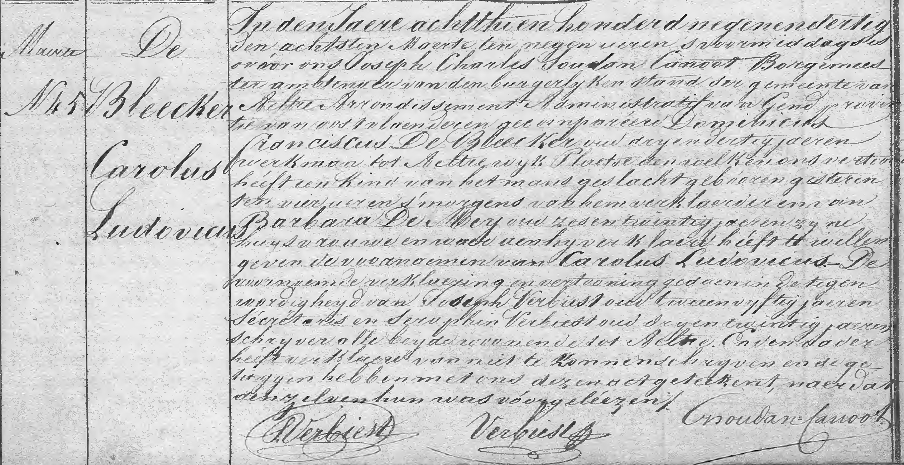

Dit is een kopie van de originele geboorteakte van Carolus Ludovicus De Bleeckere. Hij is geboren op _7 maart 1839_ te Aalter en is overleden op _21 juli 1922_ in Sint-Joris-ten-Distel.

De geboorteakte, geregistreerd te Aalter op 8 maart 1839, laat de (e) op het einde van de familienaam vallen: _De Bleecker_ en niet _De Bleeckere_. Dit is een mooi voorbeeld van hoe in de eerste jaren van de jonge Belgische Staat (1830) de administratie nog vrij slordig te werk ging. Een aspect ervan is dat de vader van Carolus Ludovicus ongeletterd was, zoals de akte zelf vermeldt. De gewone, ongeletterde man en vrouw spraken dialect en natuurlijk werd de eind-'e' van de familienaam niet duidelijk uitgesproken. Trouwens, dat is nu in de streek Aalter-Beernem nog het geval: men zeg nog steeds 'De Blééker' in plaats van voluit 'De Bleeckere' te zeggen. Vermoedelijk bestonden in die eerste jaren ook nog geen identiteitskaarten (nog te verifiëren) en moesten de burgermeester en zijn gemeentesecretaris het doen met een zuiver modelinge mededeling van de familienaam.

De akte leert dat de ouders van de vader van [Vitalis](1879-vitalis-de-bleeckere), zijn grootouders van vaderszijde, _Franciscus De Bleecker(e_) en _Barbara Den Mey_ waren. Het echtpaar woonde in de wijk _Plaetse_ van de gemeente Aalter. Franciscus De Bleeckere was zelf geboren in 1806, zijn vrouw Barbara in 1813. Verdere data over hen, ontbreken nog.

Hier volgt een zo letterlijk mogelijke transcriptie van de akte:

>_In den Jaere achtthien honderdnegenendertig den achtsten maerte ten negen uren ’s voormiddags is voor ons Joseph Charles Soudan Canoot Borgemeester ambtenaer van den burgelyken stand der gemeente van Aalter Arrondissement Administratif van Gent provincie van oost-vlaenderen gecompareerd Dominicus Franciscus De Bleecker oud dryen dertig jaeren, werkman, tot Aeltre wijk Plaetse den welken ons vertoond heeft een kind van het mans geslacht geboren gisteren vier uren ’s morgens van hem verklaerder en van Barbara Den Mey oud zesentwintig jaeren zijne huysvrouwe en waeraan hij verklaerd heeft te willen geven de voornaemen van Carolus Ludovicus. De voorangaende verklaerjing en vertooning gedaen in de tegenwoordigheyd van Joseph Verbiest oud tweeenvijftig jaeren secretaris en Seraphin Verbiest oud dryentwintig jaeren schrijver alle beyde woonende tot Aelter. En de vader heeft verklaerd van niet te konnende schrijven en de getuigen hebben met ons dezen ackt geteekend, naerdat denzelven hun was voorgeléezen._ 

Er is een vreemd detail in de akte te lezen in verband met de volledige naam van de toenmalige burgermeester _Joseph-Charles Soudan_. Zo wordt hij officieel genoemd in de lijst van burgemeesters van Aalter, zoals vermeld op bladzijde 259 van het grote historisch boek over Aalter van Luc Stockman. In de geboorteakte van Carolus Lodevicus De Bleeckere wordt de burgermeester voluit Joseph Charles Soudan Canoot genoemd. Zijn handtekening bevestigt dat: _Soudan=Canoot_. Waarom de officiële lijst van Aalterse burgermeesters enkel het eerste deel van zijn naam -  Soudan - vermeldt, is onduidelijk. 

Toen de burgemeester Soudan-Canoot de akte ondertekende in 1839 was hij nog net geen twee jaar burgemeester. Hij was namelijk in juli 1837 tot burgemeester benoemd. Onder zijn burgemeesterschap (1837-1848) kreeg de gemeente Aalter zijn eerste gemeenteschool en trad in 1844 de allereerste gemeente-onderwijzer in dienst. Onder zijn bestuur maakte de gemeente een begin van de bestrating van Aalter. In zijn laatste ambtsjaar (1848) brak er in Aalter een tyfusepidemie uit. Die gegevens geven een inzicht in het feit dat in de beginjaren van de staat België het gewone volk ongeletterd was. Er bestond absoluut geen structureel onderwijs voor het gewone volk. Er bestonden immers geen scholen. Het aantal geletterde mensen was dus ook in Aalter erg beperkt. De levensomstandigheden van de gewone mensen, denk aan het gevaar van epidemiën, maakten hun dagelijks leven ook nog erg onzeker. 

## Geboorteakte van Mathilde Vandevoorde

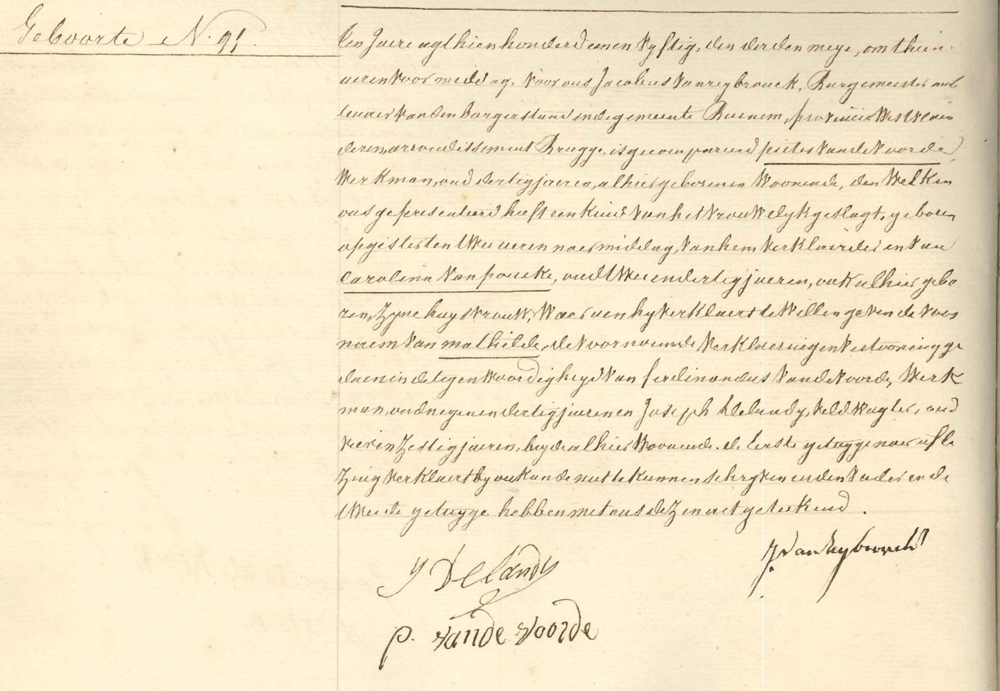

Dit is een kopie van de geboorteakte van Mathilde Vandevoorde, de moeder van [Vitalis](1879-vitalis-de-bleeckere). De akte is opgenomen in het geboorteregister van de gemeente Beernem, jaartal 1850, nummer 91. Dat gebeurde op 3 mei 1850. Via de ouders van de moeder van Vitalis is de familie Vitalis De Bleeckere-Octavia Versluys geconnecteerd met de familie Pieter Vandevoorde-Carolina Vanpoucke.

Pieter Vandevoorde is geboren in 1820 te Beernem en zijn vrouw Carolina Vanpoucke in 1818, eveneens te Beernem. Bij de geboorte van Mathilde was haar vader Pieter 30 jaar en haar moeder 32 jaar. Hij was werkman en zij was huisvrouw. De burgermeester die de geboorteaangifte heeft geregistreerd, heet Jacobus Vanreybrouck. Het valt ook op dat Pieter Vandevoorde zelf de akte heeft ondertekend. Dat wil zeggen dat hij kon lezen en schrijven.

