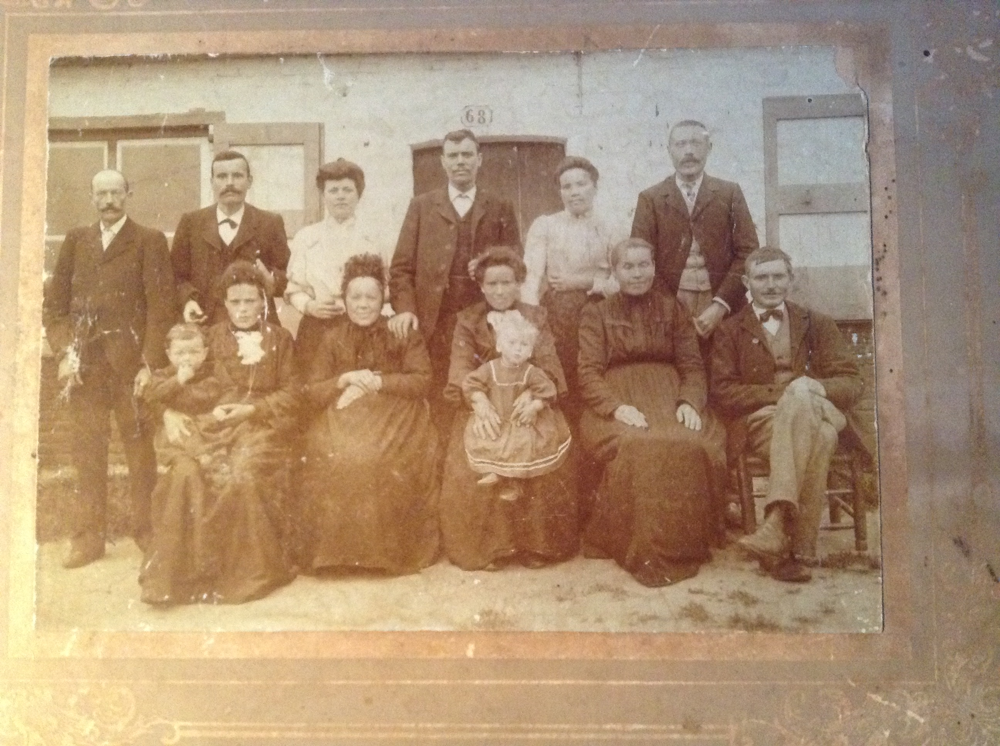

# Knesselare

In Knesselare heeft zich het grootste deel van het leven van Vitalis en Octavia afgespeelde, alsook dat van hun kinderen. Deze zeer oude prentkaart toont de Kerkstraat, een weg die, zoals de naam zegt, recht naar de kerk leidt. Die weg is ontelbare keren afgelegd door het gezin De Bleeckere. Ze woonden immers in Hoekestraat die rechtstreeks richting het dorp leidt via de kerkstraat.   

