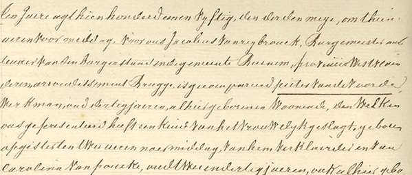

## Bronnen 

Onderzoek zonder bronnen is onbestaande. Dat geldt bij uitstek voor genealogisch onderzoek en historisch onderzoek in het algemeen. 

## Bevoorrechte getuigen

Voor deze site zijn de bevoorrechte getuigen onmisbaar. Dat zijn hier eerst en vooral de kinderen zelf en de kleinkinderen, plus familieleden van [Vitalis](1879-vitalis-de-bleeckere) en [Octavia](1878-octavia-de-bleeckere). Ze kennen de familieverhalen. Enkele van die bevoorrechte getuigen spelen voor deze site een hoofdrol.

 Sylvain heeft in de periode 1980-1990 talrijke uitgebreide interviews afgenomen van zijn vader [Maurits](1916-maurits-de-bleeckere) en moeder Flora Verscheure. De aantekeningen ervan zijn neergeschreven in een Atoma-schrift. In de periode 1990-2019 heeft hij eveneens verschillende gesprekken gevoerd met zijn oudste broer Luciën, zijn tante Louisa van moederszijde, zijn oudere neef [Emeric](), alsook met Clara De Bleeckere, de jongste dochter van [Hendricus]() De Bleeckere, de oudste broer van Vitalis. 

 Vanaf december 2018 heeft Emeric verschillende gesprekken gevoerd met nichten en neven, alsook documenten verzameld uit verschillende familiearchieven. Hij ondersteunt sinds die tijd Sylvain bij het verder verzamelen van getuigenissen bij de derde generatie. 

 Sarah, de oudste dochter van [Sylvain](), en haar dochter Thirza die aan de Rijksuniversiteit geschiedenis studeert, ondersteunt het onderzoek naar digitale en geschreven data over de historische en geografische context, eigen aan de familie De Bleeckere-Versluys. 

## Publieke bronnen

Vandaag staan er heel veel en belangrijke bronnen ter beschikking van wie wil op zoek gaan naar het eigen verleden. Ziehier een korte voorstelling van de belangrijkste onderzoeksbronnen die voor de uitwerking van deze site van grote waarde zijn. De volgende sites en publicaties vormen belangrijke bronnen voor deze site.

[Erfgoed Vlaanderen](www.inventarisonroerenderfgoedvlaanderen.be). 

[Familiekunde-vlaanderen](www.familiekunde-vlaanderen.be)

[Het Rijksarchief](www.arch.be)

[Erfgoedbank Meetjesland](www.ergoedbankmeetsjesland.be)

[Knesselare Nieuws](https://knesselaarsnieuws.net)

[Forum Eerste Wereldoorlog](http://www.forumeerstewereldoorlog.nl)

