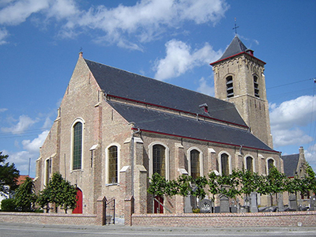

# Connectie Lapscheure

Tijdens een eerste bezoek aan het dorp Lapscheure dat heden deel uitmaakt van de gemeente Damme en langs de Knokkebaan (E34/A11) ligt, 
ontdekte [Sylvain](1950-sylvain-de-bleeckere) op het kerkhof verschillende oude graven van overledenen met de familienaam De Bleeckere. Dat was een toevallige ontdekking want de eerste reden van het bezoek was het feit dat de familie van zijn grootmoeder aan moeders kant de familienaam Martens heette. Hij wist die afkomstig waren van Lapscheure. In dat dorp komen zo twee aparte verhalen van de familie De Bleeckere samen via [Maurits](1916-maurits-de-bleeckere) en Flora Verscheure. Vandaar de onderzoeksvraag: **Bestaat er een connectie tussen de familie De Bleeckere uit Lapscheure en die van Sint-Joris-ten-Distel en Knesselare?**   

