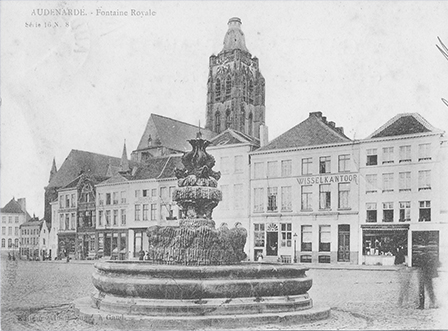

## De groep Oudenaarde

Als je als lid van de familie De Bleeckere-Verluys iemand tegenkomt aan wie je je voor de eerste keer voorstelt met de naam De Bleeckere, dan reageert die meestal met de vraag of je familie bent van de scheidsrechter Frank De Bleeckere. Het eerste antwoord is neen. De scheidsrechter behoort immers tot de grote groep De Bleeckere die zich in en rond Oudenaarde situeert, terwijl de kleinere groep De Bleeckere-Versluys, Sint-Joris-ten-Distel en Knesselare als bakermat heeft. De onderzoeksvraag is: **Is er een genealogische connectie tussen beide groepen en indien die er is, van welke aard is die dan?**.

## Connectie Oudenaarde 

De meest gekende groep De Bleeckere situeert zich in Oudenaarde. Dit wordt verder uitgewerkt.

## Een licht in de duisternis

Via de gesprekken die [Sylvain](1950-sylvain-de-bleeckere) had met Clara De Bleeckere van Aalter, wier nonkel Vitalis was, is gebleken dat er wel degelijk een connectie bestond tussen de groep De Bleeckere van Oudenaarde en die van Aalter-Knesselare. Dit wordt verder uitgewerkt.  