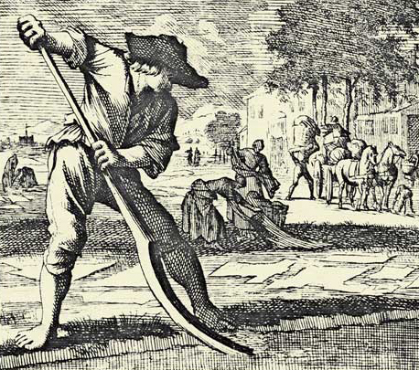

# De Bleeckere - De Bleeker

Het was in Torhout, in Groenhove Diocesaan Dienstenhuis, dat iemand [Sylvain](1950-sylvain-de-bleeckere) na de lezing die hij er had gegeven, hem aansprak. Een oudere zuster. Ze stelde zich voor als zuster Ireen-Marie van de Congregatie van de Zusters Maricolen te Brugge. Ze overleed op 13 januari 2019. Tijdens de ontmoeting in Groenhove vertelde ze dat ze geboren was als Alice De Bleeker. Ze was er heilig van overtuigd dat zij en [Sylvain](1950-sylvain-de-bleeckere) eigenlijk familie waren. Ze geloofde stelllig dat de familie De Bleeker verwant moet zijn aan de familie De Bleeckere. De onderzoeksvraag luidt: **Heeft  de overtuiging van wijlen zuster Ireen-Marie enige grond?**    

## Herkomst van de naam De Bleeker en varianten

