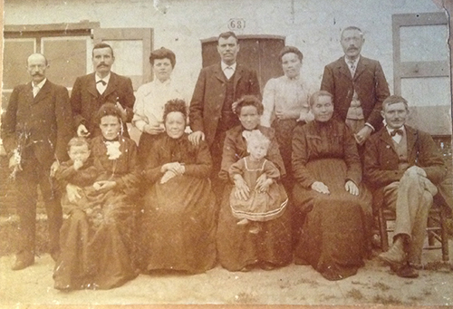

# Familiefoto Versluys

Vandaag heeft zowat iedereen, jong en oud, een fototoestel bij zich, altijd. De smartphones en iPhones zijn uitgerust met gesofistikeerde camera’s voor foto’s en filmpjes, en met software om die ook direct te bewerken. Zo een situatie kon de generatie van Vital De Bleeckere – Octavia Verluys zich niet voorstellen. Voor hen was een foto van zichzelf, het gezin of de familie nog een echt wonder. Daarom is de [familiefoto Versluys](/onderzoek-versluys) van 1904 een waarachtig wonder, ook nu nog anno 2021. 

De uitwerking van het antwoord volgt.

