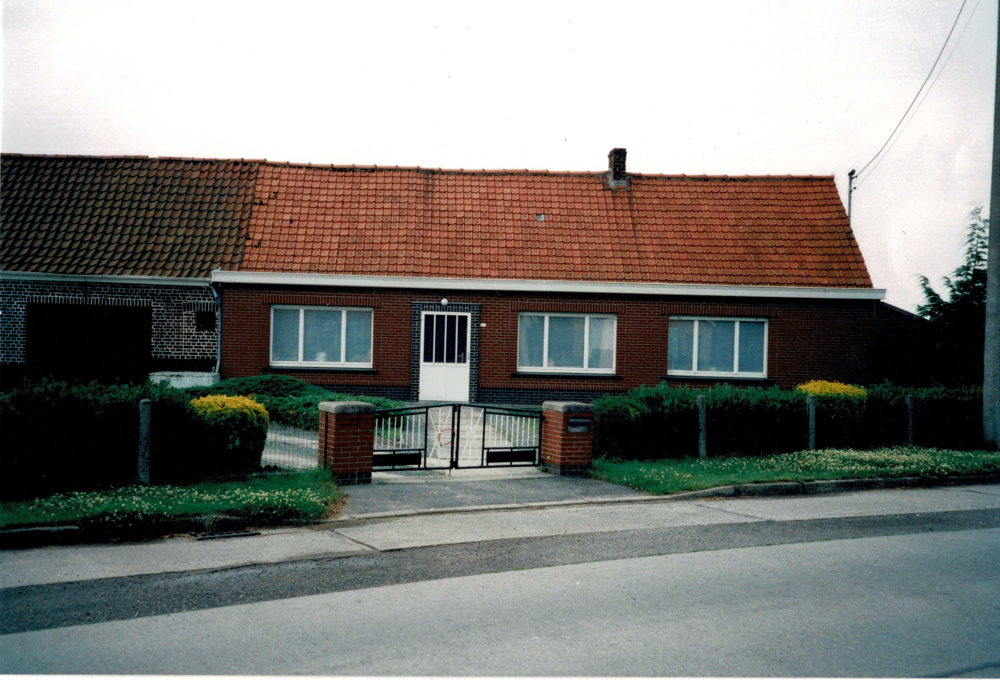

**OP ZOEK NAAR WIE IS WIE** 

Vandaag heeft zowat iedereen, jong en oud, een fototoestel bij zich, altijd. De smartphones en iPhones zijn uitgerust met gesofistikeerde camera’s voor foto’s en filmpjes, en met software om die ook direct te bewerken. Zo een situatie kon de generatie van Vital De Bleeckere – Octavia Verluys zich niet voorstellen. Voor hen was een foto van zichzelf, het gezin of de familie nog een echt wonder. Daarom is de [familiefoto Versluys](/1878-octavia-versluys/mozaik/3-versluys) van 1904 een waarachtig wonder, ook nu nog anno 2021. 

**VRAGEN** 

Voor Octavia moet die foto erg kostbaar zijn geweest. Ze heeft hem heel haar leven bewaard. Na haar overlijden in 1963 is de foto terecht gekomen in de ijzeren koekendoos met familiefoto’s van [Maurits De Bleeckere](1916-maurits-de-bleeckere). Bij het overlijden van Maurits in 1990 heeft zijn zoon Sylvain de oude Versluysfoto gevonden. Hij had die daarvoor nooit eerder gezien. De foto leed een slapend bestaan tot in 2015, toen Sylvain de foto bovenhaalde naar aanleiding van de voorbereiding van de opstart van deze website. Bij het bekijken van de foto, wist hij niet wat hij zag. Wie was wie? Hoe oud was die foto? Stonden zijn grootouders Vital en Octavia erop? Naar aanleiding waarvan was die foto ooit genomen? Was het mogelijk om op al die vragen een antwoord te vinden? Waar moest Sylvain beginnen? Kon er iemand of iets hem helpen?

**TOEVAL** 

Het toeval zorgde voor de eerste stap naar een antwoord op de vragen. Dat deed zich voor op 5 januari 2016. Die dag belde hij aan in de Kouter huisnummer 37 te Knesselare, waar Annie De Dobbelaere en Lucien Nemegeer wonen. Sylvain had een goed contact met hen omdat Annie een nicht is van zijn overleden echtgenote Nicole Van de Kerckhove. De moeder van Annie en Nicole waren zussen. Maar tijdens het bezoek kwam er vreemd genoeg nog andere familielink aan het licht. Sylvain had de foto van Versluys mee met de bedoeling die eens aan Annie voor te leggen. Misschien wist zij daar iets over. Annie was immers opgegroeid in Hoekestraat waar ook het gezin De Bleeckere-Versluys woonde en werkte. Toen Sylvain de woonkamer van Annie en Lucien betrad, zag hij tot zijn grote verbazing en verwondering identiek dezelfde oude foto staan op de schouw. Hij kon zijn eigen ogen niet geloven. Hoe is zo iets mogelijk zonder vooraf te hebben afgesproken? Een goed voorteken!

**EERSTE AANKNOPINGSPUNT** 

Annie had de foto op haar schouw geplaatst omdat ook zij op zoek was naar de achtergrond ervan. Ze had de foto gevonden in de koekendoos met foto’s van haar overleden moeder en weduwe Gaby Clincke. Annie moest in tegenstelling met Sylvain niet van nul vertrekken. Zij had een direct aanknopingspunt. Ze heeft namelijk haar grootvader-weduwnaar Ivo De Dobbelaere (‘peetje Ivo’) goed gekend. Haar ouders, Fons De Dobbelaere en Gaby Clincke, waren bij hem in Hoekestraat gaan inwonen. Annie kon haar grootvader op de familiefoto Versluys aanwijzen als de man rechts zittend op de stoel. En ze kerkende ook haar grootmoeder, Irma Versluys. Annie wist dat Irma de jonge vrouw was met het kleine meisje op haar schoot. Annie had immers het trouwboekje van Irma en Ivo gevonden in de documenten die ze had geërfd van haar ouders. Bij het nakijken ervan ontdekte ze een familiegeheim. De twee kinderen op de foto waren voorkinderen van Irma die door Ivo werden erkend op de dag van hun trouw op 4 mei 1904. 

Annie constateerde nu dat haar moeder Gaby nooit over die voorkinderen van Irma Versluys had gesproken. Annie herinnerde zich nog levendig dat ze als kind een stamboom moest maken als huiswerk. Die stamboom had ze nu teruggevonden, maar stelde vast met het trouwboekje van Irma en Ivo in de hand, dat haar moeder Gaby de geboortedata van haar oudste nonkel en tante, de twee kinderen op de familiefoto Versluys, had aangepast. De uitwisseling tussen Annie en Sylvain van die gegevens op 5 januari 2016 bracht nog iets anders aan het licht. 

Sylvain was dikwijls samen met zijn echtgenote Nicole op bezoek geweest bij de moeder van Annie in Hoekestraat. Het was altijd een bezoek aan ‘tante Gaby’, de tante van Nicole. Vreemd genoeg heeft Annies moeder van die gelegenheid nooit gebruik gemaakt om ook te spreken over die andere directe familieband met Sylvain, namelijk die via zijn grootmoeder Octavia Versluys. Haar overleden man Fons was namelijk de zoon van Irma Versluys, de zus van Octavia. Zo ontdekte Sylvain op late leeftijd dat hij met Annie eigenlijk een tweede familieband hadden: een indirecte via haar moeder Clincke en een directe via haar vader De Dobbelaere. De zoektocht naar de familiefoto Versluys leverde ook dat onverwachte resultaat op.

**GISSINGEN EN MEER VRAGEN DAN ANTWOORDEN** 

De eerste stap was gezet, maar nog niet de laatste. Er was nog een hele weg te gaan. Annie kon de andere personen op de foto ook niet thuisbrengen. De speurtocht ging verder. Dat gebeurde met gissingen en vergissingen. Zo veronderstelde Sylvain eerst dat zijn beide grootouders Octavia en Vital op de foto zouden moeten staan. Hij nam aan dat de jonge Octavia de vrouw rechts bovenaan was. De mannen naast haar kwamen echter niet in aanmerking om door te gaan als de jonge Vital. Die zou eerder de man helemaal links bovenaan kunnen zijn. Maar waarom stondt het jonge koppel Octavia en Vital dan zo ver van elkaar?

Sylvain veronderstelde ook dat de oudere vrouw tussen het getrouwde koppel Irma en Ivo de moeder-weduwe Rosalia De Witte moest zijn. De moeder tussen het getrouwde koppel in, dat leek wel logisch. Maar wie is dan de nog oudere vrouw, zij die links van Irma zit? Zonder harde bewijzen konden die vragen nooit een antwoord krijgen. Sylvain en zijn directe omgeving deden ook een visuele proef. Ze vergeleken onafhankelijk van elkaar de foto van de oude Octavia en die van de jonge Octavia van de familiefoto. Het resultaat was dat men ging twijfelen of Octavia op de foto wel de jonge vrouw rechts bovenaan was. Was het niet eerder de andere vrouw bovenaan links? Wie of wat kon hier met zekerheid op antwoorden?

**ARCHIEVEN** 

Sylvain besloot dat we eerst een goed zicht moesten krijgen op het gezin Versluys, het gezin waartoe Octavia behoorde en waarvan hij nu wist dat haar zus Irma was getrouwd op 4 mei 1904, de dag van de familiefoto. Had ze nog zussen en broers? Wie waren dat? Staan ze allemaal op de foto? In de tweede helft van september 2020, het coronajaar, startte Sylvain met het opsporen van de geboorte- en sterftedata van het gezin Versluys-De Witte. Dat deed hij via de officiële akten die het [Rijksarchief](/onderzoek-bronnen) online beschikbaar stelt: geboorteaktes, overlijdensakten, trouwakten. Sylvain moest zich inwerken want hij had geen ervaring met het online Rijksarchief dat soms overkomt als het zoeken naar een speld in een hooiberg. Zijn neef Emeric bracht hem in contact met Herman Vandevoorde uit Aalter. De man is bedreven in het opzoeken van officiële akten. In de stamboom die hij opstelde van zijn familie Vandevoorde ontdekte hij een link met [Vital De Bleeckere](1879-vital-de-bleeckere). Herman bezorgde Sylvain verschillende kopies van akten. Sylvain begon op zijn beurt met de verwerking van die data en ging ze combineren met de gegevens die hij vond op [Geneanet](/onderzoek-bronnen), de online site voor stambomen. Wat hij ontdekte, was niet wat hij had verwacht.

**NIEUW RAADSEL** 

Bij zijn analyse van de verkregen huwelijksakten deed Sylvain een vreemde vaststelling. In plaats van helderheid bracht die een nieuw raadsel op de werktafel. Dat bestond erin dat dat de zussen Irma en Romania op dezelfde dag maar niet op dezelfde plaats en uur waren getrouwd. In eerste instantie dacht Sylvain hierin een teken van onenigheid in het gezin te zien. Met die gedachte in het achterhoofd besloot Sylvain dat Romania niet op de gezinsfoto kon staan. Hiermee was er geenszins duidelijkheid verworven over wie van de zussen van Octavia er dan wel op stond. Het onderzoek zat weer vast.

**HALLO, SPREEK IK MET...?** 

Om voortgang te kunnen boeken, besloot Sylvain de gekende Witte Gids te raadplegen. Die staat nu online en je kan gemakkelijk een familienaam en een gemeente ingeven. Gesterkt door de huwelijksakte van Romania Versluys en Eduard Danneels in Maldegem, ging Sylvain in oktober 2020 op zoek naar de familienaam Danneels in Maldegem. Hij kwam zo in contact met Marijse Danneels, een kleindochter van Romania en Eduard. Zij gaf Sylvain een gouden tip: Romain Verstringe van Torhout. Ook hij is een kleinzoon van Romania en Eduard. Romain had al gewerkt aan de familiegeschiedenis. De familiefoto Versluys kende hij echter niet. Kon dit erop wijzen dat Romania die foto niet heeft gehad omdat ze wegens een mogelijke onenigheid tussen haar en het gezin Versluys, niet aanwezig was in Hoekestraat toen de foto werd genomen? Of had ze de foto wel en is die verloren gegaan? Romain kon op die vragen natuurlijk geen antwoord geven. Wel kreeg Romania, de zus van Octavia, een concreet gezicht en een eigen geschiedenis die zich in Maldegem situeerde. 

Dit is een fragment van de studiofoto van Victor Versluys. Sylvain kreeg die foto van diens dochter Rita. Zij woont in Knesselare. Sylvain contacteerde haar telefonisch. Zij kende de familiefoto Versluys ook niet, maar…zij herkende direct haar grootvader, Augustus Versluys, de vader van haar vader Victor. Ze bezorgde Sylvain eigen fotomateriaal onder andere ook een foto van haar grootvader. Met de hulp van Rita kon Sylvain een stap vooruit zetten: de man helemaal rechts was Augustus, de oudste broer van Octavia. Of ze ook anderen personen op de historische foto kon herkennen, moest Rita ‘neen’ antwoorden. Het raadsel bleef en spitste zich nu toe op de drie broers van Octavia. 

Wie zijn de twee andere broers die samen met Augustus en twee zussen op de tweede rij staan? Er kwamen anno 1904 nog twee broers in aanmerking: Hendrik, Aphonsus en Aloysius. De man die helemaal links bovenaan staat, kan de vader van Ivo De Dobbelaere zijn. We weten dat hij aanwezig was die dag via de huwelijksakte. Daar staat hij op vermeld. Misschien was hij die dag de gast van het gezin Versluys en mocht hij als de schoonvader van de jonge echtgenote Irma mee op de foto? Hij ziet er ook wat anders uit de drie broers en hij staat ook wat opzij. Misschien, misschien??? 

**HET RAADSEL VAN DE OUDSTE VROUW** 

De akten hadden Sylvain geleerd dat de moeder-weduwe Rosalia De Witte in 1904 de huwelijken van haar twee dochters heeft meegemaakt. Ze moet dus zeker op de familiefoto staan. Sylvain ging er altijd van uit dat moeder Rosalia de oude vrouw was die op de stoel tussen de twee trouwers in zat. Maar wie was dan de oudste vrouw op de eerste rij? Gissingen waren er genoeg. Misschien was het wel een oudere zus van Rosalia die ook weduwe was geworden en bij haar was komen inwonen om ook wat bij te springen in het huishouden? Misschien had zij wel meegeholpen met de verzorging van de twee kleine kinderen? Sprak de waardering daarover niet uit het feit dat een van de zonen zijn hand op haar schouder legt? Hoe lost je zo iets op? Herman Vandevoorde gaf Sylvain een gouden tip. Het bevolkingsregister! Na een telefonisch contact en e-mail communicatie, bezorgde archivaris Jan Claeys van Aalter, waar zich nu ook het archief van Knesselare bevindt, Sylvain op 22 oktober 2020 het uittreksel uit het bevolkingsregister van Knesselare van de periode 1901-1910 van het gezin Versluys. Zo kon Sylvain zwart op wit vaststellen dat er helemaal geen oudere zus of andere oude verwanten van Rosalia De Witte in het gezin Versluys woonden. Wie was dan die oudste vrouw op de foto? 

**HET VRAAGTEKEN VAN MERELBEKE** 

Het mysterie groeide nog aan via de huwelijksakte van Leonia, de oudste zus van Octavia. Die onthulde dat Leonia was getrouwd met Alphonsus Van den Broecke uit Merelbeke. Sylvain concludeerde dat Leonia hoogstwaarschijnlijk niet op de trouw van haar zus aanwezig was daar in die tijd een reis van Merelbeke naar Knesselare niet voor de hand lag. Door die gissing ontstond er nieuw vreemd probleem. In 1904 had Octavia vier zussen in leven: Leonia, Maria Elisa, Romania, Maria Hirma. Er staan vijf vrouwen op de familiefoto: Octavia zelf, haar moeder en Maria Hirma staat er zeker op. Dan blijven er nog drie over. Romania zou niet aanwezig zijn geweest daar ze die dag zelf ook trouwde, maar in Maldegem. Leonia zou er niet bij zijn geweest want die woonde in het verre Merelbeke. Gevolg: er staan teveel vrouwen op de foto! Maar het werd nog erger!

**HUISNUMMERS** 

Sylvain, Annie en iedereen die de foto al had gezien, veronderstelden dat de familiefoto genomen was voor de gevel van het huis Versluys. Het vertrekpunt daarbij was namelijk het huisnummer nummer 68 in de Hoekestraat. Het huisnummer is immers goed leesbaar op de familiefoto Versluys. Die gissing bleek opnieuw een vergissing te zijn. Archivaris Claeys van Aalter liet weten dat op het huisnummer 68 toen niet het gezin Versluys woonde. Het situeerde zich in het huis met nummer 93. Op het nummer 68 van de Hoekestraat woonde toen het gezin Hooft tot in 1901. Daarna betrok het gezin Van Parijs-Fransoo tot in 1910 die woning. Wellicht, aldus de suggestie van archivaris, heeft de fotograaf op 4 mei 1904 de familiefoto de straat overgestoken naar 68 omwille van de stand van de zon. Overvloedig zonlicht was absoluut noodzakelijk om in die tijd [een geslaagde foto]() te kunnen maken. Na kennis van die gegevens te hebben genomen, belde Sylvain met Annie. Zij bevestigde dat haar gezin De Dobbelaere-Clincke altijd heeft gewoond in nummer 93 van Hoekestraat. Dat nummer is later door een herschikking drie keren veranderd in 99, dan 103 en vandaag 113. 

Wat is de conclusie? In de foto hierboven schuilt het antwoord. Die is genomen op de maandag na Annies plechtige communie in 1957. Bij Annie staat haar tante Mimi uit Seraing; Mimi’s man of nonkel Henri, de broer van Annies vader, een zoon van Irma en Ivo, zit op de fiets. Ze poseren voor het huis waar het gezin Versluys-De Witte heeft gewoond. In 1957 was uitgerekend dàt het huis waar Annie is geboren en opgegroeid, en waar Sylvain later met zijn echtgenote Nicole dikwijls de moeder-weduwe van Annie is gaan bezoeken. Het huis werd in 1963  gerenoveerd, zoals te zien is op de volgende foto. In 2001 werd het huis volledig afgebroken voor de bouw van een heel nieuw huis. 

Annie bevestigde nog dat haar jonge ouders, Fons en Gaby, zijn gaan inwonen bij hun grootvader-weduwnaar Ivo. Fons en Gaby traden hiermee in de voetsporen van hun eigen ouders en schoonouders Ivo en Irma. Immers, het uittreksel van het bevolkingsregister bevestigt dat de jonge trouwens Irma en Ivo na hun trouw in 1904 zijn ingetrokken bij moeder-weduwe Rosalia De Witte. Irma en Ivo hebben dus gans hun leven gewoond in het huis Versluys. De ouders van Annie, Fons en Gaby, vormden de volgende generatie in het huis Versluys dat zo het huis De Dobbelaere werd. Sylvain ontdekte dat hij zonder het te weten altijd al in het huis Versluys was geweest. Hij was vele keren op bezoek geweest op de plek waar zijn grootmoeder Octavia was geboren en opgegroeid, daar waar haar thuis was geweest. Een heel vreemde vaststelling.

**DE REDDENDE ENGELEN** 

In het Engels gebruiken ze de uitdrukking ‘Gods works in mysterious ways’, wat we in het Nederlands kennen in de zegswijze ‘Gods wegen zijn ondoorgrondelijk’. Vrij vertaald zou dat kunnen klinken als ‘de oplossing was altijd al in handbereik, maar we wisten het niet.’ Sylvain vertelde zijn broer Lucien over zijn zoektocht naar de broers van hun grootmoeder Octavia. Lucien wist nog uit eigen ervaring als kind dat Octavia een broer had die in Aalter-Brug woonde en daar beenhouwer en herbergier was: Alfons, officieel Aphonsus. Lucien herinnerde zich nog dat Alfons niet zo groot van gestalte was. Dat betekent dat hij op de familiefoto wellicht van drie broers de linkse man is. Maar ook dat kan een gissing en dus ook een vergissing zijn. Sylvain had al geleerd erg voorzichtig te zijn met gissingen. Maar toch is het beter een vogel in de hand dan tien in de lucht. Lucien wist echter nog een spoor aan te geven.

Als geroutineerde fietstoerist heeft hij veel contacten, ook in Aalter-Brug. Daar kende hij Willy D’hooge en zijn vrouw Adrienne Van de Walle. Willy heeft nog weet van Alfons en het café met vleeswinkel in Aalter-Brug. Willy interesseert zich aan familieonderzoek en wilde helpen. Hij verwees Sylvain door naar Jozef Van Haver in Aalter. Hij is de zoon van een dochter van Alfons, de broer van Octavia. Alfons was getrouwd met Elisa Danneels. Een van hun dochters heet Madeleine Versluys en die was getrouwd met een Van Haver. Jozef, hun zoon, is dus een kleinzoon van Alfons. Dat was een grote stap voorwaarts.

Die werd nog groter toen Sylvain telefonisch en daarna per e-mail rechtstreeks contact kreeg met Jozef Van Haver en zijn echtgenote Annie Van Maldeghem. Opnieuw bracht een kleinkind van het gezin Versluys-De Witte licht in de duisternis. Sylvain zond Jozef de familiefoto Versluys. En toen werd het bevrijdende licht een sterk hemels zonlicht. Wat bleek? Jozef Van Haver had ook via zijn moeder Madeleine Versluys dezelfde familiefoto geërfd. Dat was dus de derde keer dat de historische familiefoto opdook: bij Sylvain zelf, bij Annie De Dobbelaere en nu bij Fons Van Haver. Maar het wonder breidde zich uit. Jozef en zijn ondertussen overleden moeder Madeleine bleken nu de reddende engelen te zijn. Jozef bezorgde Sylvain op 23 januari 2021 de volgende foto. Hij viel in de mailbox als een donderslag bij heldere hemel.

Jozef heeft met zijn moeder Madeleine over de familiefoto Versluys gesproken. Zij heeft de personen op de foto geïdentificeerd. Dat wil zeggen dat zij in directe lijn haar grootmoeder en haar ooms en tantes, daarbij natuurlijk haar eigen vader, kon aanwijzen. De gissingen van Sylvain vielen als een kaartenhuisje in elkaar. Anders geformuleerd: de raadsels smolten weg als sneeuw voor de zon. De lucht opende zich en er kwam een heldere blauwe lucht over de familiefoto te hangen. Wat blijkt nu? De oudste vrouw is de moeder-weduwe Rosalia De Witte. Zowel Leonia als Romania waren bij de fotoshoot in Hoekestraat aanwezig. Met ander woorden, er bestond helemaal geen conflict tussen Romania en de anderen. Integendeel, zij en haar man Eduard waren present. De foto, zo bleek nu, is niets minder dan een feestelijke, dubbele huwelijksfoto. En nu loste het raadsel van de twee broers zich op: de broer met de kleinste gestalte was inderdaad Alfons die in Aalter-Brug woonde. De andere, de grote man in midden, is Henri. Alleen heeft Madeleine haar twee tantes, de twee bruiden, verwisseld. Ze lijken ook erg op elkaar. Je zou bijna denken dat het een tweeling was. Wie Irma was, wisten we met de grootste zekerheid via haar kleindochter Annie De Dobbelaere. 

Sylvain kon Romania op de foto van 1904 combineren met de foto’s die hij eerder al had mogen ontvangen van Romain Verstringe. Hierdoor kon hij met zekerheid bepalen dat Romania op de foto van 1904 wel degelijk links op de stoel zit, terwijl ze het eerste voorkind van haar zus Irma vasthoudt. Voor het eindresultaat van de zoektocht naar de historische foto met al juiste namen, [klik hier](1878-octavia-versluys/mozaik/3-versluys). 

**CONCLUSIES** 

Het onderzoek naar een historische familiefoto zoals die van Versluys is niet gemakkelijk. De betrokkenen op de foto bewaren die zonder op de achterzijde ervan de namen van hen die erop staan, te noteren. Hun nakomelingen begrijpen later niet meer de foto, wat ertoe leidt dat die op zeker moment verloren kan gaan. Zonder de hulp van de kleinkinderen en hun geërfde ‘koekendozen’ zou ons onderzoek meer vergissingen dan zekerheden hebben opgeleverd. We hebben geluk gehad dat een van de kleinkinderen, Fons Van Haver, met zijn moeder Madeleine, een dochter van een van de gefotografeerden, de foto zelf heeft kunnen bespreken. Zonder die informatie zou het heel erg moeilijk zijn geweest om hetzelfde resultaat te bekomen. 

Een tweede conclusie van het onderzoek betreft de onmisbaarheid van de officiële akten die deel uitmaken van het archief van de gemeenten. Zij bevatten onloochenbare feiten. Zonder de documenten van het trouwboekje van Hirma Versluys en haar man Ivo De Dobbelaere konden we het verhaal van de twee voorkinderen op de foto niet meer achterhalen. En zonder de twee huwelijksakten konden we geen zicht krijgen op de dubbele huwelijksdag waarmee het verhaal van de familiefoto Versluys is verbonden. Het uittreksel uit het bevolkingsregister van Knesselare, nu bewaard in Aalter, bezorgde ons onmisbare informatie over de samenstelling van het gezin Versluys anno 1904. 

De derde conclusie mag deze zijn: Zonder het verhaal van de kleinkinderen die levendige herinneringen bewaren aan hun ouders en in sommige gevallen ook nog aan hun grootouders zouden de officiële data in akten nooit leiden tot de concrete mensen en hun levensverhaal. Maar dit veronderstelt dat die kleinkinderen elkaar zien en spreken en tijd nemen om die herinneringen samen te brengen en ervoor te zorgen dat ze niet verloren gaan.

