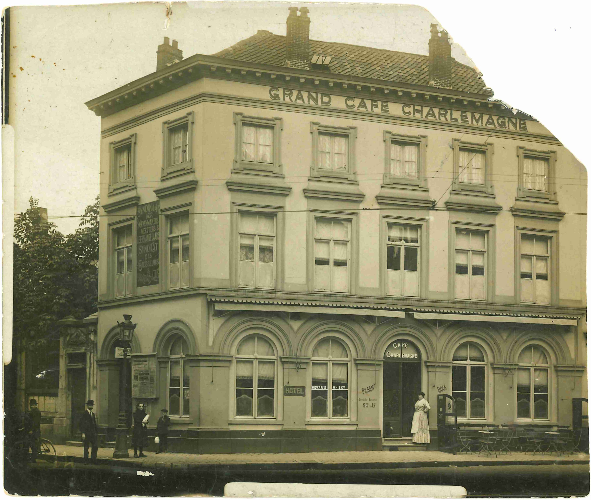

Waar staat Grand Café Charlemagne? Bestaat het nog? En de vrouw bij het gebouw, wie is zij? Welke band heeft ze ermee? Waarom bevindt die kleine foto zich in het archief van de kleinzoon van [Alfons Versluys](https://www.debleeckere.be/1878-octavia-versluys/mozaik/3-versluys)?

Die vragen drongen zich op toen Sylvain voor het eerst op zondag 6 november 2022 de foto zag bij Jozef Van Haver in Aalter. Jozef en zijn vrouw Annie hadden dezelfde vragen. Waar te beginnen om antwoorden te vinden? Het bijna twee jaar durende onderzoek heeft twee fasen gekend: eerst de Brugse, daarna de Versluyse.
Sylvain volgde eerst het spoor van de tekst achteraan op de foto waarin sprake is van Brugge: ‘_Maria Elisa woonde alleen in Brugge_’. Sylvain nam op 20 juni 2023 voor het eerst contact op met het Brugse Stadsarchief (Jan Anseeuw, Pieter Meirlaen). De dienst zond direct een kopie van de overlijdensakte van Maria Elisa, wat een hele stap voorwaarts betekende daar Sylvain tot dan toe over geen enkel gegeven had in welk jaar Maria Elisa was overleden. Nadien mocht hij ook nog het volledige burgerlijke dossier van Maria Elisa te Brugge ontvangen door toedoen van de heer Anseeuw en zijn team. Sylvain zond ook een digitale kopie van de foto naar de Erfgoedcel Brugge (Dieter Viaene). Die antwoordde: ‘_Er is niets over een Hotel Grand Café Charlemagne in Brugge te vinden. Als ik naar de foto kijk, komt er geen enkele plaats in Brugge in mij op waar zo’n gebouw staat._’ Dat bericht was erg ontgoochelend. Snel trokken de donkere wolken over het onderzoek weg dankzij de heer Thomas Wets, Monumentenzorg en Erfgoedzaken, Cluster Omgeving, van de stad Brugge. Hij had de e-mail met de foto in bijlage meegelezen. Hij liet weten dat het gebouw nog altijd bestaat en het zich op loopafstand van de Markt bevindt. [Het gerenoveerde gebouw]() heet nu _Café du Theatre_. Het oude opschrift Grand Café Charlemagne is tijdens de renovatie niet weerhouden. De heer Wets vroeg om de originele foto te mogen ontvangen. Hij heeft er in Brugge een zeer hoogwaardige, digitale kopie van laten maken en aan Sylvain bezorgd. Nu staat de foto uit het gezinsarchief van Jozef Van Haver ook op de [Beeldbank van de stad Brugge](https://zoeken.erfgoedbrugge.be/resultaten.php?nav_id=0-0). In de zoekbalk van de beeldbank geeft men het trefwoord ‘Charlemagne’ in. 

Na de positieve afronding van het Brugse spoor van het onderzoek werd het tweede spoor, het Versluyse, zichtbaar. Dat bestond uit het herbekijken en analyseren van de tekst op de achterzijde van de foto. Die handelt over Maria Elisa in Brugge. De notitie luidt: ‘Maria Versluys woonde alleen in groot café’. Sylvain begreep nu dat de vrouw op de kleine foto niemand anders kon zijn dan Maria Elisa zelf. Wie aandachtig de foto bekijkt, ziet de vrouw in zijaanzicht vóór de dubbele deur van het gebouw staan. Zij bevindt zich daar niet zomaar. Ze poseert. Iemand die ze kent, heeft met haar afgesproken om haar samen met het gebouw te fotograferen. Ze moet dit een belangrijk moment hebben gevonden. Uit de compositie blijkt dat de dame zich identificeert met het gebouw. Ze lijkt te zeggen: ‘Hier hoor ik bij. Dat is mijn thuis.’ We zien dat ze zich fier en vol zelfvertrouwen keert naar het gebouw toe en we kunnen vaststellen dat ze het belangrijk vond dat de grote letters op de gevel duidelijk op de foto leesbaar zouden zijn. Bovendien draagt de dame haar werkkleding van de serveerster van het Grand Café Charlemagne. Ze zegt ons: ‘_Kijk, hier werk ik._’ Er bestaat geen twijfel over. De dame is Maria Elisa. Haar persoonlijke foto is terecht gekomen bij haar familie, in het bijzonder bij haar broer Alfons. Zijn dochter Magdalena had duidelijk een sterke affiniteit met haar vaders familie Versluys. Ze heeft alle familiefoto’s zorgvuldig bewaard en bij de foto’s ook aantekeningen gemaakt op basis van wat haar moeder, de schoonzus van Maria Elisa, haar heeft verteld. Magdalena’s notitie neemt alle onzekerheid weg. Het gaat om Maria Elisa. De bijkomende bevestiging vormt de gelijkenis met de Maria Elisa op de [familiefoto van 1904](https://www.debleeckere.be/1878-octavia-versluys/mozaik/3-versluys). Het is betekenisvol dat haar Brugse foto nu op de Beeldbank van Brugge is vereeuwigd. Ze was immers in de stad ingeschreven als inwoonster van Brugge. Ze bleef, zo weten we, daar officieel ingeschreven tot in 1926, toen ze alle enkele jaren in [Asile Notre-Dame]() verbleef. 

