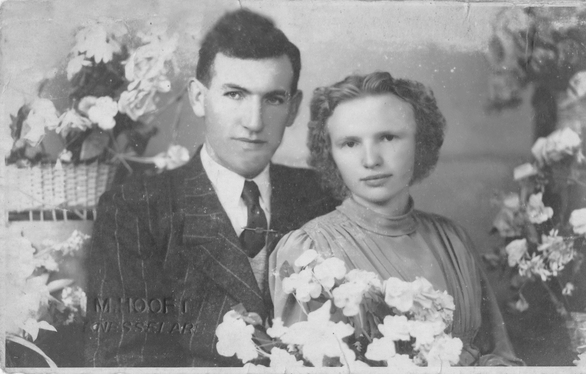

# Albert De Bleeckere
We can here in words put anything we like
with different sections for the person

## More info
We can probably use linked names 
We can autogenerate some info from the frontmatter,
example all known ancestors in line with their dates

