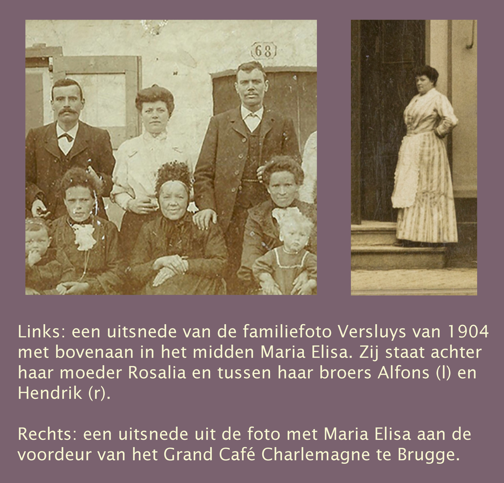
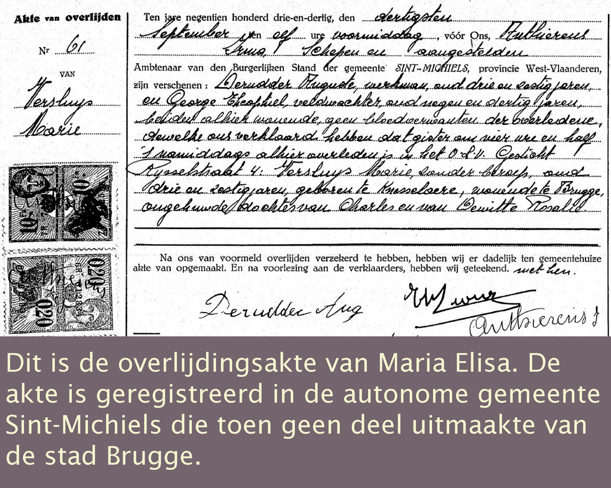
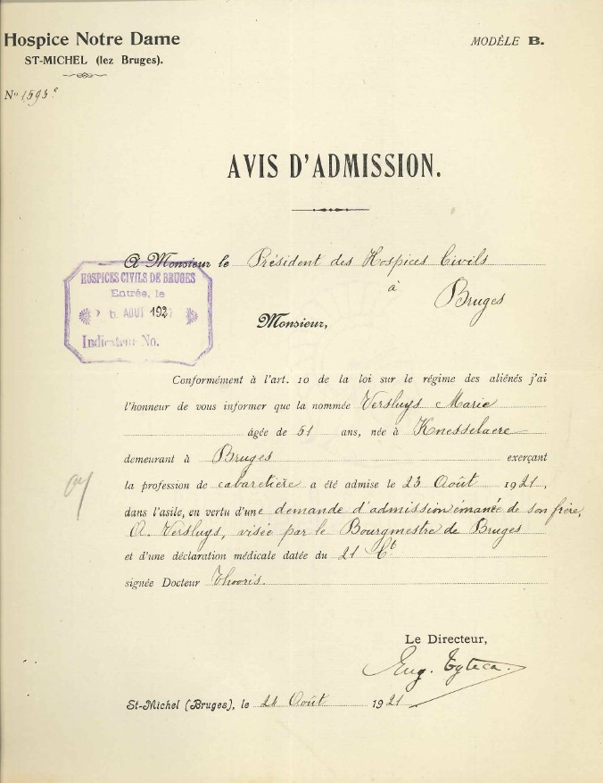
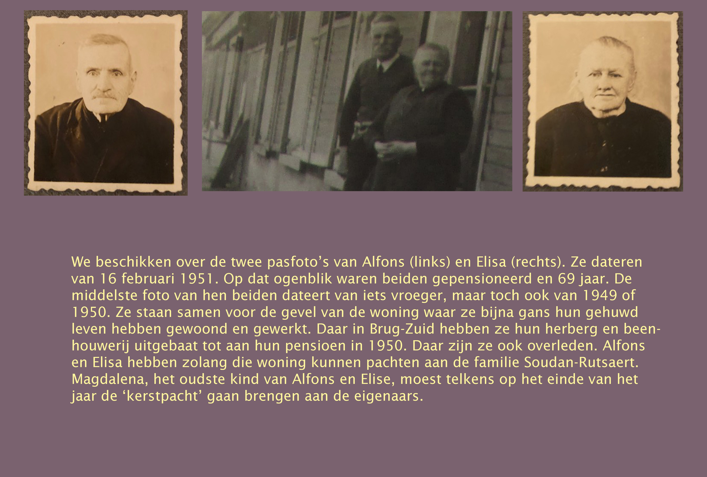
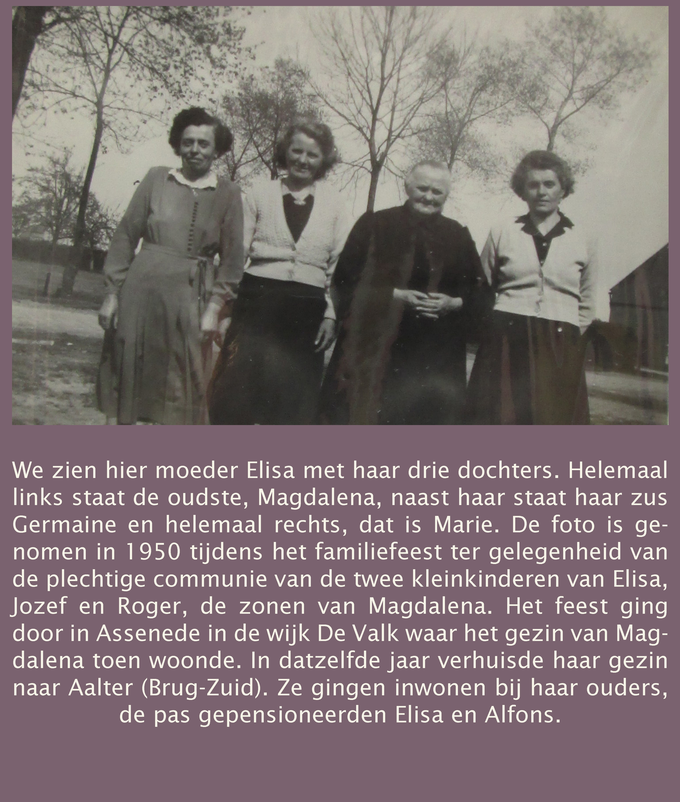

De voorstelling van het gezin Versluys heeft de volgende titels waarop men kan klikken.

- [De familienaam Versluys](#fam_versluys)
- [De historische familiefoto](#fam_foto)
- [Ouders en voorouders](#fam_ouders)
   - [Carolus Ludovicus en Rosalia De Witte](#fam_carolus_rosalia)
   - [Weduwe Rosalia](#fam_rosalia)
   - [De moederlijke familielijn van Octavia : De Witte](#fam_de_witte)
   - [De vaderlijke familielijn van Octavia: Versluys](#fam_vader_versluys)
- [Zussen en broers](#fam_zussen)
   - [De vroeg gestorvenen](#fam_vroeg)
   - [Leonia](#fam_leonia)
   - [Augustus](#fam_augustus)
   - [Hendrik](#fam_hendrik)
   - [Maria Elisa](#fam_maria)
   - [Aphonsus](#fam_aphonsus)
   - [Romania](#fam_romania)
   - [Hirma](#fam_hirma)

## De familienaam Versluys

Eerst is er de familienaam Versluys zelf. Op basis van de gegevens van www.familienaam.be kunnen we stellen dat Versluys een typisch Vlaamse familienaam is. Hij komt, gezien de data van 2008, het meest voor in België en slechts in tweede instantie in Nederland. In België zelf concentreert zich de familienaam Versluys hoofdzakelijk in vier grote Vlaamse, stedelijke regio’s: Gent, Antwerpen, Brugge en Oostende. Een nazaat van de Oostendse tak Versluys, die eigenlijk afkomstig is van Bredene, is daar nu een heel grote immobiliënmakelaar. Die tak is echter geen familie van het gezin Versluys van Knesselare. Die maakt deel uit van een kleine groep in een aantal landelijke gemeenten op de grens tussen Oost- en West-Vlaanderen: Beernem, Ruislede, Zomergem, Maldegem en Knesselare. Anno 2021 leven er in Knesselare verschillende gezinnen Versluys die echter geen familie zijn van elkaar. Het gezin Versluys van Octavia situeert zich aan de zuidkant van Knesselare, in en rond de [Hoekestraat](/1878-octavia-versluys/mozaik/4-weduwe). De familienaam Versluys zelf heeft een typische geografische herkomst. In de naamkunde heet dat fenomeen een microtoponiem. Het betreft familienamen die gekoppeld zijn aan kleine (‘micro’), lokale fenomenen zoals een speciaal huis (‘Van de Casteele), een veld (‘Van de Velde), een waterloop (‘Beeken’ ), een kerkhof (‘Van de Kerckhove), enzovoort. In het geval van Versluys gaat het natuurlijk om een sluis. ‘Van de sluis’ is samengetrokken tot 'versluys'. In het oud-Nederlands schreef men 'sluis' als ‘sluys’ en ‘van de’ werd ‘vander’, wat nog verder werd samengetrokken tot ‘ver..’. En omdat er in Vlaanderen nogal wat sluizen voorkwamen in de steden maar ook in het platteland, is het niet moeilijk om in te zien dat er zich in het verre verleden verschillende families Versluys hebben gevormd die onderling geen verwanten waren. 

## De historische familiefoto

We hebben het geluk dat we van onze tak Versluys een belangrijke historische familiefoto bezitten. Het is tevens de oudste foto in de familie De Bleeckere-Versluys. Het vergde een lang maar boeiend onderzoek om klaarheid te krijgen over de foto en de personen erop. Dat onderzoek zelf vormt een spannend verhaal op zich. Klik daarvoor naar het domein [onderzoek](https://www.debleeckere.be/onderzoek-familiefoto%20versluys).

We weten dat de foto dateert van 1904 en in menig opzicht echt speciaal is. Het betreft namelijk een dubbele huwelijksfoto. Bij de feestelijke gelegenheid van twee huwelijken op een en dezelfde dag besliste het gezin Versluys een voor die tijd nog ongewone gezinsfoto te laten maken. De dag van het dubbele huwelijk was 4 mei 1904: het ene werd voltrokken in de voormiddag in het gemeentehuis van Knesselare, het andere vond plaats in de namiddag in dat van Maldegem. De foto moet wellicht die dag op de middag – tussen beide huwelijken in - zijn gemaakt omwille van het noodzakelijke zonlicht. De toen nog vrij primitieve fotografie had toen veel zonlicht nodig. Ziehier het resultaat van het onderzoek naar de foto.  

Op 4 mei 1904 trouwden twee oudere zussen van Octavia. Maria Hirma (‘Irma’) Versluys trouwde in Knesselare met Ivo De Dobbelaere, terwijl Romania Versluys op diezelfde dag in Maldegem huwde met Eduardus Danneels. De twee bruiden zitten vooraan op een stoel met hun oude moeder-weduwe tussen hen. De echtgenoten, zij die vanzelfsprekend geen Versluysen waren, staan aan de zijkanten: De Dobbelaere helemaal rechts zittend, terwijl Danneels helemaal links bovenaan staat nabij zijn bruid Romania op de stoel. Het valt op dat de twee trouwzussen veel op elkaar lijken. Ze hadden wellicht een sterke band, wat kan helpen begrijpen dat ze op dezelfde dag wilden trouwen. Wat hierna volgt, laten we door Octavia zelf vertellen.

>>_Dag iedereen, ik Octavia ben blij jullie de foto van ons gezin te kunnen voorstellen. Mijzelf vind je terug op de tweede rij rechts. Ik leg mijn rechterhand op de leuning van de stoel waarop mijn lieve zus Irma zit. Je ziet mij staan achter mijn oudste zus, Leonia. We verschillen nogal van leeftijd. Op de feestelijke dag was ik 25 en de jongste telg van het gezin, terwijl Leonia al 40 was. Naast mij zien jullie twee van mijn grote broers. Rechts van mij, dat is August, onze oudste broer. Hij was toen al 38. De man links van mij, dat is mijn broer Hendrik, toen ook al 36. Beide mannen waren in ‘de fleur’ van hun leven, zoals men dat gewoon is te zeggen. Links van hem zie je mijn 34jarige zus Maria. Wij beiden zijn de enige vrouwen in het wit. Dat komt omdat we toen nog niet gehuwd waren. Maria en Hendrik staan achter ons moeder. Hendrik heeft zijn rechterarm op haar schouder gelegd. Je ziet dat ons moeder-weduwe Rosalie straalde; voor haar was het een echte hoogdag van haar gezin. Haar officiële naam was Rosalia De Witte. Ons vader, Charles Louis, was 56 toen hij in april 1884 overleed. Op de dubbele trouwdag was ons moeder al 20 jaar weduwe. Naast Maria zie je nog onze 30jarige broer Alfons. Mijn gelukkige zussen, Romania en Irma, kennen jullie al, samen met mijn nieuwe schoonbroers Ivo en Eduard. Misschien verwonderen jullie zich over de aanwezigheid van twee kinderen. Een meisje en een jongen, ze zitten elk op de schoot van de trouwers. Het meisje heet Maria en de jongen noemt Henri. Zij de twee schatten van ons gezin. Ze zijn opgegroeid in ons huis. Het zijn de kinderen van Irma. De mensen in de streek noemen ze ‘voorkinderen’. Ons Irma was op de dag van haar trouw een ongehuwde moeder. Ons gezin heeft altijd voor hen gezorgd en vandaag heeft onze nieuwe schoonbroer en echtgenoot van Irma de twee kinderen erkend, waardoor ze vanaf vandaag De Dobbelaere heten. Zo begrijpen jullie waarom het voor ons allen vandaag een heel bijzondere en mooie heugelijke dag is. Een feestelijke dag om in te kaderen. Dat hebben we dan ook gedaan._

## Ouders en voorouders

>**CAROLUS LUDOVICUS VERSLUYS X ROSALIA DE WITTE**

>

>8 juni 1860. Die dag trad er een koppel te Knesselare in het huwelijk. Een nieuw koppel maakte zijn opwachting op het gemeentehuis bij burgermeester Gerard August Wille. De bruid heette **Rosalia De Witte**; de bruidegom luisterde naar de naam **Carolus Ludovicus** (Charles Louis) Versluys. De unieke familiefoto Versluys laat ons toe een beeld te vormen van Rosalia, de moeder van Octavia. Rosalia  was 64 jaar op de dag dat haar twee dochters Hirma en Romania trouwden; zeven en een half jaar later overleed ze op 22 januari 1912. Ze werd 73. Op de dag van haar huwelijk, 8 juni 1860, had Rosalia de dag voordien haar 22ste verjaardag gevierd. Ze was afkomstig van het naburige Ursel waar ze geboren was in de late lente op 7 juni 1838.  Haar ouders waren van Ursel naar Knesselare verhuisd. Wellicht heeft ze daar haar man Charles Louis leren kennen. We beschikken over de [huwelijksakte](/officiele-stukken) van het koppel. De huwelijksakte leert ons dat Carolus Ludovicus Versluys analfabeet was, terwijl Rosalia kon lezen en schrijven. Zij was immers in staat de huwelijksakte te tekenen, haar man niet.

><a name="fam_rosalia">**WEDUWE ROSALIA**

>

>Rosalia’s echtgenoot Carolus Ludovicus was toen hij trouwde 32 jaar. Hij was 11 jaar ouder dan zijn bruid. Hij werd namelijk geboren op 12 oktober 1827 te Knesselare. De 56jarige Charles Louis Versluys overleed, zoals blijkt uit zijn [overlijdingsakte](/officiele-stukken) op 5 april 1884. Toen haar man overleed, was Rosalia nog maar 45 jaar. Ze bleef daarna op enkele maanden na nog 28 jaar weduwe; dat is meer dan een kwarteeuw. Ze was meer jaren weduwe dan echtgenote. Haar jongste dochter, Octavia, was slechts 5 jaar toen haar vader overleed. Ze zal wellicht weinig of geen herinneringen hebben gehad aan haar vader. Ze is opgegroeid bij haar moeder-weduwe. Via de twee huwelijksakten van 1904 – de twee dochters van weduwe Rosalia: Hirma en Romania – hebben we officiële info over het beroep van de moeder-weduwe. Volgens de huwelijksakte van Irma en Ivo oefende Rosalia het beroep van ‘landbouwster’ uit, terwijl de secretaris in Maldegem op de huwelijksakte van Romania ‘huishoudster’ noteerde voor het beroep van Rosalia. Beide akten werden nochtans geschreven op dezelfde 4 mei 1904.

><a name="fam_de_witte">**DE MOEDERLIJK FAMILIELIJN VAN OCTAVIA: DE WITTE**

>

>We kennen de naam van de moeder van Rosalia De Witte: **Joanne Catharine Lievens**. Zij werd geboren op 17 november 1805 in het dorp Oostwinkel. Het is een klein dorp dat ligt op de landweg van Kruipuit naar Leischoot. Op de kaart hierboven situeert het dorp zich ter hoogte van de O van Oostwinkel. Het dorp behoort tot het hart van het Meesjesland, gelegen tussen de grotere gemeenten Ursel en Eeklo. Sinds 2019 hoort Oostwinkel tot de fusiegemeente Lievegem. Joanne Catharine Lievens verhuisde naar Ursel, de gemeente van haar toekomstige man, **Augustinus De Witte**. Het paar trouwde in de winter op 20 januari 1836. Augustinus zelf was afkomstig van Ursel. Op zijn trouwdag was hij reeds 48 jaar. Hij was immers geboren op 9 augustus 1788. Hij was dus 17 jaar ouder dan zijn bruid die op haar trouwdag ook al 30 was geworden. Dat Augustinus heel wat ouder was dan Joanne Catharine toen hij met haar trouwde, kwam doordat hij weduwnaar was. Hij hertrouwde. Zijn eerste vrouw, Regine Francisca Roelandts, was te Ursel overleden in november 1835. Hij bleef niet lang weduwnaar want drie maanden later trouwde hij al met Joanne Catharine Lievens in Ursel. Twee jaar later werd Rosalia geboren. Toen was het koppel De Witte-Lievens al naar Knesselare verhuisd. Rosalia was dus een geboren Knesselaarse met roots in Ursel.

><a name="fam_vader_versluys">**DE VADERLIJKE FAMILIELIJN VAN OCTAVIA: VERSLUYS**

>Voor de kennis van de vaderlijke familielijn van de grootouders van Octavia beschikken we over [vijf oude, belangrijke akten](/officiele-stukken) - van drie op elkaar volgende generaties Versluys. Die akten vormen, anno 2021 de verste sporen in de tijd van de familie Versluys van Knesselare.

>De oudste akte is de huwelijksakte van **Jacobus Versluys** en **Jacoba Clays**. We weten niet wanneer ze zijn geboren noch wie hun ouders waren. We weten wel dat ze in de parochiekerk van Knesselare zijn getrouwd op 3 mei 1684. Dat is de tweede helft van 17de eeuw. Eind februari 1690 kregen zij een zoon, Petrus Versluys. De tweede akte die we hebben gevonden, is de huwelijksakte van hun zoon Petrus. Hij trouwde, net als zijn ouders ook te Knesselare, op 12 april 1722 met **Joanna Maenhaut**, eveneens van Knesselare. Joanna stierf in februari 1751 en Petrus een jaar nadien, in mei 1752. Ongeveer dertien jaar eerder, op 10 april 1739, kregen Petrus en Joanna een zoon, **Petrus Franciscus Versluys**; over hem hebben we twee akten: de doopakte en de huwelijksakte. Petrus Franciscus brengt ons dichter bij het gezin Versluys-De Witte want Petrus Franciscus is de overgrootvader van Octavia’s vader, Carolus Ludovicus. Petrus Franciscus erfde de voornaam van zijn vader Petrus en kreeg als tweede voornaam Franciscus. In die tijd waren voornamen eigenlijk doopnamen. Dat wijst op de dominante invloed van de rooms-katholieke kerk via haar parochiepastoors. Zo verwijst de voornaam Petrus naar de eerste apostel die volgens de katholieke kerk haar stichter was met als opvolgers de pausen van Rome, en de voornaam Franciscus verwijst naar de naam van de populaire kerkelijke heilige Franciscus van Assisi. Petrus Franciscus werd vroeg wees. Op zijn 12de stierf zijn moeder en op zijn 13de verloor hij zijn vader. Zijn trouwakte leert ons dat de 25jarige Petrus Franciscus op 18 september 1764 te Knesselare trouwde met **Joanna Van Acker**. 

>Tussen de vader van Octavia, Carolus Ludovicus, en diens overgrootvader Petrus Franciscus bevinden zich nog twee generaties: **Livinius Ignatius** en **Carolus Franciscus**. Nu is het even opletten want de namen Rosalia, Carolus en Franciscus kunnen voor verwarring zorgen.

>**Carolus Franciscus** was Octavia’s grootvader die ze echter nooit heeft gekend. Hij was geboren in 1800, het jaar van de eeuwwisseling. Hij oefende het beroep van wever uit, was gehuwd met Rosalia Van Acker en overleed reeds in 1854. Octavia kan wel haar grootmoeder Rosalia Van Acker nog hebben gekend want die stierf pas op 19 maart 1887, toen was Octavia in november van het jaar ervoor 8 geworden.

>De vader van Carolus Franciscus heette **Livinius Ignatius**. Zijn [geboorteakte](/officiele-stukken) bevestigt dat hij in Knesselare is geboren op 30 juli 1765 als zoon van Petrus Franciscus en Joanna; hij werkte als dagloner en trouwde met Isabella Brandt, geboren op 11 februari 1768; hij overleed op 21 september 1812; zijn vrouw stierf negen jaar later op 17 juli 1821. 

>Terugblikkend kunnen we afleiden dat de vader van Octavia de voornaam Carolus kreeg via zijn vader die op zijn beurt diens tweede voornaam Franciscus had gekregen via zijn grootvader, Petrus Franciscus. Er is nog een bijzonderheid die opvalt. We kennen Petrus Franciscus en Carolus Franciscus. De eerste Franciscus was de grootvader van de tweede. De eerste huwde met Joanna Van Acker, en de tweede met Rosalia Van Acker. Waren Joanna en Rosalia familie, respectievelijk grootmoeder en kleindochter misschien? Waren de Knesselaarse families Versluys en Van Acker over de generaties heen erg close met elkaar? Woonden ze in elkaars buurt en steunden ze elkaar? 

>**TWEE VASTSTELLINGEN**

>De vijf oude kerkelijke akten voeren ons ver terug in de tijd, namelijk naar de tweede helft van de 17de en de eerste helft van de 18de eeuw. Het leven van de drie oudste generaties Versluys van Knesselare – Jacobus, Petrus en Petrus Franciscus – speelde zich nog af tijdens de periode die gekend is als die van het Ancien Regime. Dat betekende dat de feodale orde het dagelijkse leven van de mensen nog volledig in haar greep had. Van de moderne ideeën ‘vrijheid’ en ‘mensenrechten’, uitgedragen door de Amerikaanse (1776) en de Franse (1789) Revolutie, viel er toen in de verste verte nog geen spoor te bespeuren.

>

>De oude kerkelijk akten leren dat de familie Versluys een echte Knesselaarse familie is. We komen ze immers al tegen in Knesselare tijdens de tweede helft van de 17de eeuw. Over de tijd daarvoor hebben we vooralsnog geen verdere data kunnen vinden. De enige aanwijzing is de [trouwakte](/officiele-stukken) van Petrus Versluys en Joanna Maenhaut. Daar vinden we de naam Isidorus Versluys. Het zou de grootvader-peter kunnen zijn van Petrus en de vader van Jacobus. Indien dit het geval zou zijn, dan bezitten we een spoor van nog een generatie voor Jacobus. Maar daarover hebben we geen enkele zekerheid. Gerekend vanaf Jacobus  tot aan Octavia tellen we nu zeven generaties Versluys. Tellen we daar de kleinkinderen van Vital De Bleeckere en Octavia Versluys erbij, zij die anno 2021 zestig, zeventig en tachtig zijn, dan komen we al aan negen generaties. Heel wat van hen wonen nog steeds in Knesselare. De kinderen van de kleinkinderen van Octavia vormen de tiende generatie nakomelingen van de Knesselaarse familie Versluys.

## Zussen en broers<a name="fam_zussen">

>Carolus Ludovicus Versluys en Rosalia De Witte stichtten te Knesselare een gezin dat 12 kinderen telde: 7 dochters en 5 zonen, geboren in loop van twee decennia, tussen 1861 en 1881. Jaartallen vertolken de menselijke realiteit niet. Dat geldt zeker voor het gezin van Charles Louis en Rosalia. In de realiteit werden slechts 9 van de 12 kinderen volwassen: 5 dochters en 4 zonen. Bij het bekijken van de voornamen van de kinderen, valt er direct iets op. De oudste en jongste dochter, Ludovica en Octavia, alsook de meisjes Elisa en Hirma kregen dezelfde eerste voornaam: Maria. Hiermee eerden de ouders de nagedachtenis van hun eerst geborene: Maria Ludovica. Zij werd amper een jaar oud.

><a name="fam_vroeg">**DE VROEG GESTORVENEN**

>Dat de ouders van Octavia 12 kinderen kregen, is anno 2022 moeilijk te vatten, maar in de tweede helft van de 19de eeuw was dit eerder het normaal. Octavia is duidelijk in de voetsporen van haar moeder gestapt want ze werd zelf moeder van [11 kinderen](/1878-octavia-versluys/mozaik/2-huwelijk). Wat veel voorkwam in die grote gezinnen, was kindersterfte. De ouders van Octavia hebben drie kinderen op jonge leeftijd zien sterven. Hun eerste twee kinderen hebben ze moeten ‘afgeven’ zoals de volksmond dat toen formuleerde. Het zijn Maria Ludovica en Emma. De eerst geborene van het gezin, Maria Ludovica, zag op 1 april 1861 het levenslicht. Haar tweede voornaam, Ludovica, verwees naar haar vader Ludovicus. Hij was 35 jaar toen hij op 11 mei 1862 naar de gemeente moest om Maria’s overlijden te laten registreren. Maria’s moeder, Rosalia, moest toen nog 23 jaar worden. Haar meisje was juist een jaar oud geworden. De akte noteert dat Maria Ludovica ‘om acht uur ’s morgens’ is overleden ‘zonder bedrijf’ (!) (d.w.z. ‘zonder beroep’) en ‘ongehuwd’ (!). Dat was in die tijd de administratieve geplogenheid, ook al klinkt dat vandaag cynisch.

> 

Voor het jonge koppel Rosalia en Ludovicus was dat gebeuren een erg tragisch voorval. Toen ze in mei 1862 hun eerste kind moesten ten grave dragen, was de jonge moeder Rosalia immers al voorbij de helft van haar tweede zwangerschap. Ze beviel op 29 september van datzelfde dramatische jaar. Het was weer een meisje. De jonge ouders noemden haar Emma. Heeft het grote en woordeloze verdriet van de jonge, zwangere moeder een impact gehad op haar tweede zwangerschap? Het zou te begrijpen zijn. Emma is kunnen opgroeien als kind, maar in 1870, toen ze zeven jaar en enkele maanden was geworden, overleed ze in de winter op 12 januari. Had ze een zwakke gezondheid? Was ze vatbaar voor het griepvirus of een ander gevaarlijk virus? Dat is mogelijk want we kunnen ons een vrij duidelijk beeld vormen via een overgeleverd medisch rapport van 1879 – negen jaar na het sterfjaar van Emma – van de toenmalige leefomstandigheden van de bevolking in het nog arme boerendorp Knesselare van de jaren zeventig van de negentiende eeuw. 

>

>Bij haar overlijden was Emma de oudste van het gezin; ze had toen al een zus en twee broers. Daarna volgden er nog zeven kinderen. Die groeiden op en werden volwassen, behalve de laatst geborene: Cyrillus (‘Ceriel’). We beschikken over [een geboorte- en een overlijdensakte](documenten). Cyrillus werd geboren op 19 februari 1881 om 21u00. De aangifte gebeurde in het gemeentehuis van Knesselare ’s anderendaags om 11u00 bij burgermeester Arnoldus Bellaert. De vader was aanwezig; hij was toen 53 jaar. De moeder, Rosalia, was uiteraard niet aanwezig; zij was toen 42 jaar. De herbergier Petrus De Coster en de veldwachter Francies Lips waren de getuigen. Iets meer dan twee jaar later, op 11 april 1883, stond de vader Carolus Ludovicus samen met Peter De Coster opnieuw in het gemeentehuis bij de burgermeester. Hij was ondertussen 55 jaar geworden en moest nu het overlijden van ‘Ceriel’ ‘gisteren om vijf uur ’s morgens’ ‘in de woning zijner ouders’ komen registreren. Was dit teveel voor de vader? Woog het verdriet te zwaar? Zijn eerst geborene en zijn laatst geborene ten grave moeten dragen? Feit is dat hij, op enkele dagen na, een jaar later zelf is overleden op 5 april 1884. Hij is 56 jaar oud geworden. Het overlijden van de kleine Ceriel werkte door in het gezin. Toen de 20-jarige dochter Hirma Versluys, de zus van Octavia, haar eerste voorkind kreeg op 10 augustus 1897 liet ze het kind Henri Cyrillus noemen. De overleden kinderen werden in het gezin Versluys-De Witte niet vergeten. De eerst geborene, Maria Ludovica, werd herinnerd via de voornamen van de dochters Maria Elisa, Maria Hirma en Maria Octavia.

>**DE VOLWASSENEN**

>In chronologische volgorde zijn de volgende kinderen volwassen geworden in het gezin Versluys-De Witte: Leonia, Augustus, Hendrik, Maria Elisa, Alphonsus, Romania, Aloysius, Maria Hirma en Maria Octavia. Van zes van deze negen kinderen hebben we een vrij duidelijk beeld. Octavia niet meegeteld, blijven er vijf over van wie we door officiële documenten en bevoorrechte getuigen een vrij concreet portret hebben kunnen vormen. Eerst komt Leonia in beeld.

><a name="fam_leonia">**LEONIA**

>Het derde kind werd te Knesselare op zondag 3 januari 1864 geboren. Wegens het overlijden van de eerste twee kinderen groeide Leonia op als de oudste van het gezin. Haar geboorteakte leert dat ze om 22u00 is geboren. Wat nog opvalt, is dat haar voornaam met een accent werd geschreven: Léonia. Later, in haar huwelijksakte, is dat accent weggevallen. Wat de twee getuigen bij de aangifte van de geboorte van Leonia betreft valt er iets op. Het waren de gebroeders Verbiest. De jongste, Hyppolyte, was ‘schrijver’ en woonde te Gent; de oudste, Augustus Jan, was gemeentesecretaris te Knesselare. Wellicht was Hyppolyte die dag op bezoek bij zijn broer. ‘Schrijver’ Hyppolyte Verbiest heeft echter geen literair spoor in het landschap van de Vlaamse letteren achtergelaten.

>Toen Leonia’s vader, Charles Louis, stierf in april 1884, was ze al 20 geworden. Ze is als oudste zeker een grote steun geweest, eerst voor haar ouders, maar vanaf 1884 vooral voor haar moeder-weduwe. Ze zal ongetwijfeld taken opgenomen hebben in het huishouden en hebben geholpen met de zorg voor de kleinsten: haar zusje Octavia was bij het overlijden van vader Versluys nog maar 6, Hirma nog maar 7 en Aloysius nog maar 9. Maar Leonia’s ondersteuning van het gezin ging letterlijk verder. We weten niet wanneer ze precies is aangekomen in Merelbeke. Ze was zeker al daar in 1890, zes jaar na het overlijden van haar vader, want ze werkte op de boerderij van Eduardus Vanden Broucke. We weten niet of ze in het begin pendelde tussen Knesselare en Merelbeke. Feit is dat ze definitief in Merelbeke bleef toen ze trouwde met de zoon van Eduardus. Die overleed in 1890 op 75-jarige leeftijd. De 27-jarige Leonia trouwde op woensdag 20 mei 1891 met zijn 36-jarige zoon Alphonsus. Haar huwelijksakte registreert dat ze van beroep ‘landbouwster’ in Merelbeke was.

>

>Leonia, de oudere zus van Octavia, heeft haar volwassen leven doorgebracht in het ‘verre’ Merelbeke, meer bepaald in het gehucht Kuiël.

>

>Deze archieffoto van begin 1900 toont de Hundelgemsesteenweg van Merelbeke. Dit was en is nog steeds de invalsweg, komende van Gent, richting centrum. De foto toont de brede weg door het gehucht Kuiël. **Katrien Arnaut**, de gemeentearchivaris van Merelbeke, en auteur van het boek _Merelbeke. Terugblik_ (2010), bezorgde Sylvain de oude foto uit de beeldbank van de gemeente. Zij ondersteunde hem met de interpretatie van de oude, geografische plaatsnamen. Zo werden in de beginjaren van Leonia in Merelbeke de locaties ‘Hukkelgem’ en ‘de Kuiël’ overlappend gebruikt. Leonia en haar man Alphonsus hadden een kleine boerderij in de toenmalige ‘Kraaienhoek’ gelegen nabij de Kuiël. De eerste geboorteaktes van de kinderen van Leonia en Alphonsus  vermelden ‘Kuiël’ als plaats van de boerderij, terwijl de laatste geboorteakten ‘Kraaienhoek’ vermelden. In die tijd bevielen de moeders altijd thuis. Voor de kinderen van Leonia en Alphonsus was de boerderij van hun ouders hun letterlijke bakermat. In die periode was Kuiël tamelijk dichtbevolkt en lag vrij dicht bij het centrum van de gemeente. Decennia later, toen Leonia al weduwe was geworden, kreeg het gehucht waar de boerderij van Leonia en haar man zich bevond, de naam ‘Roskam’. 

>Hoe is de jonge vrouw Leonia terecht gekomen in het voor Knesselare ‘verre’ Merelbeke? Om een antwoord op die vraag te vinden, kreeg Sylvain ondersteuning van de reeds genoemd gemeentearchivaris Katrien Arnaut en van **Erik Leeman**. Leonia was zijn overgrootmoeder die hij nog als kind heeft gezien. Hij is namelijk de kleinzoon van Prudence, de derde dochter van Leonia. Prudence was getrouwd met Henri Joseph Cornelius Leeman, ook afkomstig van Merelbeke. Erik liet Sylvain weten dat de bijnaam van Leonia binnen de familie Leeman-Van den Broecke ‘meetje verre’ was. Dat bevestigt dat toen de afstand tussen Knesselare en Merelbeke nog steeds als ‘ver’ werd beschouwd. Ver inderdaad, maar niet onbereikbaar voor mensen uit Knesselare. Toen de jonge Leonia in haar twintiger jaren in Merelbeke aankwam, circa 1890 of nog eerder, kon men in Knesselare, meer bepaald aan de ‘Poezenhoek’ langs de Urselweg de tram nemen richting Gent, wellicht met een overstap. De tram stopte aan het toenmalige ‘Gent-Zuid’ waar ook een station was gelegen. Na de ingebruik stelling van het nieuw Gentse Station Gent-Sint Pieters werd het station Gent-Zuid afgebroken en werd het huidige Zuidpark aangelegd. Aan het toenmalige station Gent-Zuid kon de reiziger de tram nemen naar Merelbeke. Daar heette de officiële eindhalte van de tramhalte: ‘_Merelbeke-Kuiël / Arrêt du tram’_.  

>Dat Leonia haar volwassen leven in Wetteren heeft doorgebracht, leert ons iets over de toenmalige, moeilijke tijdsomstandigheden. Voor gewone mensen was het dagelijks bestaan een voortdurend gevecht tegen ontbering en armoede. Dat gold in de tweede helft van de negentiende eeuw en het eerste decennium van de twintigste eeuw voor heel ‘arm Vlaanderen’. De bronnen van Sylvain in Merelbeke bevestigen dat Leonia eerst naar Wetteren is gekomen als seizoenarbeidster. Dat economisch verschijnsel kwam in heel Vlaanderen voor. In april 2021 schreef Erik Leeman Sylvain over dat gegeven het volgende:

>>>_Seizoenarbeid was in die tijd een maatschappelijk fenomeen. De grote toename van de bevolking, de crisis in de landbouw en betere transportmodaliteiten lagen aan de basis ervan. Zuid-Oost-Vlaanderen - waaronder het Land van Rode (Merelbeke, Melsen, Munte,, …) - leverde samen met West-Vlaanderen 90% van alle Belgische seizoenarbeiders. In Merelbeke vertrokken jaarlijks veel arbeiders en arbeidsters (niet alleen landbouwers) naar Waalse en Franse velden voor de oogst. In Merelbeke was voornamelijk de suikerbietenteelt en verwerking in de suikerfabrieken in Noord-Frankrijk populair. Deze beweging was financieel aantrekkelijker dan tewerkstelling in de landbouwsector in eigen streek. Hierdoor kwam een echte arbeidsmigratie tot stand. Tijdens de perioden dat zij arbeid verrichten in Frankrijk deden deze landbouwers vaak beroep op andere minder betaalde seizoenarbeiders uit West-Vlaanderen. Vanaf wanneer Leonia op de boerderij van Eduardus Van den Broecke is beginnen werken is mij vooralsnog onduidelijk. Feit is dat Eduardus in 1890 op 75-jarige leeftijd overleden is en dat Leonia hierop relatief snel op 20 mei 1891 met zijn zoon Alphonsus Van den Broecke in het huwelijk is getreden. Ook de periodiciteit van het pendelen van Leonia tussen Knesselare en Merelbeke vóór haar huwelijk met Alphonsus (wekelijks, maandelijks, …) is mij nog onbekend. Of was zij eerder quasi permanent aanwezig in Merelbeke? Door het overlijden van Eduardus was er zeker voldoende werk op de boerderij. Vermoedelijk is de boerderij na het overlijden van Alphonsus Van den Broecke op 4 november 1936 overgenomen door zijn dochter Marie Van den Broecke en haar echtgenoot. Leonia is blijven wonen op de boerderij tot haar overlijden op 24 juli 1952._ 

>

>In dezelfde lijn van het getuigenis van Erik Leeman, liet archivaris Katrien Arnaut Sylvain weten dat rond de eeuwwisseling van de 19de naar de 20ste eeuw ook kranten al een hoofdrol speelden in de communicatie, vooral via de veel gelezen rubriek van de advertenties. Andere middelen bestonden toen niet. De krantenadvertenties informeerden over werkaanbiedingen. Maar ook de mondelinge communicatie werkte goed. Iemand kende iemand en die kende weer iemand anders. Er zullen zeker mensen uit Merelbeke zijn geweest die banden hadden met Knesselare. De archivaris meldt dat zij in de oude bevolkingsregisters van Merelbeke regelmatig iemand tegenkomt die afkomstig is uit Knesselare. Leonia was toen zeker niet de enige Knesselaarse in Merelbeke. Wellicht is het via een mondelinge tip dat het gezin Versluys en in het bijzonder Leonia op het spoor is gekomen van werk in Merelbeke. Er waren daar heel wat bloemisten actief die handen tekort kwamen. Misschien is Leonia bij een bloemisterij begonnen en is ze via de lokale informatie terecht gekomen bij de boerderij Van den Broecke. Zij had van huis uit immers ervaring met het boerenleven. We weten dat de kennismaking met het boerengezin Van den Broecke haar leven veranderde.
Leonia werd de bruid van Alphonsus Van den Broecke. Over de schrijfwijze van de familienaam Van den Broecke is er een eigenaardigheid. Op de doopakte van Alphonsus wordt zijn familienaam geschreven als ‘Vanden Broecke’, terwijl op de trouwakte van hem en Leonia de familienaam ‘Van den Broecke’ staat geschreven. Officieel telt de schrijfwijze van de geboorteakte, maar de wet van de gewoonte beslist er soms anders over. De man van Leonia zag het levenslicht op 27 januari 1855. Zijn ouders heetten Eduardus Vanden Broecke – hier wordt de familienaam nog in twee woorden geschreven - en Barbara Gremmens. 
 
>Leonia werd moeder van zes kinderen, vijf meisjes en een jongen. Van oud naar jong zijn het: de eerste geborene Maria Louisa Cornelia (°Merelbeke, 23.08.1891) die kloosterzuster werd, Maria Coralia Cornelia (roepnaam Coralie) (°Merelbeke, 09.02.1893), Maria Prudentia Cornelia (roepnaam Prudence) (°Merelbeke, 17.01.1896),  Maria Cornelia (roepnaam Marie) (°Merelbeke, 11.10.1897) en Armandus Josephus Cornelius (roepnaam Jozef) (°Merelbeke, 04.06.1900) en Irma Cornelia (roepnaam Irma) (°Merelbeke, 16.06.1903). Via **Andre Van Acker** van Merelbeke beschikt Sylvain over een digitale kopie van de doopakten van alle kinderen van Leonia en Alphonsus. 

>

>Er zijn verschillende tekenen die wijzen op de goede, blijvende band tussen Leonia en haar thuis in Knesselare. Het beeld hierboven is een fragment van de huwelijksakte (20 mei 1891) van Leonia en Alphonsus met hun handtekeningen, maar ook van die van Leonia’s moeder, de  weduwe Rosalia (‘R. De Witte’). Dat betekent dat Rosalia in Merelbeke aanwezig was op de trouwdag van haar oudste, levende dochter. Dit zou ze nooit hebben gedaan wanneer er geen goede band was geweest. Ze had evengoed een administratief document kunnen ondertekenen op het gemeentehuis van Knesselare die het dan had bezorgd aan dat van Merelbeke. Trouwens, Rosalia De Witte heeft dit meer dan tien jaar later, op die manier gedaan voor het huwelijk van haar andere dochter Romania toen die huwde te Maldegem, vlakbij Knesselare. Ze kon immers toen niet op [de trouw van Romania](/onderzoek-familiefoto%20versluys) aanwezig zijn omdat op diezelfde dag haar andere dochter Hirma in Knesselare trouwde.

>In 1891 was de reis van Knesselare naar Merelbeke nog een echte onderneming. Uit de huwelijksakte leren we ook dat de trouw plaats vond om 20u00, ‘s avonds dus, in het gemeentehuis van Merelbeke. Wellicht heeft dat te maken met de lange reis van de moeder-weduwe die daarna zal blijven overnachten zijn in de boerderij van het koppel. Trouwens op de trouw waren de beide moeders aanwezig en ze waren op dat ogenblik allebei weduwen. Rosalia was 52 jaar toen Leonia trouwde en de akte noemt haar ‘werkvrouw te Knesselare’. De trouwers hadden vier getuigen gekozen: een herbergier, een notarisklerk, een winkelier en een vlashandelaar.

>Er zijn nog andere tekenen van de sterke band tussen Leonia en haar thuis in Knesselare. Ze staat op [de gezinsfoto van Versluys-De Witte](/onderzoek-familiefoto%20versluys) van 1904. Nog een vol jaar daarvoor was haar jongste dochter Irma geboren. Let even op de voornaam. Leonia’s jongere zus heette ook Irma (‘Hirma’) en had twee voorkinderen die ook op de genoemde gezinsfoto van 1904 staan. Leonia zit op die foto tussen het trouwkoppel Irma en Ivo. Dit wijst er ook op dat Leonia een bijzondere band moeten hebben gehad met haar jongere zus Irma. Daar is nog een andere ‘bewijs’ van. In 1933 trouwde het voorkind van Irma, Maria Elisa. Op die trouw waren de families Versluys en De Dobbelaere uitgenodigd. Uit het fragment van de familiefoto waarover we beschikken en die bij die gelegenheid is genomen, staat ook Leonia en wellicht ook haar man Alphonsus. Ofschoon het koppel toen al hoogbejaard was - Leonia 69 jaar, Alphonsus 78 jaar – hebben ze de uitnodiging aanvaard en erop gestaan persoonlijk aanwezig te zijn op de trouw van Leonia’s nichtje, de dochter van haar geliefde zus. 

>

>Leonia werd weduwe op 4 november 1936. Ze bleef weduwe tot aan haar dood in de zomer van 1952, op 24 juli, te Merelbeke. Dat is bijna 16 jaar. Tijdens de Tweede Wereldoorlog en de moeilijke periode van de Wederopbouw daarna is ze op de boerderij kunnen blijven wonen. Haar kinderloze dochter Marie en haar man hadden de boerderij overgenomen. Op haar bidprentje wordt ze ‘Leonie Versluys’ genoemd: ‘Weduwe van Alfons Van den Broecke’. Hier wordt de familienaam van haar overleden man weer in drie woorden geschreven. We weten niet of Octavia naar Merelbeke is gereisd voor de begrafenis van haar oudste zus. Ze zal zeker het bidprentje hebben gekregen dat tijdens de begrafenis van Leonia is uitgedeeld.

>

>Octavia heeft kunnen lezen wat de dorpspastoor van Merelbeke over haar zus Leonia heeft geschreven. Geheel in de katholieke geest van die tijd schetst de dorpspastoor een zeer vroom beeld van de overledene. Het is niet duidelijk wat de pastoor bedoelde met zijn eerste zin: ‘_Zij leed veel maar droeg verduldig elke pijn, alles ter ere Gods._’ Wel weten we iets van het lijden dat Leonia tijdens haar volwassen leven in Merelbeke heeft gekend. Erik Leeman heeft via zijn grootmoeder en zijn eigen moeder vernomen dat Leonia ‘een groot verdriet’ met zich meedroeg. De voedingsbodem ervan was het heimwee naar haar thuis in Knesselare. Dat gegeven bevestigt haar sterke band met haar moeder-weduwe Rosalia en haar zussen en broers, in het bijzonder met haar jongere zus Hirma. Bovenop dat verdriet nestelde zich de droefheid over haar enige zoon Jozef. Hij was in aanraking gekomen met het gerecht. Hij heeft een gevangenisstraf uitgezeten. En dan was er nog haar jongste dochter Marie die met haar man de boerderij van haar ouders had overgenomen en bij wie Leonia als weduwe is blijven inwonen. Het koppel kon moeilijk kinderen krijgen. Voor boerenmensen is dat reeds een grote beproeving, wat concreet meebracht dat Leonia ook op haar oude dag zal hebben geprobeerd zoveel al ze kon nog mee te werken op de boerderij. Toen Marie toch zwanger raakte, koesterden het koppel en moeder Leonia een sterke hoop. Die veranderde in wanhoop omdat de foetus in de moederschoot stierf. In die tijd stond de gynaecologie nog in haar kinderschoenen. De verwijdering van de dode foetus uit de moederschoot was een enorm pijnlijk, gevaarlijk en dramatisch gebeuren dat iedere mogelijke volgende zwangerschap definitief uitsloot. Leonia heeft haar geliefde dochter bijgestaan en verzorgd. Dat gebeuren heeft haar in haar laatste levensfase zeer sterk getekend, temeer dat ze een zeer vrome, biddende vrouw was. Ze zal zich zeker hebben afgevraagd waarom zo’n lijden en dergelijk lot haar en haar geliefde dochter moesten overkomen.

>

><a name="fam_augustus">**AUGUSTUS**

Het was 5 september 1866 toen de tweede Belgische koning, Leopold II, en zijn echtgenote Marie Henriëtte van Oostenrijk op de markt van Tongeren verschenen. Ze kwamen er de inhuldiging van het standbeeld van de Gallische leider Ambiorix glans bijzetten. Het beeld staat er nog steeds. Enkele maanden eerder was er ook reden tot vreugde, weliswaar zonder enige koninklijke aanwezigheid, in het gezin Versluys-De Witte: de geboorte van hun eerste jongen, Augustus die het levenslicht zag op 5 maart 1866 te Knesselare. Hij werd de oudste broer van Octavia. Toen hij poseerde voor [de gezinsfoto van Versluys-De Witte](/onderzoek-familiefoto%20versluys) was hij 38 jaar en reeds getrouwd. 

Over het leven van Augustus vond Sylvain directe informatie via twee bronnen. De eerste is de kleindochter van Augustus, **Rita Versluys** (°1943) van Knesselare. Zij was nog geen drie jaar toen haar grootvader Augustus overleed. De tweede bron is **Patrick Vanhauwaert** (°1956) van Ruiselede, de achterkleinzoon van Augustus. Patrick contacteerde ook nog een andere achterkleinzoon van August, **Johan Versluys** (°1954). Johan telefoneerde daarna met **Godelieve en Rachel Versluys**, net zoals Rita Versluys nog – anno 2022 – levende kleindochters van Augustus. Via Patrick Vanhauwaert ontving Sylvain de gegevens van die telefonische contacten. Voor het Brugse luik van het verhaal kon Sylvain beroep doen op het gedigitaliseerde stadsarchief van Brugge.

>Biografische schets van Augustus

De oudste broer van Octavia heeft tachtig jaren geleefd. Hij is geboren en is overleden te Knesselare. Zijn overlijden op 12 augustus 1946 situeert zich in de tweede zomer na de Tweede Wereldoorlog in Europa. Weduwe Octavia zal de begrafenis van haar oudste broer in de kerk van Knesselare zeker hebben bijgewoond. Op het Bidprentje van Augustus lezen we: ‘Mijn geliefde Familie, mijn leven ging voorbij in kommer en zorg.’ Dit zijn natuurlijk niet zijn eigen woorden, maar die van de pastoor die in het kader van de toenmalige kerkelijke visie in het leven van de mens altijd de negatieve zaken belichtte. In de realiteit heeft Augustus een boeiend leven gekend.

Hij is tweemaal getrouwd, telkens met een weduwe. De eerste keer trad hij te Knesselare op 24 mei 1893 in het huwelijk met Pelagia Verfaillie. Zij was een Knesselaarse, geboren op 24 april 1852. Ze was 14 jaar ouder dan Augustus. Het was Pelagia’s tweede huwelijk, want ze was weduwe van Constantinus Van de Walle. Hij overleed op 11 december 1887. Pelagia was dus bijna zes jaar weduwe toen ze voor de tweede keer trouwde in het voorjaar van 1893. Octavia was toen bijna 14 jaar; ze heeft het trouwfeest van haar broer en nieuwe schoonzus meegemaakt. Augustus en Pelagia bleven iets meer dan een kwarteeuw, 27 jaar, getrouwd. Pelagia stierf op 11 september 1920. Ze werd 68 jaar. 

Gedurende acht jaar die daarop volgden, sloeg de levensweg van weduwnaar Augustus geleidelijk een andere richting in, letterlijk dan. Hij kwam terecht in Brugge. Hoe dat gebeurde, weten we niet. Het feit is dat hij in de West-Vlaamse hoofdstad op 11 september 1928 hertrouwde met weduwe Stephanie Vanden Bossche. Hun trouwakte vermeldt dat de 62jarige  Augustus landbouwer was en dat de 69jarige Stephanie ‘zonder beroep’ was. De ouders van Stephanie waren Charles (Carolus) Vanden Bossche en Stephanie Lommez. Het Brugse gezin woonde in de Maagdenstraat 42, niet ver van de Smedenpoort. Charles was afkomstig van Maldegem, maar hij had zich als bakker gevestigd te Brugge. Hij was weduwnaar toen hij in de zomer van 1885 trouwde met Stephanie Lommez, een echte Brugse. Ze was, toen ze trouwde met Charles, een jonge weduwe van 29 jaar. Het gezin moet vrij bemiddeld zijn geweest want op de overlijdensakte van de moeder-weduwe Lommez die overleed in de oogstmaand van 1894, lezen we dat ze ‘rentenierster’ was. Stephanie, de tweede vrouw van Augustus, droeg dezelfde voornaam als haar moeder. Zij was in het Brugse gezin Vanden Bossche-Lommez geboren op 26 juni 1859. Stephanie was zeven jaar ouder dan Augustus. Ook voor Stephanie Vanden Bossche was dit al haar tweede huwelijk. Ze was namelijk weduwe van de Brugse koopman François Beyers die overleed op 24 maart 1927. In Knesselare, in het gezin van Victor, de zoon van Augustus, werd Stephanie als ‘een rijke weduwe’ aanzien, aldus Rita Versluys, de dochter van Victor. Stephanie was twee jaar en enkele maanden weduwe toen ze trouwde met Augustus. Zij en Augustus woonden in de periode van hun huwelijk in Brugge, in de Guido Gezellelaan 18, op wandelafstand van het ouderlijke huis van Stephanie in de Maagdenstraat. In Brugge leerde Augustus het stadsleven kennen. Wellicht nam hij daar de gewoonte aan om een bolhoed te dragen. Stephanie was 74 jaar toen ze overleed op 25 oktober 1933.

Augustus was 67 jaar toen hij Stephanies overlijden aan de balie van de burgerlijke stand van Brugge liet registreren. Bij die aangifte was ook Charles Beyens aanwezig. Hij was de 49jarige zoon uit het eerste huwelijk van Stephanie en stiefzoon van Augustus. Het huwelijk van Augustus en Stephanie bleef kinderloos. Toen Augustus voor de tweede maal weduwnaar werd, had hij twee eigen zonen en twee stiefzonen. Hij keerde terug naar zijn geboortedorp Knesselare waar ook zijn oudste zoon Victor woonde. Eerst woonde Augustus alleen in de toenmalige Molenstraat, waarna hij is gaan inwonen in het gezin van zijn oudste zoon Victor in een zijstraat van de Hoekestraat, vooraan in de Kneukelstraat. Dit is een smal straatje waar aan het begin ervan zich de boerderij van landbouwer Augustus stond, daar waar hij woonde met zijn eerste vrouw Pelagia. Later verkocht hij de boerderij aan zijn oudste zoon Victor die het landbouwbedrijf overnam en voortzette. Uiteindelijk kwam Augustus terug in zijn eerste thuis toen hij introk bij het gezin van zijn zoon Victor. Daar, in het huis waar voor hem alles begon, is hij overleden op 12 augustus 1946. Hij heeft zijn tweede vrouw Stephanie met 13 jaren overleefd. 

>De stiefzoon van Augustus

Alvorens zelf voor de eerste maal vader te worden, werd Augustus eerst stiefvader van Julius Bernardus Van de Walle, de zoon van Pelagia. Die jongen heeft zijn echte vader nooit gekend want zijn moeder-weduwe schonk hem het leven nog geen twee maanden na het overlijden van zijn vader, Constantinus Van de Walle, op 4 februari 1888. Toen Julius Bernardus later trouwde met Maria Bellaert, werd hij vader van drie kinderen: twee zonen, Remi en Antoine, en een dochter, Anna. Bijzonder is dat de twee zonen van Jules allebei priester zijn geworden. Remi werd kloosterling bij de missionarisorde van de Witte Paters (Patres Albi) en Antoine trad binnen in het grootseminarie van het bisdom Gent. Het bidprentje van Augustus leert ons dat Augustus peter was van Antoine, de priester. Die heeft een periode in Belgische Congo gewerkt als missionaris om daarna terug te keren en godsdienstles te geven in Oostakker. Op het einde van het gebedsprentje van Augustus lezen we: ‘Bidt veel voor mijn ziele zaligheid, gij vooral, mijn petekind, priester des Heeren.’ De stiefzoon van Augustus, Julius Bernardus Van de Walle, woonde met zijn vrouw Maria Bellaert in het centrum van Aalter. Hij had er een zelfstandige handel in eieren en was bestuurslid van de christelijke Middenstandsbond. Hij haalde bij de boerderijen in de streek de eieren op. Hij overleed in Aalter op 8 april 1956. Hij werd 66 jaar. Hij was ook de dooppeter van onze bevoorrechte getuige, Rita Versluys. Dit toont ook de sterke band aan die er altijd is geweest tussen de gezinstak van Augustus Versluys en die van Van de Walle. 

>De twee zonen van Augustus en Pelagia

>

Deze samengestelde foto toont een studiofoto van Augustus en Pelagia, wellicht naar aanleiding van de twintigste verjaardag van hun huwelijk in 1913. Misschien hebben ze toen een feest gegeven voor de familie waarbij ook Octavia en haar man Vital aanwezig waren. Daarnaast toont diezelfde foto de twee zonen van Augustus en Pelagia: Victor en Alphonse. Augustus en Pelagia kregen in het vijfde jaar van hun huwelijk hun eerste zoon: Victor. Hij zag het levenslicht te Knesselare op 28 juni 1898. Op dat ogenblik waren Augustus 32 jaar en Pelagia op enkele maanden na 46 jaar. De geboorteakte van Victor vermeldt dat zijn vader Augustus landbouwer was en dat hij woonde in ‘de wijk Hoekstraat’, geschreven zonder tussen ‘e’. In die tijd noemde men de ‘Hoekstraat’ een wijk waartoe ook de Kneukelstraat behoorde. De moeder, Pelagia, was volgens diezelfde akte ‘zonder beroep’. Dat betekende in de praktijk dat ze huisvrouw was en meehielp op de boerderij. Dezelfde geboorteakte leert ook dat een van de getuigen de broer was van Pelagia, de vijftigjarige Charles Verfaillie, staatsbediende. Hij woonde toen in Lier. 

> 

Over Victor hebben we een getuigenis van zijn nicht Rachel, de dochter van zijn broer. Zij vertelde anno 2022 aan Johan Versluys, een kleinzoon van Victors broer, dat ze zich haar Knesselaarse nonkel herinnert als ‘een pronte meneer’, wat zoveel wil zeggen als ‘flink, goedgekleed, netjes, knap’. 

> 

De dochter van Victor, Rita Versluys, bezorgde Sylvain de mooie studiofoto van haar vader Victor die het getuigenis van Rachel bevestigt. Ook Rita zelf herinnerde zich anno 2022 nog dat haar vader ‘een fiere man’ was. Zij herinnert hem als zeer zorgzaam en degene die in het gezin alles regelde. Hij ging bijvoorbeeld naar de markt, kocht er stoffen en gaf die aan zijn dochter Yvonne om er kleren voor het gezin van te maken. Rita vertelde ons dat Victor overleed aan kanker. Hij is gestorven in zijn ouderlijk huis, de boerderij in de Kneukelstraat, daar waar eerder ook zijn vader Augustus was overleden. Later is de boerderij verkocht. Het gerenoveerde woonhuis bestaat nog steeds, het landbouwbedrijf niet, ofschoon, anno 2022, verderop aan de noordzijde van de Kneukelstraat nog steeds uitsluitend akkerbouw voorkomt.

Twee jaar na de geboorte van Victor, op enkele dagen na, kregen Augustus en Pelagia in het eerste jaar van de nieuwe eeuw, op 21 juni 1900, hun tweede zoon: Alphonse. Zijn voornaam verwijst wellicht naar zijn peter, de jongere broer van Augustus, Alphonsus, een andere broer van Octavia. Over Alphonse kregen we een mooi getuigenis van Patrick Vanhauwaert:

_Mijn grootvader schreef gedichten en kleine versjes en hij volgde tot op latere leeftijd cursussen rondom sociale onderwerpen. Hij was een boekenlezer en was zeer creatief met het vlechten van rieten manden en allerhande crea-spullen. Ik blijf mijn grootvader herinneren als een stille en zachte man die tot op zeer hoge leeftijd geïnteresseerd bleef in de vele aspecten van het leven en vooral zijn kleinkinderen een warm hart toedroeg._

Op het bidprentje van Alphonse, dat erg persoonlijk is opgesteld, wellicht door een van zijn kinderen die spreekt in naam van alle kinderen: _‘Vader… Je waart een mens die van ons hield. Je waart een mens om van te houden.’_ Ook citeren ze op zijn bidprentje een fragment uit een van zijn gedichten, met name zijn gedicht _Kinderweelde_. 

    O kind dat zelden wordt verstaan
    en altijd wordt voorbijgezien.
    Och kind.
    'k weet zeker zonder voorbehoud
    dat iemand heel veel van je houdt.

>Kleinkinderen van Augustus en Pelagia

>

We beschikken, dankzij Rita Versluys, over twee zwart-wit foto’s van de oude, tweevoudige weduwnaar Augustus in Knesselare. We zien vader en grootvader Augustus. Op de gezinsfoto links zien we de oude man met de bolhoed. Hij is Augustus. Zijn oudste zoon Victor staat naast hem. Diens vrouw Maria draagt het jongste kind, dochtertje Rita, op haar arm. En dan is er nog hun dochter Anna (°1934). Naar aanleiding van haar plechtige communie – het witte communiekleed, de eigen kerkmissaal in de hand – is deze gezinsfoto genomen op de boerderij in de Kneukelstraat in het voorjaar van 1946, enkele maanden voor het overlijden van Augustus in de zomer van dat jaar. De tweede foto toont Augustus op een stoel gezeten buiten aan het venster in de zon, samen met zijn kleinkind Yvonne (°1924 - 1999). De foto is genomen in Knesselare vóór de gevel van het huis waar Augustus eerst woonde na zijn periode in Brugge, de toenmalige Molenstraat. Wellicht is de foto genomen circa 1938, kort na Augustus’ terugkeer naar Knesselare. Met zijn kleinkind Yvonne had hij een bijzondere band daar ze bij hem en zijn vrouw Stephanie in Brugge verbleef voor haar opleiding als naaister. Yvonne, Anna en Rita, de kleinkinderen van Augustus, zijn de dochters van Victor en Maria Magdalena. Ze hadden nog twee andere dochters. Eerder, op 21 mei 1924 trouwden de bijna 26jarige Victor en de bijna 20jarige Maria Magdalena De Jaeger, geboren op 27 juni 1904. Ze waren allebei van Knesselare. Interessant is te weten dat Maria De Jaeger geen familie was van de andere familie De Jaeger waartoe de gekende burgermeester van Knesselare August De Jaeger behoorde. Het gezin De Jaeger, de schoonfamilie van Victor, woonde eveneens in de Kneukelstraat. Victor en Maria Magdalena waren buren van elkaar en leerden elkaar zo kennen. Toen ze trouwden was Maria al zwanger van hun dochter Yvonne. Victor en Maria Magdalena werden de gelukkige ouders van vijf dochters: Yvonne, Georgette, Simone, Anne en Rita. Deze laatste werd geboren op 11 maart 1943 en scheelde 18 jaar met haar oudste zus Yvonne. Toen Rita 12 jaar werd, overleed haar vader thuis in de boerderij in de Kneukelstraat op 20 juni 1955, nog geen negen jaar na zijn vader Augustus. Victor is op enkele dagen na 57 jaar geworden.
	
>

Augustus had 11 kleinkinderen: tien meisjes, de vijf dochters van Victor en de vijf dochters van Alphonse, plus één jongen: Roger, de enige zoon van Alphonse. Hij werd in 1928 geboren. Het gezin had toen ook al een dochter. Die oudste dochter, Gabrielle, was echter een voorkind van Maria en werd geboren te Staden. Zij is dus niet in de volle zin van het woord een kleindochter van Augustus, maar ze is altijd als een volwaardige dochter opgenomen geweest in het gezin van Alphonse en Maria. Hun eerste eigen kind, Roger, werd geboren in Louveigné, deel van Sprimont, gelegen in de Waalse provincie Luik. Daar verbleef het gezin tijdelijk. Wellicht heeft Alphonse daar in de steengroeve gewerkt. In ieder geval,  Alphonse en Maria zijn uiteindelijk teruggekeerd naar Ruiselede, ook al hebben ze eerst nog een tijdje in Sint-Maria-Aalter gewoond, op de grens met Ruiselede. Uiteindelijk is Roger het enige mannelijk kleinkind van Augustus gebleven. Hij overleed te Eke in 2019. Roger zelf kreeg één zoon: Johan. Die is anno 2022 nog de enig levende mannelijke Versluys van de tak van Augustus. Voorts valt op dat in die tak verschillende nakomelingen lid zijn geworden van de rooms-katholieke kerk: de twee zonen van  de stiefzoon van Augustus, Julius Bernardus Van de Walle, en de twee dochters, Godelieve en Rachel, van Alphonse en Maria. 

>Familiale band

>

Tussen de twee gezinnen van de zonen van Augustus is er altijd een hechte familieband blijven bestaan. Een historische foto van 1984 bevestigt die band. Hij is genomen in de feestzaal Kleitenhof te Knesselare. Daar werd toen de 80ste verjaardag van Maria De Jaeger gevierd. Zij was toen al bijna dertig jaar de weduwe van Victor Versluys en de moeder van onze getuige Rita Versluys bij wie ze inwoonde. Op de foto zien we rechts de toen 84jarige Alphonse Versluys en de 81jarige Maria De Bel. Helemaal links zien we Marta De Jaeger, de zus van de feestelinge Maria. 

Was er ook een onderlinge familieband tussen de tak van Augustus en die van Octavia? Augustus heeft het grootste deel van zijn leven gewoond en gewerkt in de Kneukelstraat, in de wijk Hoekestraat. Dit was erg dichtbij het huis en boerderij van Octavia en haar man Vitalis De Bleeckere. Ze waren praktisch elkaars buren. Hetzelfde geldt voor Victor, de oudste zoon van Augustus, en zijn gezin; hij had immers de boerderij van zijn vader overgenomen. Die nabijheid heeft de twee gezinnen zeker geholpen om elkaar niet uit het oog te verliezen. Het gezin van de tweede zoon van Augustus, Alphonse, woonde verder, in Ruiselede. Om bij elkaar te komen, moesten ze door het dorp Sint-Maria-Aalter. We hebben een getuigenis van Godelieve Versluys, de kloosterzuster, met wie Johan Versluys, de kleinzoon van Augustus, over dit onderwerp anno 2022 heeft gesproken. Johan sprak ook met de zus van Godelieve, Rachel, eveneens kloosterzuster. We verwezen eerder al naar haar getuigenis over haar ‘prompte’ oom Victor. Beide getuigenissen bevestigen de familiale band tussen Versluys-Ruiselede en Versluys-Knesselare. Godelieve verklaarde dat ze haar grootvader Augustus slechts enkele keren heeft ontmoet. Er waren dus familiale contacten met de Knesselaarse familie, maar die waren voor en tijdens de Tweede Wereldoorlog beperkt. Volgens Godelieve waren die contacten schaars mede omdat Augustus tijdens de periode van zijn tweede huwelijk in Brugge woonde. Zo’n verre familiebezoeken waren in die tijd niet vanzelfsprekend. Ze voegde er nog aan toe: ‘De meeste mensen hadden genoeg werk met het opvoeden van de vele kinderen en de noeste arbeid voor het dagelijkse brood op de plank.’ Godelieve wist wel dat Yvonne, de dochter van haar oom Victor, bij Augustus in Brugge heeft verbleven. Tekenen van die familiale band was ook het feit dat Victor in 1930 de dooppeter werd van de latere kloosterzuster Godelieve. Rita Versluys herinnert zich anno 2022 nog zeer levendig dat zij, haar man Etienne en haar moeder-weduwe Maria in de jaren zestig van vorige eeuw regelmatig op bezoek zijn geweest bij het gezin van oom Alphonse, de schoonbroer van haar moeder-weduwe, in hun toenmalige huis in Sint-Maria-Aalter op de grens met Ruiselede. Het gezin Victor Versluys werd ook uitgenodigd naar de begrafenis van zowel Alphonse als Maria. Tot slot, de oude Godelieve wist ook nog te vertellen aan Johan Versluys dat ze Vitalis De Bleeckere en haar tante Octavia Versluys heeft gekend. 

><a name="fam_hendrik">**HENDRIK**

><a name="fam_elisa">**MARIA ELISA**

>Geboorte

>

Het was op een zondag, rond de middag, 6 maart 1870. Carolus Versluys vertrok vanuit zijn huis in de Hoekestraat naar het gemeentehuis van Knesselare. Hij was niet alleen en het was niet de eerste, maar de zesde keer dat hij de geboorte van een kind kwam aangeven. De burgemeester zelf, Gerard August Mille, wachtte de gelukkige vader op. Carolus, zo luidt de akte, ‘vertoonde’ zijn baby-dochter die thuis ‘s  morgens in de vroegte, om 5 uur, was geboren en aan wie hij de voornaam Maria Elisa gaf. Wellicht wilden de ouders met de voornaam Maria hun eerstgeboren kind, Maria Ludovica, blijvend herdenken. Het meisje was bijna acht jaar geleden, in mei 1862, een jaar na haar geboorte, overleden. Uit het familiearchief leren we dat Maria Elisa als Maria Versluys door het leven is gegaan. Ze was dus in het gezin Versluys-De Witte een levende herinnering aan haar oudste, overleden zus. De geboorteakte van Maria Elisa vermeldt de Franse naam van de vader: Charles Louis Versluys. Zijn Latijnse naam, Carolus Ludovicus, werd dus in de toenmalige gemeente van Knesselare verfranst. De vader was toen 42 jaar en de moeder, Rosalia, was 31. De ongeletterde vader met beroep ‘werkman’ kon de akte zelf niet ondertekenen. 
De gelukkige ouders hadden op de geboortedag van Maria Elisa tegenstrijdige gevoelens. Carolus en Rosalia rouwden nog. Amper twee maanden eerder, op 12 januari om precies te zijn, hadden ze pas hun tweede kind, Emma, ten grave gedragen. Carolus was toen naar het gemeentehuis moeten stappen om het overlijden van zijn zeven jaar oude dochter aan te geven. Op 6 maart stond hij er opnieuw, nu om de geboorte van Maria Elisa te laten registreren.

>Fotografische kennismaking

>

Maria Elisa was net 14 geworden toen haar vader Karel Versluys in april 1884 overleed. Tijdens haar jeugd kon ze rekenen op haar weduwe-moeder Rosalia en Leonia, haar twintigjarige zus. Van de volwassen Maria Elisa kunnen we ons een vrij goed beeld vormen. We beschikken immers over twee foto’s van haar. De samengestelde foto hierboven toont de twee portretten. De eerste foto kunnen we met zekerheid dateren in 1904; de datering van de tweede is minder zeker. De gegevens waarover we beschikken, laten ons wel toe de tweede foto te dateren na 1904 en voor 1914, het begin van de Grote Oorlog. Beide foto’s liggen in de tijd hoogstens tien jaar en heel waarschijnlijk minder dan tien jaar uit elkaar. Ze tonen Maria Elisa als volwassen vrouw van middelbare leeftijd. Op de feestelijke familiefoto van 1904 (link) staat de bijna 34 jaar oude Maria Elisa. Ze was toen aanwezig in Knesselare op de dubbele trouwdag in het gezin Versluys-De Witte, die van haar jongere zussen Romania (l) en Hirma (r), zittend op de eerste rij. Dat wijst op een goede band tussen haar en haar ouderlijke thuis in Hoekestraat 99, Knesselare, waar haar oude moeder-weduwe Rosalia nog steeds woonde. Wonder boven wonder beschikken we over een tweede en unieke foto van Maria Elisa. Daarop staat ze alleen. Ze poseert vóór de deur van het Brugse etablissement Grand Café Charlemagne. De merkwaardige geschiedenis van die foto en de betekenis ervan voor het onderzoek van Sylvain naar Maria Elisa, staat beschreven in het domein Onderzoek. (link)
Wat leren ons de twee overgeleverde foto’s van Maria Elisa over haar persoon? Sarah De Bleeckere, de oudste dochter van Sylvain, bekeek de foto’s aandachtig en schreef de volgende kennismaking met Maria Elisa, haar overgroottante.

>>_Maria Elisa staat op de eerste foto tussen haar familie en kijkt met geheven hoofd recht vooruit naar de camera. Zo kijkt ons, zo mooi, zo levendig aan. Ze staat rechtop met een zelfverzekerde maar bescheiden houding. Haar gezicht is rond met zachte trekken; haar blik is serieus en geconcentreerd. Haar grote ogen en ronde gezicht stralen vriendelijkheid uit. Haar opgestoken haar is in de stijl van die tijd. Haar armen zijn voor haar gevouwen, wat een gevoel van rust en zelfbeheersing geeft. Ze draagt een ring aan haar rechter ringvinger. De ring is het enige juweel dat ze draagt. Haar verschijning straalt eenvoud en schoonheid uit. Ze draagt een witte blouse die hooggesloten is, met een opstaande kraag. De blouse is eenvoudig van snit, zonder overmatige decoraties, maar straalt toch een zekere verfijning uit. De kraag en de voorkant van de blouse hebben subtiele plooien en knoopdetails. De katoenen blouse heeft lange mouwen die licht gepoft zijn bij de schouders. De witte blouse contrasteert sterk met de donkere kleding van de twee zussen. Maria Elisa is eerder stedelijk, de zussen zijn eerder landelijk gekleed. Ze straalt een zekere kalmte en zelfzekerheid uit in contrast met de meer beladen gezichtsuitdrukkingen van haar twee jongere zussen. Dit kan te maken hebben met een verschil in verantwoordelijkheden en levensomstandigheden. Op de tweede foto herkennen we bij Maria Elisa dezelfde rustige maar zelfzekere, verzorgde maar bescheiden uitstraling. Ze heeft nog steeds haar opgestoken haar en nu draagt ze een waarschijnlijk lichtgekleurd kleed met hoge kraag en lange mouwen, dat tot haar enkels reikt. Het kleed lijkt eenvoudig maar elegant, met mogelijk enkele subtiele versieringen of plooien die de stof extra vorm geven. Er zijn geen opvallende accessoires zichtbaar. Over het kleed draagt ze een typisch functionele schort voor iemand die eten en drinken serveert in een etablissement. Als we nog even terugblikken op de familiefoto van 1904 kunnen we besluiten dat Maria Elisa erg lijkt op haar moeder Rosalia; die struise uitstraling vinden we ook terug bij haar broer Hendrik die op de familiefoto bovenaan rechts van haar staat. Ook blijkt dat de verschijning van Maria Elisa in vergelijking met die van haar moeder en haar twee jongere zussen op de foto eerder iemand is die meer in de stad dan op het platteland thuishoort. Het stond in de sterren geschreven: Maria Elisa zou niet in Knesselare blijven._ 

>De jaren in Merelbeke

1890 bracht de ommekeer. In dat jaar verbleef haar oudste, levende zus Leonia al in Merelbeke waar die op de boerderij van Eduardus Vanden Broucke werkte. De boer stierf in 1890 en Maria Elisa zal zeker aanwezig zijn geweest op diens begrafenis te Merelbeke. Haar zus Leonia was immers verloofd met Alphonsus, de zoon van de overleden boer. Het jaar daarop trouwde het koppel. Via haar zus Leonia kreeg Maria Elisa zeker contacten in Merelbeke. In de herfst van 1890 hakte de 30-jarige Maria Elisa de knoop door. Ze liet zich in het bevolkingsregister van Knesselare uitschrijven op 21 november en vertrok naar Merelbeke. Tot dan had ze verbleven in het ouderlijke huis in Hoekestraat, Knesselare. In Merelbeke werd ze ingeschreven als ‘Marie Elisa Versluys’. In tegenstelling met Leonia, is Maria Elisa als dienstmeid niet in de landbouw maar in de tuinbouw van Merelbeke gaan werken. Haar eerste werkplaats was de bloemisterij Van Coppenolle Edmond-De Boes Marie Coleta, gelegen in de Merelbeekse Meerschwijk. Rond de eeuwwisseling kende Merelbeke een bloeiende tuinboom en sierteelt, vooral bloemisterijen, familiebedrijven die zich toelegden op de teelt van begonia’s, azalea’s en sierplaten. De telers konden heel wat groene vingers van plattelandsvrouwen gebruiken in de serres en op het veld. Na haar geslaagde proeftijd liet Maria Elisa zich op 21 november 1891 officieel ingeschreven in Merelbeke. Op dat moment werkte ze als dienstmeid bij de bloemisterij van Fretin Georges-Van Schoor Alice Françoise in de Florawijk. Ze had in de zomer van dat jaar in Merelbeke het huwelijk van haar zus Leonia en haar man Alphonsus meegevierd. Aangezien Maria Elisa zich in de herfst van 1891 definitief liet inschrijven in Merelbeke, betekende dat ze er een jaar heeft over gedaan om te beslissen en dat ze na een lang twijfelen vond dat ze zich in Merelbeke thuis voelde met haar oudere zus Leonia altijd in de buurt; ze zag toen voor zich een toekomst in Merelbeke. Ze is er inderdaad vier jaar gebleven. Waarom ze uiteindelijk besloot om zich niet definitief in Merelbeke te vestigen en op 12 juni 1894 naar Brugge vertrok, dát weten we niet. Feit is dat ze niet naar Knesselare is teruggekeerd, maar zich in Brugge heeft gevestigd. Misschien was het werk op het platteland toch niet haar ding en trok het leven in de stad haar aan.

>Aankomst in Brugge

Toen Maria Elisa met de tram Knesselare – Brugge arriveerde in de West-Vlaamse hoofdstad op 12 juni 1894 verkeerde de ganse stad in feeststemming. In de hoofdstraten hingen overal vlaggen; de huizen en de straten waren versierd; er was veel volk op de been. Alleen de regen in de namiddag was een spelbreker. Niettegenstaande al dat moois bedoeld was voor de plechtige intrede van de nieuwe bisschop, Petrus De Brabandere, zal Maria Elisa toch een goed gevoel hebben gehad toen ze die dag op haar eentje haar eigen stille intrede deed. Ze kon direct als ‘dienstmeid’ – vandaag zouden we zeggen ‘serveerster’ – aan de slag in het nog steeds bestaande Café Craenenburg, Markt nummer 16, recht tegenover het Provinciaal Hof. In het Café had in die periode een Brugse rokersclub zijn vast lokaal. Maria Elisa kwam dus direct terecht in het kloppende hart van de stad, toen nog geen toeristenstad was, wel een erg druk bezochte handelsstad van circa 50 000 inwoners, met onder andere een belangrijke centrale veemarkt voor de ganse regio en met natuurlijk ‘de grote markt’ zelf. Haar Brugse intrede moet voor Maria Elisa een grote uitdaging hebben gevormd. Dat ze die uitdaging opnam, getuigt van haar sterke persoonlijkheid, haar moed en vastberadenheid om in de ‘stede’ Brugge haar eigen toekomst uit te bouwen. De eerste dagen moeten voor haar een echte vuurdoop zijn geweest. Dat ze zich daar goed op haar plaats voelde, blijkt uit haar verschijning op het grote familiefeest te Knesselare in mei 1904 naar aanleiding van het dubbele trouwfeest in het gezin Versluys-De Witte. Op dat moment werkte ze nog steeds in Café Craenenburg op de Markt. De familiefoto leert dat ze vanuit Brugge goede contacten onderhield met het thuisfront in Hoekestraat, Knesselare. Die dag moet ook voor Maria Elisa een echte hoogdag zijn geweest want daar zag ze ook Leonia uit Merelbeke terug. Die twee zullen veel te vertellen hebben gehad. Maria Elisa vond duidelijk haar eigen weg in Brugge. In de oogstmaand augustus, de 23ste,  van datzelfde jaar 1904 verhuisde ze als dienstmeid naar de Rodestraat 38; vervolgens verhuisde ze naar de Ezelstaat 100 om uiteindelijk vanaf 28 december 1906 zich definitief als dienster te vestigen in het nieuwe Grand Café Charlemagne (link) vlakbij de Brugse Schouwburg, niet ver van de Markt. Het gebouw heeft vandaag twee huisnummers: Jakob van Ooststraat 2, Kuipersstraat 14. 

De foto van Maria Elisa die poseert aan de ingang van Grand Café Charlemagne, toont hoe ze eruit zag tijdens haar vast werk als dienster van het chique, nieuwe Brugse etablissement. Ze was verbleef toen al twaalf jaar in Brugge. Ze was duidelijk fier over wat ze als ‘boerenmeisje’ uit Knesselare had bereikt in de West-Vlaamse hoofdstad. Het Grand Café Charlemagne was geen gewone volkscafé. Het was een gelegenheid met prestige waar notariële verkopen werden georganiseerd en waar Frans de voertaal was. Tijdens haar eerste volle werkdag in het Grand Café op zaterdag 29 december 1906 zal Maria Elisa het erg druk hebben gehad, zo vlak voor nieuwjaar. Die dag lag er veel sneeuw in Brugge. Op zondag speelde de toneelkring ‘Breidels Zonen’ in de nabije Schouwburg eerst het drama ‘Storm’ van Miel Frantzen, gevolgd door het blijspel ‘Zij mag niet trouwen’ van Karel van Rijn. Door haar werk kwam Maria Elisa aldus in contact met een kunstminnend publiek, met de hogere burgerij en de gegoede middenklasse van Brugge, een heel andere wereld dan die van het landelijke, agrarische Knesselare en Merelbeke. Ze moet goed Frans hebben gesproken en ze raakte er ook vertrouwd met de moderne, antiklerikale denkwereld van vrijheid en emancipatie, ideeën die in Grand Café Charlemagne via lezingen werden verspreid. Dat gedachtengoed was in het katholieke Vlaanderen van toen, zeker op het platteland, nog taboe. Maria Elisa heeft daar in Grand Café Charlemagne haar eigen geslaagde carrière als moderne, ongehuwd gebleven vrouw opgebouwd, wat ook wijst op haar natuurlijke intelligentie om zich te kunnen handhaven in die toch overwegend mannelijke wereld van de culturele, politieke en economische Franssprekende bovenlaag van de Brugse samenleving. 

De ‘Brugse’ Maria Elisa bleef ook contact houden met haar broers en zussen in Knesselare. Er bestond immers een vaste tramlijn tussen Knesselare en Brugge. De kleine foto van Maria Elisa op de trappen van het Grand Café Charlemagne bewijst de goede familiale contacten. Die foto bevond zich bij haar jongere broer Alphonsus. (link) En wellicht is ook haar oudste broer Augustus (link) met haar in Brugge contact blijven houden. Hij leerde via zijn zus Grand Café Charlemagne kennen. Toen Augustus in september 1920 weduwnaar werd, heeft hij waarschijnlijk in het Grand Café zijn toekomstige tweede vrouw leren kennen. Weduwnaar Augustus hertrouwde namelijk in Brugge op 11 september 1928 met de rijke Brugse weduwe Stephanie Vanden Bossche. Ze woonden na hun huwelijk in Brugge, in de Guido Gezellelaan 18, op wandelafstand van de Markt. Toch heeft Maria Elisa het Brugse huwelijk van haar oudste broer niet kunnen bijwonen. Haar actief leven was toen al voorbij. Op dinsdag 23 augustus 1921 eindigde de bijna zevenentwintigjarige succesvolle carrière van Maria Elisa in de Brugse horeca, waarvan vijftien jaar in het Grand Café Charlemagne. Die dag verloor ze definitief haar vrijheid. De 51-jarige vrouw was mentaal ingestort.

>Asile Saint-Marie

>

Maria Elisa is op 29 september 1933 overleden in het toenmalige Onze Lieve Vrouw Gesticht te Sint-Michiels. Haar overlijden werd ’s anderendaags aan de gemeente gemeld door twee mannen: een werkman van het Gesticht en de veldwachter van Sint-Michiels. Ze was voorheen, op 23 augustus 1921, verplicht opgenomen in het psychiatrische vrouwenziekenhuis. Ze was 63 jaar geworden toen ze overleed en had twaalf jaar en een maand doorgebracht achter en binnen de muren van het ‘Asile d’aliénés de Notre-Dame à Saint-Michiel-lez-Bruges’ – zo heette de instelling officieel, verkort ‘Asile Notre-Dame’ of in de volksmond soms ‘Hospice Notre-Dame’ of ‘Sainte-Marie’ genoemd. De psychiatrische instelling bestaat nog steeds en de officiële naam is nu Psychiatrisch Ziekenhuis Onze-Lieve-Vrouw. De overlijdensakte van Maria Elisa  noteert dat ze ‘zonder beroep’ en ‘ongehuwd’ was. Wellicht werd ze op het kerkhof van Sint-Michiels begraven. Van een eventueel gebedsprentje is er geen spoor te vinden. Vandaag, zo blijkt na navraag in Sint-Michiels, bestaat er ook geen graf meer van haar. Haar broers en zussen waren wel op de hoogte van haar verblijf in de psychiatrie. Dat blijkt uit de handgeschreven notitie op de achterzijde van de foto van Grand Café Charlemagne.

Over de verplichte opname van Maria Elisa op 23 augustus 1921 in het toenmalige psychiatrisch ziekenhuis te Sint-Michiels beschikken we over zowel administratieve als medische data. Dat danken we respectievelijk aan het Stadsarchief Brugge (Jan Anseeuw) en het archief van het huidige Psychiatrisch Ziekenhuis Onze-Lieve-Vrouw (Anne Vanhoutte).

Uit de administratieve documenten (link) blijkt dat Maria Elisa reeds eind juli 1921 al door het ‘Bestuur der Burgerlijke Godshuizen der Stad Brugge’ – de verre voorloper van het huidige OCMW – werd opgevangen in één van de Brugse godshuizen. Na haar verplichte opname in het ‘Asile Notre- Dame’ heeft het Brugse Bestuur van de Burgerlijke Godshuizen Maria Elisa erkend als een ‘behoeftige’ die recht heeft op een ‘nuttige inwoning’ van ‘meer dan drie jaar in het krankzinnigengesticht Onze-Lieve-Vrouw te St-Michiels’. Dat betekent concreet dat het verblijf van Maria Elisa in de instelling van Sint-Michiels werd bekostigd door de stad Brugge, samen met de Belgische overheid die de psychiatrische instellingen toen al subsidieerde per erkende patiënt. Van alle documenten omtrent de verplichte opname van Maria Elisa beschikken we over een merkwaardig stuk. Het betreft nummer 1593 ‘Avis d’admission’ van ‘Asile Notre-Dame St-Michel (lez Bruges), Model B’. 

>

Twee elementen vallen op: het beroep van Maria Elisa en de naam van haar broer A. Versluys. Voor de vermelding ‘cabaretière’ als beroep van Maria Elisa op het moment van haar opname, tekent de toenmalige directeur van het Asile. Het betreft directeur-kanunnik Eugeen Tyteca. Hij was afkomstig van Diksmuide waar hij geboren was op 1 oktober 1867. Hij was drie jaar ouder dan Maria Elisa. Ze waren generatiegenoten. Priester Eugeen Tyteca begon zijn kerkelijke carrière als onderpastoor op de Brugse Sint-Walburgaparochie. Hij verwierf de kerkelijke eretitel van kanunnik en mocht vanaf 1 april 1912 de Congregatie der Zusters van de Bermhertigheid Jesu leiden. De verzorging van ‘de zwakzinnigen’ was het werkterrein van die West-Vlaamse, vrouwelijke kloosterorde. De rooms-katholieke zusters vormden het verzorgend personeel van Asile Notre-Dame. Als geestelijke leidsman van die vrouwelijke kloosterorde werd Eugeen Tyteca in 1912 automatisch de directeur van het Asile. De zusters waren hem gehoorzaamheid verschuldigd. Hij functioneerde eveneens als de baas van de dienstdoende Brugse hoofdgeneesheer Eugeen Veys. In die periode  was er nog geen echte psychiater werkzaam want die medische discipline bestond nog niet. De dokter, verbonden aan het Asile, werkte in de praktijk als een huisarts die enkel het fysiek-lichamelijke aspect van de patiënten onder zijn hoede kreeg. Wat wij nu psychiatrische zorg noemen, kende men niet. De mentale zorg werd zodoende gereduceerd tot de geëigende spiritueel-kerkelijke zorg in de vorm van bidden en het samen met de zusters bijwonen van de kerkelijke diensten in de neogotische kapel van het Asile. Die klerikale insteek verklaart waarom directeur-kanunnik Tyteca het beroep van ‘dienster’ van Maria Elisa in het Frans omzette naar ‘cabaretière’. Als kerkelijke, celibataire hoogwaardigheidsbekleder keek hij neer op vrouwen, zeker op ongehuwde vrouwen zoals Maria Elisa en op een ongehuwde vrouw die dan nog in de horeca werkte, een ‘duivelse’ wereld van ‘verderf’ in de ogen van iemand als kanunnik Tyteca.  

In zijn officieel document van de verplichte opname van Maria Elisa noteert de directeur Tyteca dat de vraag voor die opname is uitgegaan ‘_de son frère A. Versluys’_, nagezien door de burgermeester van Brugge en voorzien van een medische verklaring door dr. Paul Thooris, een voormalige armendokter van het Bureel van Weldadigheid van Brugge, getekend op 24 augustus 1921. Dat betekent alvast dat haar familie uit Knesselare weet had van de toestand van Maria Elisa en dat de Brugse instanties ook contact hadden met haar familie in Knesselare. De broer ‘A. Versluys’ kan zowel haar jongere broer Alfons als haar oudere broer August zijn. Alfons was een jaar jonger dan Maria Elisa en August was vier jaar ouder. Alfons en Maria Elisa zullen ook een bijzondere band hebben gehad, gezien ze kort na elkaar werden geboren en dus samen zijn opgegroeid in het grote gezin. Aangezien de foto van Maria Elisa vóór Grand Café Charlemagne zich alleen in het gezin van Alfons bevindt, is het hoogst waarschijnlijk dat Alfons betrokken was bij de verplichte opname van zijn zus. De toenmalige wetgeving vereiste dat er iemand van de familie een aanvraag tot verplichte psychiatrische opname moest ondertekenen, samen met de burgermeester en een arts. Wellicht onderhielden Maria Elisa en Alfons goede contacten, en heeft hij geholpen in de noodsituatie waarin zijn zus zich toen bevond. Zij was officieel een Brugse geworden en ook als zodanig erkend. De broers en zussen in Knesselare konden haar niet helpen en als Brugse had ze volgens de Belgische wet recht op hulp van de stad van zodra ze als ‘behoeftige’ werd erkend. De notitie op de achterzijde van de kleine foto van Maria Elisa vóór Grand Café Charlemagne ― ‘_overleden in gesticht St. Michiels_’ ― kunnen we afleiden dat het Asile Notre-Dame in ieder geval haar broer Alfons van het overlijden van zijn zus op de hoogte heeft gebracht. Of hij en andere broers of zussen aanwezig waren bij haar begrafenis, kunnen we niet meer achterhalen. We weten wel dat haar oudere broer, August, sinds zijn tweede huwelijk vanaf 1928 in Brugge woonde. Toen Maria Elisa in 1933 stierf, woonde hij nog steeds in Brugge. Hoogst waarschijnlijk was hij ook op de hoogte van het overlijden van zijn zus Maria Elisa en woonde hij haar begrafenis bij. 

>Haar gedwongen verblijf

De dag dat Maria Elisa gedwongen werd opgenomen in het Asile Notre-Dame oefende Eugeen Veys er de functie uit van hoofdgeneesheer. Hij was een gespecialiseerde geneesheer in oor-, neus- en keelziekten; zijn praktijk bevond zich in de toenmalige ‘_Nord du Sablon, 53, Brugge_’. Hij werkte er sinds de ingebruikneming van het gebouw op 17 augustus 1910. Toen hij Maria Elisa als nieuwe patiënte kreeg in de zomer van 1921 stond de hele werking van het Asile nog helemaal in het teken van het naoorlogse herstel van het grote gebouw. De Duitse bezetter beval in maart 1917 van de ene dag op de andere de volledig ontruiming van het gebouw. De honderden patiënten en hun verplegende zusters moesten hals over kop met de trein vertrekken naar Merksplas. Direct na de oorlog eiste ook het Belgische leger nog eens zes maanden het gebouw op. Het duurde tot in maart 1919 dat personeel en patiënten hun door het militaire gebruik, zwaar gehavende gebouw opnieuw konden betrekken. Toen dokter Veys de diagnose van Maria Elisa in de zomer van 1921 noteerde en haar plaats als patiënte toewees, waren de herstelwerken aan het gebouw nog steeds aan de gang. Zo beschikte men vanaf 1920 wel opnieuw over een telefoon, maar het herstel van de elektriciteit zou nog duren tot in 1924, drie jaar de opname van Maria Elisa. Bovendien werd het Asile en dokter Veys wegens de directe nasleep van de Grote Oorlog voor een bijkomende, ingrijpende uitdaging geplaatst. De zusterinstelling van Ieper, het Heilig Hartgesticht, was wegens de militaire beschietingen van de stad moeten verhuizen naar Frankrijk. Na de oorlog konden het personeel en de patiënten ervan niet meer naar het plat geschoten Ieper terugkeren. Op 8 mei 1919 kwamen de 313 bijkomende patiënten en 40 personeelsleden naar het Asile van Sint-Michiels. Gevolg: in 1919 kende Sint-Michiels 600 patiënten terwijl het gebouw was voorzien voor 450 patiënten. 

Maria Elisa kwam als patiënte in de zomer van 1921 terecht in het vrij chaotische Asile. Ze werd deel van een precaire situatie, getekend door materiële noden en een zeer ernstige overbevolking. 
Hoofdgeneesheer Eugeen Veys heeft patiënte Maria Elisa gediagnostiseerd en opgevolgd tot aan zijn overlijden in september 1925. Hij werd toen opgevolgd door zijn adjunct, dokter Michel Vanden Weghe. Hij noteerde de diagnose van haar overlijden in 1933. We beschikken over de medische opvolging van Maria Elisa door beide hoofdgeneesheren in het door de wet verplichte collocatieboek met als titel ‘603-903’. Maria Elisa had nummer 699. De studie van die medische notities biedt een vrij objectief houvast om ons de menselijke en medische situatie van Maria Elisa in haar laatste alles behalve rooskleurige levensjaren voor te stellen. Dr. Veys noteerde bij de opname dat de ‘_rooms-katholieke_’ Maria Elisa ‘_ongehuwd_’ en ‘_kinderloos_’ was. Na onderzoek stelde hij vast dat de vrouw geen lichamelijke problemen had. Ze verkeerde in goede gezondheid. Ze beschikte over een goede motoriek en vertoonde geen lichamelijke ziektesymptomen. Qua typering van haar karakter gebruikt hij de kwalificaties ‘_active, enjouie, serviable’_, met andere woorden: ze was actief, vrolijk en behulpzaam. In die positieve kenmerken herkennen we haar talenten als de dienster in de horeca, die ze altijd was geweest. Wat ging er dan verkeerd? Haar geestesgesteldheid, haar gedachten: ze leed aan achtervolgingswaan (‘_délire hallucinatoire, idée de persécution_’). Hierdoor kon ze niet meer ‘logisch’ denken en nam ze dingen waar die er in de realiteit niet waren, waardoor ze soms geïrriteerd was, zenuwachtig deed, aan tafel agressief en boos kon zijn en slecht sliep. Dr. Veys stelde vast dat er geen erfelijke voorgeschiedenis was, wat betekent dat hij daarover met iemand van de familie, wellicht haar broer Alphonsus, heeft gesproken. Nog belangrijker om de mentale onrust van Maria Elisa te kunnen situeren, is de notitie van de dokter dat het begin van de mentale problemen is ontstaan ‘pendant la guerre’, tijdens de Duitse bezetting van Brugge gedurende de Grote Oorlog. (link) Het begon met een drankprobleem, maar eerdere aanvallen van achtervolgingswaan waren er niet. De eerste aanval was de reden voor haar verplichte opname. 

We beschikken over een uitzonderlijk handgeschreven document (link) van dr. Veys, gedateerd op 29 november 1921, waarin hij terugblikt op de opname van Maria Elisa in augustus. Bij haar opname leed Maria Elisa aan een hevige achtervolgingswaan. Dat maakte haar de eerste weken van haar verblijf in het Asile agressief. Ze waande dat haar overbuur, de fietsmaker, haar met gas aanviel en wilde vermoorden. Na die eerste weken kalmeerde ze en verrichtte wat handwerk, maar ze bleef zich achtervolgd voelen door haar medebewoners. De meest onschuldige bewegingen van haar lotgenoten tijdens de wandelingen interpreteerde ze als tegen haar gericht. Dr. Veys stipte aan dat ze voortdurend dezelfde zin herhaalde: ‘Dat is allemaal tegen mij, dat ze dat doen.’ In zijn nota verwijst hij ook naar de therapie met elektrische schokken. 

Uit de maandelijkse notities van dr. Veys en vanaf september 1925 van dr. Michel Vanden Weghe in het medische logboek blijkt dat Maria Elisa zich tijdens haar verblijf in het Asile erg isoleerde en in zichzelf was gekeerd. Soms deed ze wat bezigheidstherapie onder andere in de tuin van het Asile, wat haar wellicht herinnerde aan haar tijd in Merelbeke. Dr. Veys verwijst in zijn persoonlijke nota wel naar de therapeutische ‘stoel’ voor het toedienen van elektroshocks’. Dergelijke therapie had, zoals geweten is, hoofdpijn als bijwerking. Met die therapie kon de dokter de woedeaanvallen wegens de achtervolgingswaan onderdrukken, wat als gevolg had dat Maria Elisa zich in zichzelf keerde en sociale contacten met haar lotgenoten vermeed. Op 11 maart 1922 noteerde dr. Veys dat de toestand van de patiënte geen tekenen van genezing vertoonde en dat de achtervolgingswaan zeer hardnekkig voortduurde zodat er geen sprake kon zijn van een mogelijke invrijheidstelling. Die diagnose veranderde de jaren daarop niet meer, wat niet hoeft te verwonderen daar er geen echte therapie bestond. De notities in het medisch logboek veranderden vanaf juni 1933. Dr. Vanden Weghe noteerde toen dat de patiënte leverklachten vertoonde. Uit het vervolg kunnen we afleiden dat Maria Elisa van juni tot aan haar overlijden op 29 september erg ziek is geworden wegens een toenemend levergezwel. De dokter vermeldt geen enkele medische behandeling. Hij vermeldt enkel dat ze is overleden aan leverkanker. 

><a name="fam_alphonsus">**ALPHONSUS**

>

In de tweede helft van de 19de eeuw was 1871 een historisch jaar. Het Pruisische leger omsingelde Parijs, veroverde de uitgehongerde Franse hoofdstad en riep in het beroemde Kasteel van Versailles het Tweede Duitse Keizerrijk uit. Dit betekende een zeer ingrijpende, nationale vernedering voor de Fransen. De grote naschokken van die historische, militaire en politieke aardbeving tussen Frankrijk en het jonge Duitse Rijk zouden worden gevoeld en gedragen door de volgende generaties tijdens de Eerste en Tweede Wereldoorlog. Anno 1871 kon nog  niemand die apocalyptische gevolgen voorzien. Dat belangrijk historisch gebeuren in Europa ging volledig voorbij aan het Knesselaarse gezin van Carolus Ludovicus Versluys en Rosalia De Witte. Zij hadden immers iets te vieren. De ooievaar was over hun huis gevlogen. De gelukkige ouders vierden een gezinsuitbreiding. Moeder Rosalia schonk op 10 september 1871 het leven aan haar zoon Alphonsus, roepnaam Alfons. Dat was de eerste dag van zijn rijk gevulde leven. 

>Huwelijk

>

Na zijn driejarige legerdienst in Wallonië kon het volwassen leven van Alfons definitief beginnen. In de winter, op 20 februari 1903, trad hij in Ruiselede in het huwelijk met de vrouw van zijn leven, Elisa Danneels. Ze waren toen allebei 31 jaar geworden. Elisa was afkomstig van Doomkerke dat deel uitmaakte van de gemeente Ruiselede. Elisa zag er het levenslicht in de winter van 1871, op 1 december, slechts enkele maanden na Alfons. We beschikken over de originele bidprentjes van Elisa’s ouders. Het zijn de van Wingene afkomstige Andreas Danneels (23 juli 1823 – 2 februari 1907) en de van Ruiselede afkomstige Maria Theresia Van De Moortele (17 september 1823 – 1 september 1911). Hetzelfde geboortejaar leert dat beiden even oud waren. Bij haar geboorte waren de ouders van Elisa reeds allebei 47 jaar. 

Toen anno 1904 in de Knesselaarse Hoekestraat de historische familiefoto Versluys - zie hierboven - werd genomen, was Alfons aanwezig. Op de tweede rij is hij de tweede man van links. Toen was hij 32 jaar en een goed jaar getrouwd met Elisa, en samen waren ze al de gelukkige ouders van hun eerste kind, dochter Magdalena. De geboorteakte van Magdalena leert dat ze is geboren te Knesselare op 7 juni 1903. Dat betekent dat Elisa reeds zwanger was toen ze met Alfons trouwde in Ruiselede. Blijkbaar heeft de moeder-weduwe Rosalia Versluys-De Witte haar zoon en zijn zwangere vrouw bij haar thuis opgenomen. Elisa is daar dan bevallen, wat verklaart dat Alfons zich op 8 juni, de dag na de geboorte van Magdalena, om 17u00 melde aan de balie van de burgerlijke stand te Knesselare. De geboorteakte bevestigt trouwens dat hij toen in de wijk ‘Hoekstraat’ woonde. De geboorteakte van Magdalena noteert verder nog dat het beroep van Alfons toen ‘veekoopman’ was. Een van de getuigen, Henri Gyselbrecht, was eveneens een veekoopman. Hij was wellicht een collega van de jonge Alfons.

Alfons en Elisa kregen nadien nog vier kinderen. Na Magdalena in 1903, kwamen Henri Michel (°Aalter 5 augustus 1905), Germaine (°Aalter, 12 november 1906), Marie Leonie (°10 februari 1908), Maurits (°Aalter, 21 september 1909). Het gezin bestond dus uit zeven leden: de ouders, hun drie dochters en twee zonen. 

>

De geboorteakten leren dat alle kinderen, op Magdalena na, te Aalter zijn geboren. De akten preciseren dat de ouders woonden in de Aalterse ‘wijk Brug-Zuid’. Hieruit kunnen we afleiden dat Alfons en Elisa tussen de geboorte van hun eerste dochter en hun eerste zoon, tussen juni 1903 en augustus 1905, verhuisd zijn naar Aalter-Brug, waar ze zich definitief hebben gevestigd. Wanneer we de beroepen bekijken op de Aalterse geboorteakten dan lezen we als beroep bij Alfons: 
_‘veekoopman’_, _‘herbergier’_, en één keer - de geboorteakte van Germaine - _‘slachter’_. Bij Elisa lezen we in diezelfde akten dat haar beroep ‘huiswerkster’ was, terwijl de eerste akte, die van Knesselare, ‘zonder beroep’ noteert. De komst van de vijf kinderen van Alfons en Elisa situeren zich allemaal in het eerste decennium van vorige eeuw, van 1903 tot en met 1909. In die periode kende Europa nog een voorlopige, duurzame vrede. De kinderen zijn kort na elkaar gekomen. Het gezin heeft de Eerste Wereldoorlog (1914-1918) met vier opgroeiende kinderen meegemaakt en overleefd.

Niettegenstaande de ellendige tijdsomstandigheden van de Eerste Wereldoorlog, de daarop volgende genadeloze Spaanse griep (1918-1920) en even later de lange Duitse bezetting tijdens Tweede Wereldoorlog (1940-1945) hebben Alfons en Elisa een geslaagd en gelukkig gezinsleven kunnen uitbouwen. Alfons combineerde de beroepen van veekoopman, beenhouwer, slachter en herbergier. Elisa hield het huishouden draaiende en bediende de klanten in de herberg en de beenhouwerij. Ze gingen op pensioen in 1950. Toen werden hun woning en zaak overgenomen door hun dochter Magdalena en  haar man Maurits Van Haver. Alfons en Elisa konden niet lang genieten van hun pensioen. Ze overleden immers kort na elkaar tijdens de winter van 1952-1953. Eerst overleed Elisa op 16 december 1952, Alfons overleed twee maanden later, op 22 februari 1953. Elisa was net 81 jaar geworden, zo ook Alfons. Ze overleden allebei in Aalter-Brug, de plaats waar ze hadden gewoond en gewerkt tijdens hun bijna 50jarig huwelijk. Bij hun overleden hadden ze 10 kleinkinderen die ze nog allemaal hebben gekend.

>Getuigenissen

We bezitten enkele directe getuigenissen over Alfons. Een ervan is zijn gebedsprentje: 

_'Levenslustig, opgeruimd en steeds immer jong van harte, stapte hij blijgezind door het leven en liet Gods zonneke schijnen over Gods’ brede velden. Goedhartig als hij was, zullen velen zich herinneren hoe hij ten dienste stond van deze die behoeftig waren, en hoe hij in stilte vele medeburgers heeft geholpen.’_

Voorts vervolgt het bidprentje: 

_‘Duurbare kinderen, niets liet vermoeden dat ik zo rap Moeder op de weg van de Eeuwigheid volgen zou…Van hierboven zullen we beide, samen met uw broeder Henri steeds over u blijven waken en voor u ten beste spreken. Geliefde zuster, kleinkinderen en Familie, ik zeg u allen: Vaarwel… Mijn talrijke vrienden en Kennissen, weest me nu ook dankbaar en stort een goed gebed voor mijn zielerust.'_
 
Kleinzoon Jozef Van Haver bevestigt dat zijn grootvader Alfons en zijn grootmoeder Elisa in Brug-Zuid het café Estaminet uitbaatten. Het café werd nadien Café Prefaliet genoemd omdat de arbeiders van de fabriek na het werk in het café kwamen drinken. Het huis bestaat nog maar is verbouwd.
Rita Versluys, de dochter van Augustus Versluys, de oudere broer van Alfons, herinnert zich dat zij met haar ouders – Victor, de zoon van Augustus, en zijn vrouw Maria Magdalena De Jaeger -  te voet naar Aalter-Brug zijn gegaan om er Nieuwjaar te gaan wensen aan de familie. Ook Lucien De Bleeckere, de oudste zoon van Maurits De Bleeckere, zoon van Octavia, herinnert zich dat hij als kind thuis in Knesselare Jozef Van Haver te hebben gezien voor de levering van vlees. Jozef hielp hiermee zijn vader Maurits van Haver die de beenhouwerij van zijn schoonvader Alfons had overgenomen in 1950. Dat betekent dat er in de jaren vijftig van vorige eeuw een tijdje toch een band is geweest tussen de kinderen van Octavia en die van haar broers. Die familieband is in de jaren zestig van vorige eeuw geleidelijk eerder onzichtbaar geworden. De nieuwe tijdgeest van de ‘sixties’ deed de nauwe familiebanden geleidelijk afnemen.

><a name="fam_romania">**ROMANIA**

><a name="fam_hirma">**HIRMA**