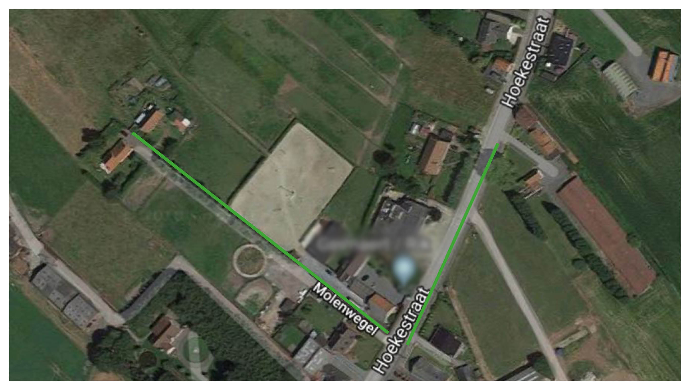
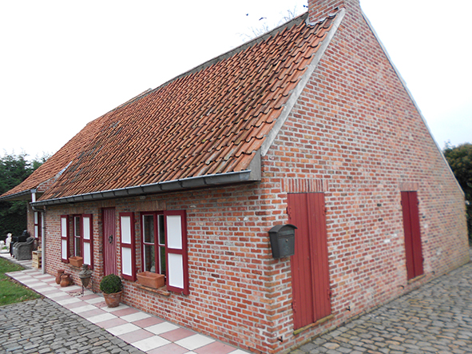

## Moeder-weduwe van een groot gezin

Op 1 februari 1936 ging er een donkere wolk over het huis van Octavia en [Vitalis](/1879-vitalis-de-bleeckere). Het werd de dag waarop Vitalis overleed en Octavia weduwe werd. Ze was 57 en een half jaar oud. Toen ze zelf op 26 augustus 1963 stierf, was ze als moeder van een groot gezin iets meer dan 22 jaar weduwe geweest. Toen haar man stierf, was haar oudste zoon en eerste kind, [Jozef](/1907-jozef-de-bleeckere), 28 jaar en haar jongste kind, dochter [Lea](/1922-lea-de-bleeckere), was toen net nog geen 14 jaar. 

## Overleven in een lange wereldcrisis

In 1936 heerstte in de westerse wereld wat de historici de [Grote Depressie](https://nl.wikipedia.org/wiki/Crisis_van_de_jaren_30) noemen. Die was ingezet met de grote beurskrach van Wall Street, NY, in 1929. De bevolking in de Europese landen moest nog herstellen van de gevolgen van de Grote Oorlog (1914-1918), later de Eerste Wereldoorlog genoemd. De Grote Depressie zette een grote rem op de langzame wederopbouw. Investeringen bleven uit, de inflatie verminderde de waarde van het spaargeld, de graad van werkloosheid lag heel hoog, de prijzen van levenswaren stegen. Het leven werd moeilijker. Tegelijkertijd broedde het Hitlerregime in nazi-Duitsland op een nieuwe wereldoorlog. Vitalis heeft de Tweede Wereldoorlog niet meer meegemaakt, maar Octavia wel. 

Het is voor haar kleinkinderen en achterkleinkinderen die allen zijn opgegroeid in de welvaarstaat zonder enige oorlog, moeilijk voor te stellen hoe Octavia erin is geslaagd te overleven, niet alleen tijdens de Tweede Wereldoorlog, maar ook nog nadien. Van het algemeen stelsel van de sociale zekerheid heeft ze niet kunnen genieten. De ontwikkeling van de  sociale zekerheid in de 19de eeuw tot en met de periode van de Eerste Wereldoorlog, betrof enkel bepaalde arbeiderscategorieën die werkten in sectoren waar veel arbeidsongevallen voorkwamen. Na de bevrijding van België kwam er voor het eerst op 28 december 1944 de '_Besluitwet betreffende de maatschappelijke zekerheid der arbeiders_' tot stand. Om alles te kunnen organiseren, werd in 1945 de '_Rijksdienst voor Sociale zekerheid_' (RSZ) opgericht. Alles stond echter in het teken van de werknemers. Huismoeders kregen in dat sociaal beleid geen eigen sociaal statuut. Het overlevingspensioen zoals het weduwepensioen vandaag bestond niet. In 1950 werd er voor het eerst een toelage ingevoerd voor 'moeders in het gezin'. 

## Molenwegel 82

Octavia en haar nog inwonende zonen, [Alfons](/1911-alfons-de-bleeckere) en [Omer](/1912-omer-de-bleeckere), verhuisden na de Tweede Wereldoorlog, meer bepaald in 1950 naar een zijstraat van de Hoekestraat, de Molenwegel 82. Op de kaart verbindt de groene lijn de twee huizen. Het is anno 2021 nog steeds een zeer smalle, doodlopende steeg, met op het einde twee relatief kleine landelijke woningen. Haar zoon [Maurits](/1916-maurits-de-bleeckere) en zijn vrouw Flora Verscheure woonden al in het huis ernaast, nummer 80, sinds het voorjaar 1942. Dat huurhuis is het rechterhuis op de luchtfoto. Het huis nr. 82 is het linkerhuis. 

Octavia heeft het huis gekocht met de opbrengst van het eerste huis in Hoekestraat 148 dat ze had verkocht. In dat huis aan de Molenwegel heeft ze nog een dertien jaar kunnen leven. Ze was daar goed omringd door haar twee ongehuwde zonen Alfons en Omer. Haar gehuwde dochters [Maria](/1908-maria-de-bleeckere) en [Irma](/1913-irma-de-bleeckere) woonden vlakbij, en op een kleine twee kilometers woonden haar gehuwde zonen Maurits en [Albert](/1918-albert-de-bleeckere). Octavia is in haar huis overleden.

 

Dit is het huis nummer 82 van de Molenwegel. Het huis is gerenoveerd met behoud van de vorm en het uitzicht. De voordeur bevindt zich in het midden van de gevel. De buitendeur opende in de grote woonkamer rechts van de deur. Aan de linkerkant van de deur bevond zich de slaapkamer. De deur ervan bevond zich in de woonkamer. 

Om te weten waar de naam 'Molenwegel' vandaan komt, zie in het domein [Bakermat](/bakermat-De Vaart).  

## 