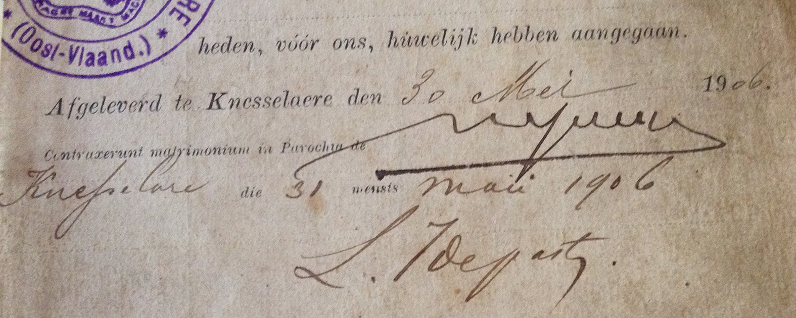

## Trouwboekje

Octavia huwde met Vitalis. De bruidegom heeft de brug van Sint-Joris-ten-Distel moeten oversteken om in Knesselare de liefde van zijn leven te vinden en daar met haar een nieuw leven te beginnen en een gezin te stichten. Zoals het ook gebruikelijk was in die tijd, werd het huwelijk officieel geregistreerd in het gemeentehuis en de parochiekerk van de plaats waar de bruid woonde. 

Het bewaarde trouwboekje van Octavia en Vitalis vermeld het volgende: '_Afgeleverd te Knesselare den 30 Mei 1906_', terwijl daaronder de Latijnse zin '_Contraxerunt matrimonium in Parochia de Knesselare die 31 mensis maii 1906_'. Dat betekent dat ze einde mei - in het Latijn _maii_ - in volle lente, zijn getrouwd. Eerst in het gemeentehuis, en de dag daarop in de kerk. 

Leerrijk is ook dat in het trouwboekje de betekening van het burgerlijk huwelijk in het Nederlands gebeurt: '_Afgeleverd..._', terwijl het kerkgelijk huwelijk in het Latijn is vermeld. De voertaal van de Kerk was in die tijd nog helemaal in het Latijn. '_Contraxerunt_' was de geijkte uitdrukking om mee te delen dat de betrokkenen '_het huwelijk waren aangegaan_'. 

Er is nog een opvallend detail. Niettegenstaande de grondwet van de nog jonge, moderne staat van het koninkrijk België de scheiding van kerk en staat voorzag, vermeldt hier het burgerlijk trouwboekje, een wettelijk staatsdocument, toch ook officieel het kerkelijk huwelijk. In 1906 kende vooral Vlaanderen de gestage heropleving van de katholieke Kerk. Dat kreeg nadien het label ['het rijke Roomse leven'](bakermat) 

## Midden in de week

De kalender van mei 1906 leert dat 30 en 31 mei op een woensdag en een donderdag vielen. Octavia en Vitalis zijn dus midden in de week getrouwd. Dat leert dat de beide families tot de grote groep van de gewone mensen hoorden. Alleen de rijkere burgerfamilies en leden van de adellijke families konden zich permiteren om een zaterdag als trouwdag te kiezen. In 1906 was een zaterdag nog een werkdag, zeker voor arbeiders en kleine boeren. Het barema voor een trouw in de kerk op zaterdag lag ook hoger dan in de week. Dan werd de kerk ook feestelijk aangekleed, betaald door de families, en ook er ook een koor en organist de huwelijksplechtigheid opluisteren. Dat konden gewonen mensen zich allemaal toen niet permitteren. 

Over het eigenlijk huwelijksfeest met de families Versluys en De Bleeckere, bestaat er geen monderlinge of geschreven overlevering. Er zijn ook geen foto's. Dat verwondert niet want ook hier geldt dat huwelijkfoto's voor gewonen mensen in 1906 een onbetaalbare luxe was. 