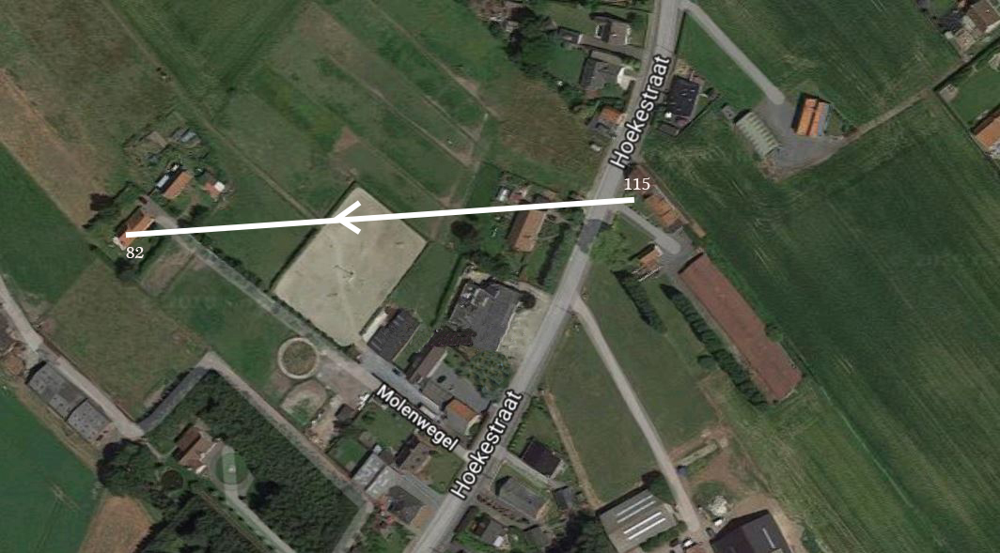

## Moeder-weduwe van een groot gezin

Op 1 februari 1936 ging er een donkere wolk over het huis van Octavia en [Vitalis](1879-vitalis-de-bleeckere). Het werd de dag waarop Vitalis overleed en Octavia weduwe werd. Ze was toen 57 jaar en een half. Toen ze zelf op 26 augustus 1963 stierf, was ze als moeder van een groot gezin iets meer dan 22 jaar weduwe geweest. Toen haar man stierf, was haar oudste zoon en eerste kind, [Jozef](1907-jozef-de-bleeckere), 28 jaar en haar jongste kind, dochter [Lea](1922-lea-de-bleeckere), was toen net nog geen 14 jaar. 

## Overleven in een lange wereldcrisis

In 1936 heerstte in de westerse wereld wat de historici de [Grote Depressie](https://nl.wikipedia.org/wiki/Crisis_van_de_jaren_30) noemen. Die was ingezet met de grote beurskrach van Wall Street, NY, in 1929. In de Europese landen moest men nog herstellen van de gevolgen van de Grote Oorlog (1914-1918), later de Eerste Wereldoorlog genoemd. De Grote Depressie zette een grote rem op de langzame wederopbouw. Investeringen bleven uit, de inflatie verminderde de waarde van het spaargeld, de werkloosheid was heel groot, de prijzen van levenswaren stegen. Het leven werd moeilijker. Tegelijkertijd broedde het Hitlerregime in nazi-Duitsland op een nieuwe wereldoorlog. Vitalis heeft de Tweede Wereldoorlog niet meer meegemaakt, maar Octavia wel. 

Hier over de sociale zekerheid. 

## Molenwegel 82

Octavia en haar nog inwonende zonen, [Alfons]() en [Omer](), verhuisden na de Tweede Wereldoorlog, meer bepaald in 1950 naar een zijstraat van de Hoekestraat, de Molenwegel 82. Het is anno 2019 nog steeds een zeer smalle, doodlopende steeg, met op het einde twee relatief kleine landelijkse woningen. Haar zoon Maurits en zijn vrouw Flora Verscheure woonden al in het huis ernaast, nummer 80, sinds het voorjaar 1942. Dat huurhuis is het rechterhuis op de luchtfoto. Het huis nr. 82 is het linkerhuis. Octavia heeft het huis gekocht met de opbrengst van het eerste huis in Hoekestraat 148 dat ze had verkocht. In dat huis heeft ze nog een dertien jaar kunnen leven. Ze was daar goed omringd door haar twee ongehuwde zonen Alfons en Omer, haar gehuwde dochters [Maria]() en [Irma]() woonden vlakbij, en op een kleine twee kilometers woonden haar gehuwde zonen [Maurits] en [Albert](),  Ze is thuis overleden.

## 